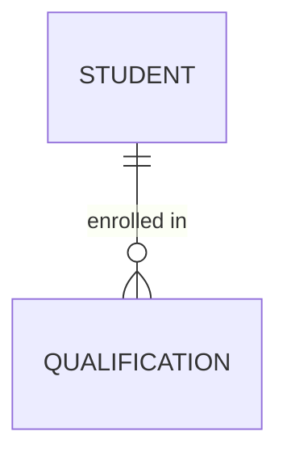
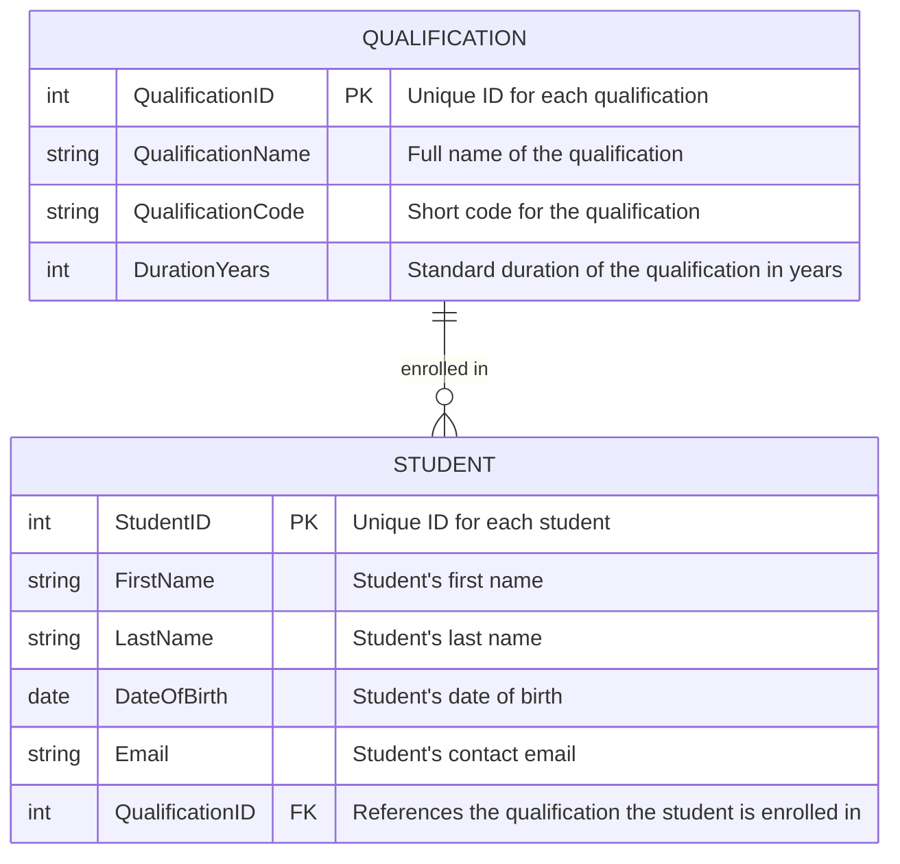

This presents a detailed overview of both the Conceptual and Logical Entity–Relationship Diagrams (ERDs) for a system designed for the Department of Electrical, Electronic and Computer Engineering. The department offers a variety of undergraduate qualifications that students can pursue. A key rule of the system is that each student can only be enrolled in one qualification at a time, while each qualification can accommodate multiple students. These ERDs will serve as a blueprint for understanding the system's data structure, and will guide future database design and implementation.

## Conceptual ERD

The Conceptual ERD represents the highest level of abstraction in data modelling. It focuses on the main entities in the system and the relationships between them, without delving into the technical details of database implementation. The aim is to capture the essential business rules and structure of the data.

In this scenario, there are two primary entities:  
1. Student – represents an individual who is registered in the department.  
2. Qualification – represents an academic programme that can be pursued by students.  
  
The relationship between these two entities is 'Enrolled In'. The rules of this relationship are:  
- A student must be enrolled in exactly one qualification.  
- A qualification can have zero, one, or many students enrolled.  
- The relationship is therefore one-to-many (one qualification to many students).

The Conceptual ERD makes it clear that students cannot be enrolled in multiple qualifications simultaneously, which is an important business rule for the department.

## Logical ERD

The Logical ERD builds upon the conceptual model by including detailed attributes for each entity, along with identifying which attributes are Primary Keys (PK) and Foreign Keys (FK). This model brings the design closer to implementation, although it is still independent of any specific database management system.

In the Logical ERD:  
• The **Student** entity includes:  
   - StudentID (PK): A unique identifier for each student.  
   - FirstName and LastName: The student's personal names.  
   - DateOfBirth: The student's date of birth.  
   - Email: The student's contact email.  
   - QualificationID (FK): Links the student to the qualification they are enrolled in.  
  
• The **Qualification** entity includes:  
   - QualificationID (PK): A unique identifier for each qualification.  
   - QualificationName: The official name of the qualification.  
   - QualificationCode: A short code for the qualification (e.g., BEngEE).  
   - DurationYears: The standard duration of the qualification in years.  
  
The 'Enrolled In' relationship is maintained by the Foreign Key 'QualificationID' in the Student entity, ensuring referential integrity between the two entities.

This logical design can be directly translated into a relational database schema, with 'Student' and 'Qualification' as tables, and an enforced one-to-many relationship through the foreign key.
