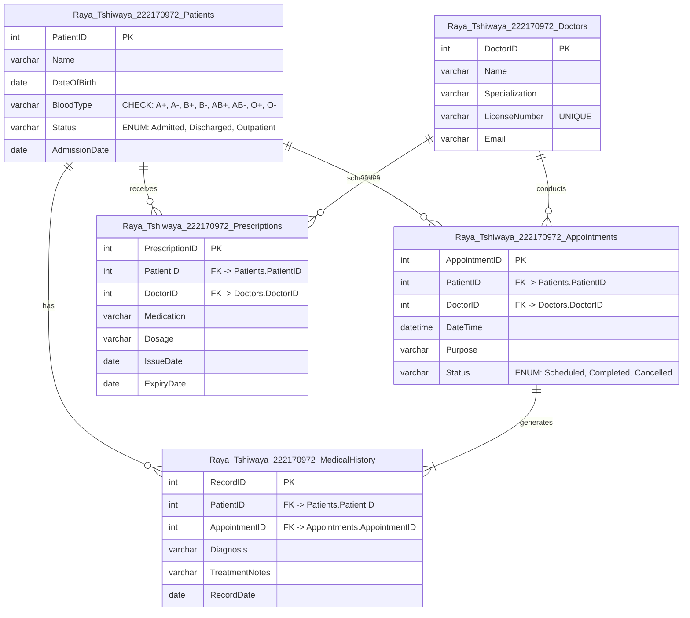

```mermaid
erDiagram
    Raya_Tshiwaya_222170972_Patients ||--o{ Raya_Tshiwaya_222170972_Appointments : "schedules"
    Raya_Tshiwaya_222170972_Patients ||--o{ Raya_Tshiwaya_222170972_Prescriptions : "receives"
    Raya_Tshiwaya_222170972_Patients ||--o{ Raya_Tshiwaya_222170972_MedicalHistory : "has"
    Raya_Tshiwaya_222170972_Doctors ||--o{ Raya_Tshiwaya_222170972_Appointments : "conducts"
    Raya_Tshiwaya_222170972_Doctors ||--o{ Raya_Tshiwaya_222170972_Prescriptions : "issues"
    Raya_Tshiwaya_222170972_Appointments ||--|{ Raya_Tshiwaya_222170972_MedicalHistory : "generates"

    Raya_Tshiwaya_222170972_Patients {
        int PatientID PK
        varchar(100) Name
        date DateOfBirth
        varchar(10) BloodType "CHECK: A+, A-, B+, B-, AB+, AB-, O+, O-"
        varchar(20) Status "ENUM('Admitted','Discharged','Outpatient')"
        date AdmissionDate
    }

    Raya_Tshiwaya_222170972_Doctors {
        int DoctorID PK
        varchar(100) Name
        varchar(50) Specialization
        varchar(20) LicenseNumber UNIQUE
        varchar(100) Email
    }

    Raya_Tshiwaya_222170972_Appointments {
        int AppointmentID PK
        int PatientID FK
        int DoctorID FK
        datetime DateTime
        varchar(50) Purpose
        varchar(20) Status "ENUM('Scheduled','Completed','Cancelled')"
    }

    Raya_Tshiwaya_222170972_Prescriptions {
        int PrescriptionID PK
        int PatientID FK
        int DoctorID FK
        varchar(100) Medication
        varchar(200) Dosage
        date IssueDate
        date ExpiryDate
    }

    Raya_Tshiwaya_222170972_MedicalHistory {
        int RecordID PK
        int PatientID FK
        int AppointmentID FK
        varchar(100) Diagnosis
        text TreatmentNotes
        date RecordDate
    }
```




