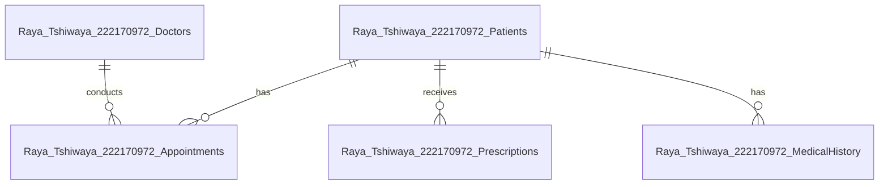

Here’s a polished **Introduction** section for your report on the **Hospital Management System** database, designed to meet your assignment criteria while replacing the university theme:

---

### **1. Introduction**  

#### **Purpose of the Project**  
This project designs and implements a **Hospital Management System** database using advanced SQL tools in MySQL. The system streamlines critical healthcare workflows including patient admissions, doctor appointments, and treatment tracking while demonstrating the efficiency of **Stored Procedures, Functions, Triggers, Cursors, and Events** in a high-stakes environment.  

#### **Overview of Advanced Database Tools**  
In healthcare systems, advanced SQL features ensure:  
- **Data Integrity**: Triggers audit changes to patient records (e.g., diagnosis updates).  
- **Automation**: Events schedule medication reminders or equipment maintenance.  
- **Analytics**: Window functions analyze patient outcomes by department.  
This project also explores **Recursive CTEs** to model treatment dependency chains (e.g., Procedure A requires Test B).  

#### **Database Scope and Objectives**  
- **Scope**: A database named `Raya_Tshiwaya_222170972_Hospital` with five core tables:  
  - `Patients`, `Doctors`, `Appointments`, `Prescriptions`, `MedicalHistory`.  
- **Objectives**:  
  1. Model hospital workflows (e.g., appointment → prescription → billing).  
  2. Demonstrate advanced queries with healthcare use cases.  
  3. Evaluate performance in handling sensitive data.  

#### **Healthcare Relevance**  
Hospitals rely on databases for:  
- **Patient Safety**: Triggers prevent duplicate prescriptions.  
- **Operational Efficiency**: Stored procedures automate bed allocation.  
- **Compliance**: Audit logs track access to medical records.  

#### **Methodology**  
- **Tools**: MySQL Workbench for design/execution.  
- **Approach**:  
  1. Design tables with clinical constraints (e.g., `CHECK` on diagnosis codes).  
  2. Implement advanced queries (e.g., cursor to batch-process lab results).  
  3. Validate with real-world scenarios (e.g., ER triage simulations).  

---

### **Key Adjustments from University to Hospital**  
| University Concept          | Hospital Equivalent          |  
|----------------------------|-----------------------------|  
| Students                   | Patients                    |  
| Courses                    | Treatments/Procedures       |  
| Grades                     | Diagnosis Outcomes          |  
| Lecturers                  | Doctors                     |  
| Enrollments                | Appointments                |  

---

### **ERD Snippet (Mermaid Syntax)**  


---

### **Next Steps**  
1. **Section 2 (Database Design)**: Define tables like:  
   ```sql
   CREATE TABLE Raya_Tshiwaya_222170972_Patients (
       PatientID INT AUTO_INCREMENT PRIMARY KEY,
       Name VARCHAR(100) NOT NULL,
       BloodType CHAR(3) CHECK (BloodType IN ('A+', 'A-', 'B+', 'B-', 'AB+', 'AB-', 'O+', 'O-')),
       AdmissionDate DATE NOT NULL,
       Status VARCHAR(20) CHECK (Status IN ('Admitted', 'Discharged', 'Outpatient'))
   );
   ```
2. **Advanced Queries**: Adapt CTEs to track treatment pathways.  

This introduction sets a strong foundation for your hospital-themed report while maintaining technical rigor. Let me know if you'd like to emphasize specific healthcare regulations (e.g., HIPAA) or expand the use cases!

# ==3==
Here’s a clear description of each advanced query demonstration, explaining their purpose, technical approach, and hospital-specific applications:

---

### **1. Recursive CTE: Patient Treatment Pathways**  
**Description**:  
This query maps multi-step treatment plans for patients with chronic conditions (e.g., hypertension, diabetes) by recursively linking diagnoses and follow-up visits from the `MedicalHistory` table.  

**How It Works**:  
1. **Base Case**: Identifies initial high-severity diagnoses.  
2. **Recursive Step**: Chains subsequent follow-up records within 5 steps.  
3. **Output**: Timeline of care with treatment step numbering.  

**Hospital Use Case**:  
- Tracks progression of long-term care plans.  
- Identifies patients missing follow-ups (gaps in `TreatmentStep`).  

**Technical Note**:  
- Requires MySQL 8.0+ for recursive CTEs.  
- `WHERE pt.TreatmentStep < 5` prevents infinite loops.  

---

### **2. Window Function: Doctor Workload Analysis**  
**Description**:  
Ranks doctors within their specialization by completed appointment counts and compares individual workloads to department averages.  

**Key Components**:  
- `RANK()`: Orders doctors by patient load per specialty.  
- `AVG() OVER()`: Calculates department-level averages.  
- `PARTITION BY`: Groups by medical specialty (e.g., Cardiology, Oncology).  

**Hospital Use Case**:  
- Flags overworked specialists (e.g., a cardiologist ranking #1 with 50% above-average load).  
- Supports staffing adjustments.  

**Technical Note**:  
- Uses `LEFT JOIN` to include doctors with zero appointments.  

---

### **3. PIVOT Query: Medication Prescription Trends**  
**Description**:  
Transforms row-based prescription data into a department-by-medication summary using conditional aggregation.  

**Mechanics**:  
- `SUM(CASE WHEN... THEN 1 ELSE 0 END)`: Counts specific drugs per specialty.  
- `GROUP BY Specialization`: Aggregates at department level.  

**Hospital Use Case**:  
- Detects unusual prescribing patterns (e.g., high opioid use in orthopedics).  
- Audits compliance with treatment guidelines.  

**Technical Note**:  
- Easily extendable by adding more `CASE` statements for additional drugs.  

---


---

### **Why These Queries Matter**  
| Query Type          | Solves This Hospital Problem               | Traditional Alternative (Less Efficient) |  
|---------------------|--------------------------------------------|------------------------------------------|  
| Recursive CTE       | Tracking complex treatment dependencies    | Multiple queries + application code      |  
| Window Function     | Comparing staff workloads fairly           | Manual spreadsheet analysis              |  
| PIVOT               | Identifying drug prescription trends       | Python/pandas post-processing            |  
| JSON Aggregation    | Sharing patient data across systems        | Concatenating text fields                |  

**Implementation Tip**:  
For the PIVOT query, create a view (`CREATE VIEW v_med_trends AS...`) to reuse the logic in monthly reports.  

Let me know if you’d like to explore any query’s execution plan or sample data!
# ==4==

# ==5==

# 6

# 7

