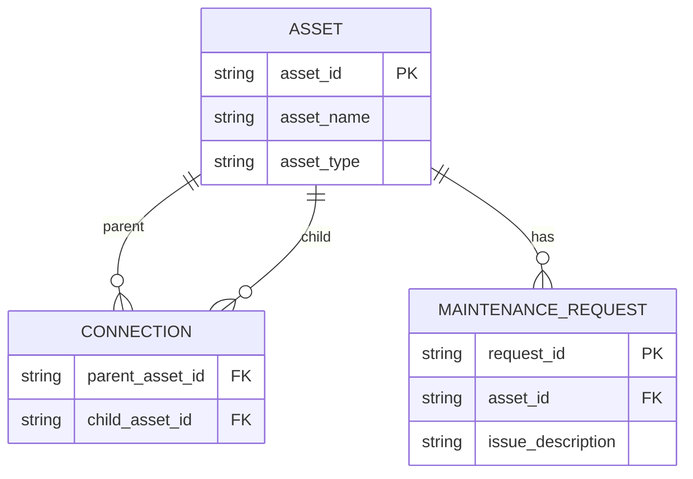

```mermaid
erDiagram
    ASSET {
        string asset_id PK
        string asset_name
        string asset_type
    }
    CONNECTION {
        string parent_asset_id FK
        string child_asset_id FK
    }
    MAINTENANCE_REQUEST {
        string request_id PK
        string asset_id FK
        string issue_description
    }
    
    ASSET ||--o{ CONNECTION : parent
    ASSET ||--o{ CONNECTION : child
    ASSET ||--o{ MAINTENANCE_REQUEST : has

```

```Cypher


```
