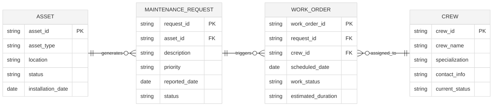

```mermaid
%%{init: {"theme":"base", "themeVariables":{"primaryColor":"#f4f4f4"}}}%%
erDiagram
    direction LR

    ASSET ||--o{ MAINTENANCE_REQUEST : "generates"
    MAINTENANCE_REQUEST ||--o{ WORK_ORDER : "triggers"
    WORK_ORDER }o--|| CREW : "assigned_to"

    ASSET {
        string asset_id PK
        string asset_type
        string location
        string status
        date installation_date
    }

    MAINTENANCE_REQUEST {
        string request_id PK
        string asset_id FK
        string description
        string priority
        date reported_date
        string status
    }

    WORK_ORDER {
        string work_order_id PK
        string request_id FK
        string crew_id FK
        date scheduled_date
        string work_status
        string estimated_duration
    }

    CREW {
        string crew_id PK
        string crew_name
        string specialization
        string contact_info
        string current_status
    }

```
