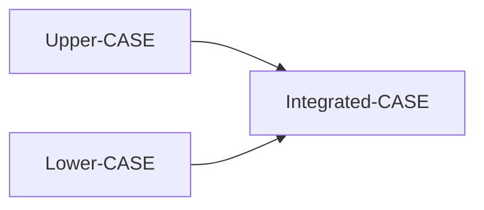

---

## 10.10 Implementation

### 📘 Concept Definition

> **Implementation** is the **physical realization** of the database and application designs using the selected DBMS and development tools.

---

### 🔧 Key Activities

- **Database Creation**
    
    - Use **DDL** (Data Definition Language) or GUI tools to define tables, constraints, indexes, and user views.
        
    - Generate empty database files.
        
- **Application Development**
    
    - Write application programs (3GL/4GL) embedding **DML** (Data Manipulation Language) to perform transactions.
        
    - Languages: Python, Java, C#, VB, COBOL, etc., or 4GL report & form generators.
        
- **Security & Integrity**
    
    - Implement access controls, grants, and roles via DDL or DBMS utilities.
        
    - Define triggers, stored procedures, and validation rules.
        

---

## 10.11 Data Conversion and Loading

### 📘 Concept Definition

> **Data conversion and loading** is the process of **migrating existing data** and, where possible, **converting legacy applications** to run on the new database.

---

### 🔄 Main Steps

1. **Plan Conversion**
    
    - Identify source files, formats, and mapping rules.
        
2. **Use DBMS Utilities**
    
    - Invoke load tools to transform and import data.
        
3. **Convert Applications**
    
    - Adapt legacy code to use new database interfaces.
        
4. **Validate**
    
    - Verify data accuracy and consistency post-load.
        

---

## 10.12 Testing

### 📘 Concept Definition

> **Testing** is running the database system under controlled conditions **to uncover errors** and verify it meets specifications.

---

### 🛠️ Testing Objectives

- **Error Detection:** Find bugs in application code and schema design.
    
- **Validation:** Confirm functionality and performance meet requirements.
    
- **Reliability Metrics:** Gather data on failure rates and response times.
    
- **Usability Evaluation:** Assess against criteria like learnability, robustness, and recoverability.
    

---

### 🔍 Usability Criteria

- **Learnability:** Time for a new user to become productive.
    
- **Performance:** Response time matching work practices.
    
- **Robustness:** System’s tolerance of user errors.
    
- **Recoverability:** Ability to recover from failures.
    
- **Adaptability:** Flexibility across work models.
    

---

## 10.13 Operational Maintenance

### 📘 Concept Definition

> **Operational maintenance** is the ongoing **monitoring and tuning** of the live database system after deployment.

---

### 🔄 Maintenance Activities

- **Performance Monitoring**
    
    - Use DBMS utilities to track usage, locking, and query plans.
        
    - Tune indexes, storage, or SQL to improve throughput.
        
- **Upgrades & Enhancements**
    
    - Incorporate new requirements via the lifecycle stages.
        
- **Capacity Planning**
    
    - Analyze trends to forecast hardware and licensing needs.
        
- **Parallel Operation**
    
    - Run new and old systems simultaneously until consistency is assured.
        

---

## 10.14 CASE Tools

### 📘 Concept Definition

> **CASE (Computer-Aided Software Engineering) tools** automate and support tasks across the database system lifecycle, from planning through maintenance.

---

### 📊 Types of CASE Tools

- **Upper-CASE:** Supports early stages (planning, analysis, conceptual design).
    
- **Lower-CASE:** Supports later stages (implementation, testing, maintenance).
    
- **Integrated-CASE:** Covers all lifecycle stages in one environment.
    

---

### ✅ Benefits of CASE Tools

- **Standards Enforcement:** Consistent notation and reusable components.
    
- **Integration:** Central repository (data dictionary) links all project artifacts.
    
- **Consistency Checking:** Automatic validation of models and definitions.
    
- **Automation:** Generate code, DDL, and documentation directly from models.
    

---

