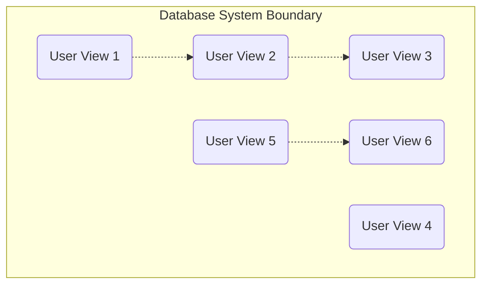

---

## 10.4 System Definition

### 📘 Concept Definition

> **System Definition** identifies the **scope** and **boundaries** of the database system and its **major user views**.

- It ensures you know **which parts** of the organization your database will serve—and which it will not.
    
- Includes **current** and **future** users and application areas.
    

---

## 10.4.1 User Views

### 📘 Definition

> A **User View** specifies the data and transactions a particular **job role** (e.g., Manager, Supervisor) or **application area** (e.g., Marketing, Personnel, Stock Control) needs from the database.

---

### 🔑 Why Identify User Views?

1. **Coverage:** Ensures no important user group is forgotten.
    
2. **Manageability:** Breaks complex requirements into smaller, focused chunks.
    
3. **Clarity:** Defines exactly **what data** and **what actions** each group needs.
    

---

## 🏗️ Mermaid Sketch of User Views

- **Subgraph** frames the system.
    
- **Dashed arrows** represent shared data/requirements between views (overlaps).

- **UV4** has no arrows—its requirements are unique.
