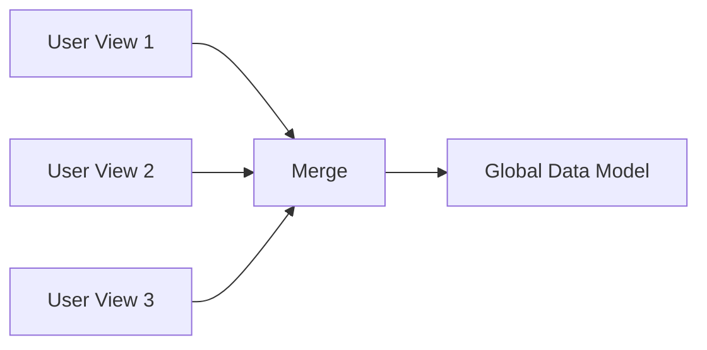
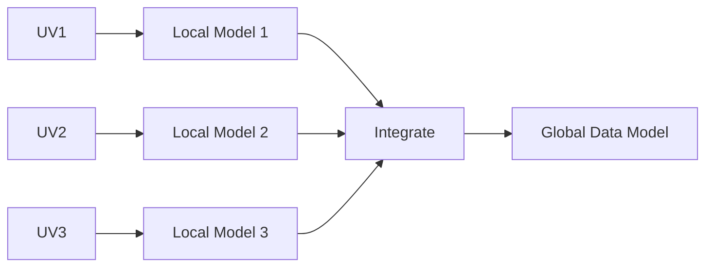
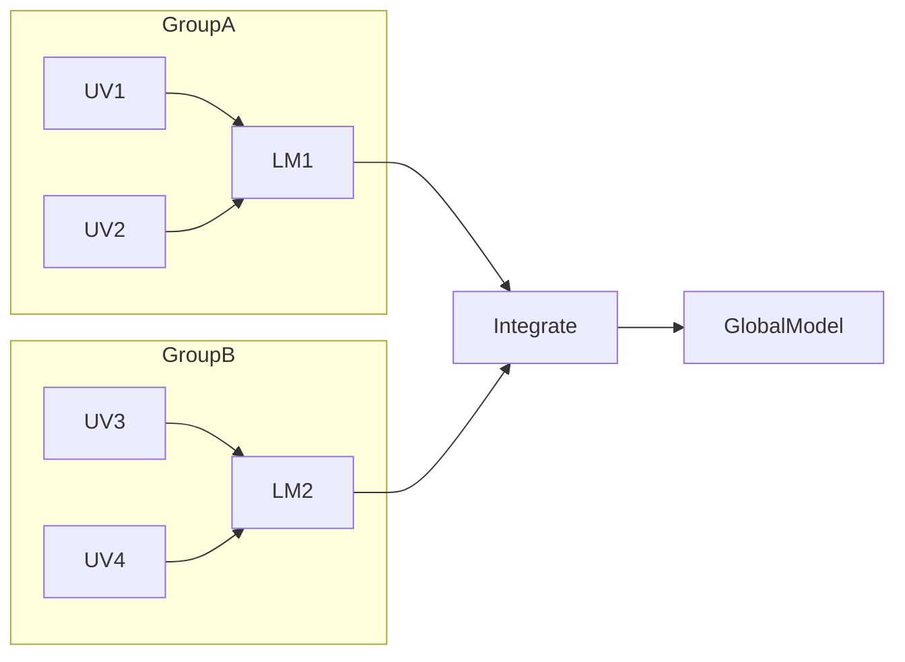

---

## 10.5 Requirements Collection and Analysis

### 📘 Concept Definition

> **Requirements collection and analysis** is the process of gathering information about the part of the organization to be supported by the database and transforming it into a clear set of system requirements.

---

### 🔍 Main Activities

1. **Fact-Finding**
    
    - Techniques: interviews, questionnaires, document review, observation, workshops.
        
2. **Data Gathering for Each User View**
    
    - **Data descriptions:** What data exists or is needed?
        
    - **Usage details:** How will users create, read, update, delete data?
        
    - **Additional needs:** Security, performance, reporting, etc.
        
3. **Analysis & Specification**
    
    - Convert informal notes into structured **requirements specifications**.
        
    - Tools: Data Flow Diagrams (DFDs), HIPO charts, SAD techniques, UML use-case diagrams.
        
    - CASE tools can help validate completeness and consistency.
        

> ⚖️ **Balance**: Too much early analysis leads to “paralysis by analysis.” Too little leads to wasted effort on the wrong solution.

---

### 🏗️ Managing Multiple User Views

When there are several user views (e.g., Marketing, Stock Control, Personnel), you can handle their requirements in three ways:

#### 10.5.1 Centralized Approach

**Definition:**  
Merge all user-view requirements into a **single** set; build **one** global data model.

- **When to use:**
    
    - High overlap between views.
        
    - System complexity is moderate.
        
- **Process Sketch:**
    

- **Outcome:**  
    A **single** requirements document and data model covering all views.
    

---

#### 10.5.2 View Integration Approach

**Definition:**  
Keep each user-view requirement **separate**; build **local** data models, then **merge** into a global model.

- **When to use:**
    
    - Views have significant differences.
        
    - System complexity is high, justifying divide-and-conquer.
        
- **Process Sketch:**
    

- **Outcome:**  
    Multiple **local** models refined separately, then **integrated**.
    

---

#### 10.5.3 Combined Approach

**Definition:**  
Use **centralized** merging for some related views to form **intermediate** models, then apply **view integration** to those intermediates to build the final global model.

- **When to use:**
    
    - Mixed overlap and divergence among views.
        
    - Need both efficiency and manageability.
        
- **Process Sketch:**
    

- **Outcome:**  
    **Local** models for clusters of views, then **integrated** into one comprehensive model.
    

---
