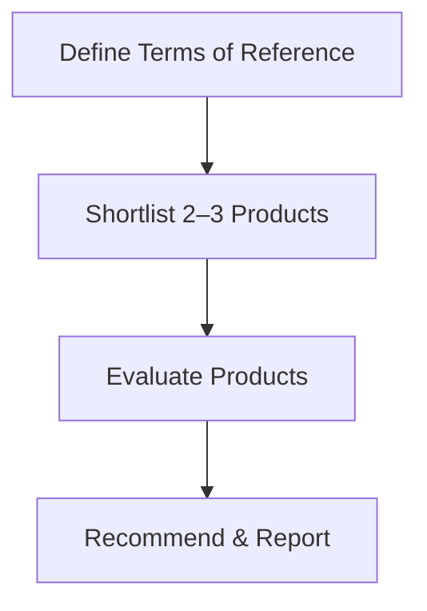

---

## 10.7 DBMS Selection

### 📘 Concept Definition

> **DBMS selection** is the process of choosing the most suitable database-management system to meet both current and future enterprise requirements, balancing functionality, performance, cost, and support.

---

## 10.7.1 Main Steps (Table 10.3)

1. **Define Terms of Reference**
    
    - Document the **objectives**, **scope**, **tasks**, and **timescales**.
        
    - List **evaluation criteria** derived from user requirements (e.g., performance, security).
        
2. **Shortlist Products**
    
    - Use **critical criteria** (budget, vendor support, platform compatibility) to narrow to 2–3 candidates.
        
    - Gather information from **vendors**, **existing users**, **benchmarks** (e.g., TPC reports), and **web reviews** (e.g., InfoWorld).
        
3. **Evaluate Products**
    
    - Identify **feature groups** to assess, such as:
        
        - **Data Definition** (keys, data types, integrity)
            
        - **Physical Definition** (file structures, indexing, reorganization)
            
        - **Accessibility** (SQL support, security, recovery)
            
        - **Transaction Handling** (locking, logging, concurrency)
            
        - **Utilities & Development** (CASE tools, 4GL support, administration tools)
            
        - **Other** (cost, vendor stability, interoperability)
            
    - **Weight** each feature/group by importance (sum of weights = 1.0).
        
    - **Rate** each feature (e.g., 0–10), multiply by its weight, and sum to get a **group score**.
        
    - Multiply each group score by its **group weight**, then sum all groups to obtain an **overall score**.
        
4. **Recommend & Report**
    
    - Compile findings, **compare scores**, and provide a **formal recommendation**.
        
    - Include **justification**, potential costs (licensing, hardware, training), and **next steps**.
        

---

### 🔍 Example: Weighted Evaluation (Physical Definition Group)

|Feature|Rating (0–10)|Weight|Score (Rating × Weight)|
|---|--:|--:|--:|
|File structures available|8|0.15|1.20|
|File structure maintenance|6|0.20|1.20|
|Ease of reorganization|4|0.25|1.00|
|Indexing|6|0.15|0.90|
|Variable-length fields|6|0.15|0.90|
|Data compression|7|0.05|0.35|
|Encryption routines|4|0.05|0.20|
|**Group Total**|**41**|**1.00**|**5.75**|

> This group score (5.75) is then multiplied by the **group weight** (e.g., 0.25) when computing the overall DBMS score.

---

### 📌 Tips for Effective Selection

- **Plan the process** carefully; don’t rush benchmarks.
    
- **In-house testing** on a pilot dataset provides real-world insights.
    
- Consider **vendor demonstrations** and **reference site visits**.
    
- Factor in **long-term costs** (upgrades, support, training).
    

---

