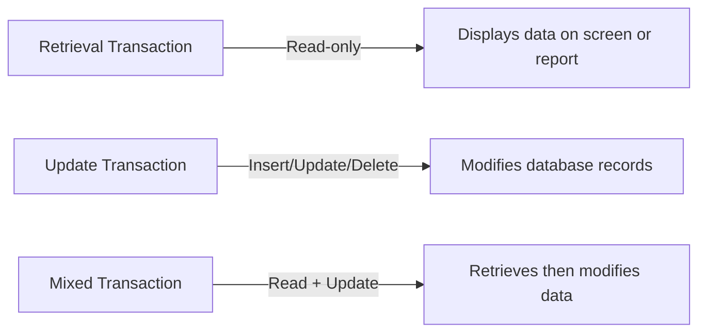

---

## 10.8 Application Design

### 📘 Concept Definition

> **Application design** involves planning both the **user interface** and the **application programs** (transactions) that interact with the database.

- Database and application design proceed **in parallel**, feeding information to each other.
    
- Must cover **all functionality** specified in the requirements.
    

---

## 10.8.1 Transaction Design

### 📘 Definition

> A **transaction** is an action or sequence of actions by a user or program that **accesses or modifies** the database, moving it from one consistent state to another.

- From the user’s view, a transaction performs a **single real-world task** (e.g., register a client, rent out a property).
    
- From the DBMS’s view, it must be **atomic**, **consistent**, **isolated**, and **durable** (ACID properties).
    

---

### 🔍 Transaction Characteristics to Document

- **Data used** (which tables/fields)
    
- **Functional description** (what it does)
    
- **Output** (reports, messages)
    
- **Priority/Importance** to users
    
- **Expected usage rate** (frequency)
    

---

### 🛠️ Transaction Types

- **Retrieval:** Read data only (e.g., look up property details).
    
- **Update:** Insert, delete, or modify data (e.g., add a new property).
    
- **Mixed:** Combines both (e.g., display and then change rent amount).
    

---

## 10.8.2 User Interface Design Guidelines

When designing forms and reports, follow these principles:

1. **Meaningful Title**
    
    - Clearly states the form’s/report’s purpose.
        
2. **Comprehensible Instructions**
    
    - Use familiar terms; keep them brief; provide help screens if needed.
        
3. **Logical Grouping & Sequencing**
    
    - Place related fields together in a consistent order.
        
4. **Visually Appealing Layout**
    
    - Balance fields evenly; align elements; use white space effectively.
        
5. **Familiar Field Labels**
    
    - Use standard terminology (e.g., “Gender” vs. “Sex”).
        
6. **Consistent Terminology & Abbreviations**
    
    - Maintain a style guide for labels and shortcuts.
        
7. **Consistent Use of Color**
    
    - Highlight important areas; use color meaningfully (e.g., white for input, gray for read-only).
        
8. **Visible Boundaries for Data Entry**
    
    - Clearly outline each field so users know input limits.
        
9. **Convenient Cursor Movement**
    
    - Support Tab order, arrow keys, or mouse navigation.
        
10. **Error Correction Facility**
    
    - Allow easy backspace/overtyping for mistakes.
        
11. **Clear Error Messages**
    
    - Indicate what went wrong and acceptable values.
        
12. **Mark Optional Fields**
    
    - Visually distinguish optional vs. required inputs.
        
13. **Field Explanations**
    
    - Show hints (e.g., in a status bar) when a field is focused.
        
14. **Completion Signal**
    
    - Provide a clear “Submit” or “Done” action; allow review before finalizing.
        

---

