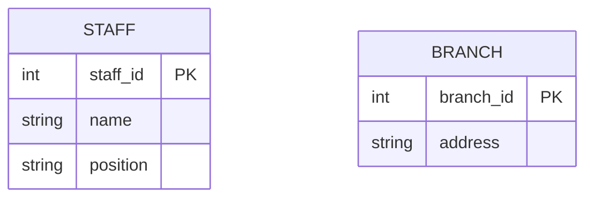

# **Entity Types Explained Simply**  

## **What is an Entity Type?**  
An **entity type** represents a group of similar real-world objects that:  
- Share the **same properties** (e.g., name, ID, age).  
- Have an **independent existence** (they matter on their own).  
- Can be **physical** (e.g., a `Person`, `Car`) or **conceptual** (e.g., an `Order`, `Account`).  

### **Examples:**  
- In a **university database**: `Student`, `Course`, `Professor`.  
- In a **hospital database**: `Patient`, `Doctor`, `Appointment`.  

---

## **Entity vs. Entity Occurrence**  
| Term | Definition | Example |  
|------|-----------|---------|  
| **Entity Type** | The general category (template). | `Employee` |  
| **Entity Occurrence** | A single instance of that type. | `"John Doe" (Employee_ID = 101)` |  

Think of it like:  
- **Entity Type = "Car"** (the general idea).  
- **Entity Occurrence = "Toyota Camry (License: ABC123)"** (a real, specific car).  

---

## **How to Represent Entity Types (UML Notation)**  
- Drawn as a **rectangle** with the name in **PascalCase** (e.g., `Staff`, `PropertyForRent`).  
- **Attributes** (details) can be listed inside.  

### **Example (DreamHome Database):**  

**Key Notes:**  
- `PK` = **Primary Key** (unique identifier, e.g., `staff_id`).  
- Each **entity occurrence** (e.g., a specific staff member) must be **uniquely identifiable**.  

---

## **Why Does This Matter?**  
- Helps **organize data** logically before building a database.  
- Avoids confusion between **categories** (types) and **real instances** (occurrences).  

---

### **Quick Quiz (Test Yourself!)**  
1. Is `"Customer"` an **entity type** or **entity occurrence**? *(Answer: Type)*  
2. If `"Order #1001"` is a specific sale, is it a type or occurrence? *(Answer: Occurrence)*  

---

