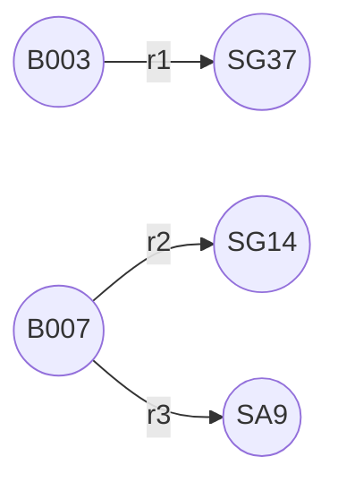
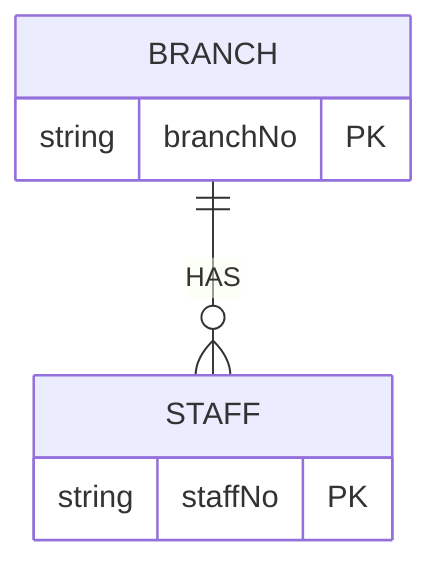

### Relationship Types vs. Occurrences
**1. Relationship Type**  
- Definition: A general pattern of association between entity types  
- Example:  
  - `Branch HAS Staff` (a branch can have multiple staff members)  
  - `PrivateOwner OWNS PropertyForRent`  

**2. Relationship Occurrence**  
- Definition: A specific instance linking concrete entity instances  
- Example:  
  - Branch `B003` HAS Staff `SG37`  
  - Branch `B007` HAS Staff `SG14`  

### Key Differences
| Aspect          | Relationship Type          | Relationship Occurrence       |
|-----------------|---------------------------|------------------------------|
| Level           | Abstract (design level)   | Concrete (data level)        |
| Example         | "Branch HAS Staff"        | "B003 → SG37"               |
| Representation  | Line in ER diagram        | Row in a relationship table |

### Visualization Examples

**1. Semantic Net (Object-Level)**  

*Shows individual relationship occurrences between branch and staff instances*

**2. ER Diagram (Type-Level)**  

*Abstracts all occurrences into a single 1:N relationship type*

### Why Use ER Models Instead of Semantic Nets?
1. **Simplicity**: ER models group similar occurrences into types  
2. **Scalability**: More practical for large databases  
3. **Design Focus**: Emphasizes structure over instance-level details  

### Best Practices
- Name relationships with verbs (e.g., "Manages", "Owns")  
- Always indicate directionality (e.g., `Branch → Staff`)  
- Use primary keys (`branchNo`, `staffNo`) to uniquely identify participants  

This abstraction from occurrences to types is what makes ER modeling powerful for database design while semantic nets are better for analyzing specific data instances.
