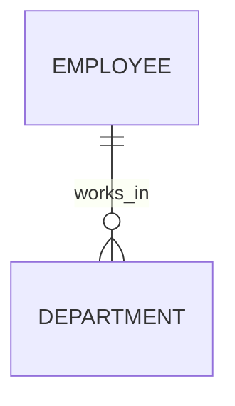
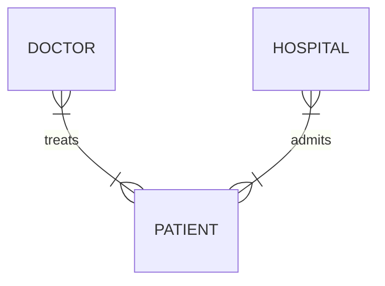
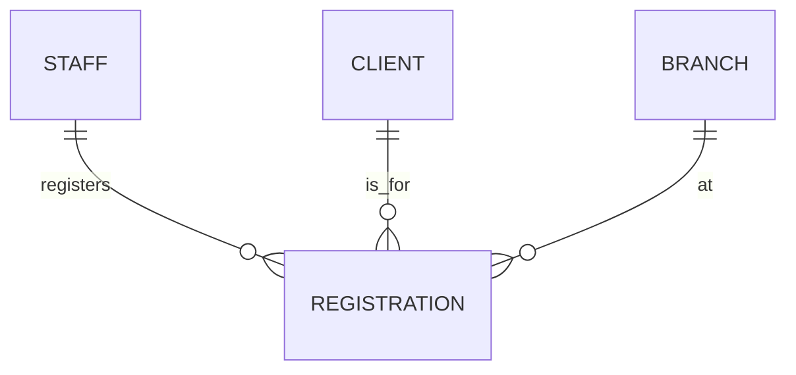

### **Understanding Relationship Types in ER Modeling**

#### **1. Relationship Basics**
Relationships define how entities interact in a database. They represent real-world connections like "employees manage departments" or "students take courses." Each relationship has:
- **Participants**: The entities involved
- **Degree**: Number of participating entities
- **Cardinality**: How many instances can relate (one-to-one, one-to-many)

#### **2. Relationship Degrees**
| Degree | Name      | Description                     | Common Example               |
|--------|-----------|---------------------------------|------------------------------|
| 2      | Binary    | Links two entities              | Employee → Department        |
| 3      | Ternary   | Connects three entities         | Student → Course → Professor |
| 4+     | Complex   | Rare, for specialized cases     | Order → Supplier → Shipper → Payment |

**Binary relationships** are most common, handling about 80% of database needs. For example:

**Ternary relationships** appear when three entities jointly describe an event:

#### **3. Practical Applications**
- **Business systems**: Customer → Order → Product
- **Education**: Student → Class → Instructor
- **Healthcare**: Doctor → Patient → Treatment

#### **4. Design Considerations**
1. **Clarity**: Ensure each relationship has a clear purpose
2. **Avoid redundancy**: Don't create overlapping relationships
3. **Validation**: Check if the relationship reflects real-world logic

#### **5. Common Mistakes**
- **Fan traps**: Creating ambiguous many-to-many paths
- **Overcomplicating**: Using ternary when binary suffices
- **Missing relationships**: Forgetting critical connections

### Representing Complex Relationships in ER Diagrams

#### Key Notation Rules
1. **Binary Relationships (2 entities)**
   - Shown as a simple line connecting entities
   - Relationship name appears above the line (with optional direction arrow)

2. **Complex Relationships (3+ entities)**
   - Represented using a diamond symbol in UML
   - Relationship name placed inside the diamond
   - No directional arrows used
   - All participating entities connect to the diamond

#### Visual Examples

**Ternary Relationship (3 entities)**

*Represents: Staff registering a Client at a Branch*

**Quaternary Relationship (4 entities)**

- A relationship of degree four is called quaternary

#### Why This Matters
- Diamonds visually distinguish complex relationships from simple binary ones
- Ensures clarity when multiple entities interact in a single business process
- Maintains consistency with UML standards for database modeling

#### Practical Applications
- **Ternary**: Doctor-Patient-Hospital treatment records
- **Quaternary**: Real estate transactions involving buyer, agent, bank, and property

#### Design Tip
Always ask: "Does this relationship fundamentally require all X entities to make sense?" If removing one entity breaks the relationship's meaning, then the complex notation is justified.

---

