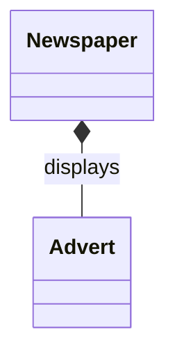

---

## 13.3 Composition

### 📘 Concept Definition

> **Composition** is a **strong form of aggregation** where a “part” cannot exist independently of its “whole.”  
> The **whole** is responsible for creating and destroying its parts, and a part belongs to **exactly one** whole.

---

### 🧠 Key Differences from Aggregation

|Aspect|Aggregation|Composition|
|---|---|---|
|Ownership|“Has-a” (weak ownership)|Strong ownership|
|Lifetime dependency|Parts may outlive the whole|Parts share the same lifetime as the whole|
|Multiplicity of parts|A part may belong to multiple wholes|Part belongs to exactly one whole|

---

### 📘 Example: Newspaper and Advert

- **Whole:** `Newspaper`
    
- **Part:** `Advert`
    
- **Relationship:** `Displays`
    
    - Each `Advert` **must** belong to **one** `Newspaper`.
        
    - When the `Newspaper` is removed, its `Adverts` are also removed.
        

---

### 🖼️ Mermaid Class Diagram Explanation

- The `*--` notation shows **composition** (filled diamond) from `Newspaper` to `Advert`.
    
- Label `displays` names the relationship.
    
- Visually indicates:
    
    1. **Strong ownership**: `Advert` cannot exist without its `Newspaper`.
        
    2. **Single containment**: Each `Advert` is part of exactly one `Newspaper`.
        

---

### 📌 When to Use Composition

- Use **only** when the data semantics require:
    
    - **Strict lifecycle** linkage (part dies with whole).
        
    - **Exclusive ownership** (no sharing of parts).
        
- Otherwise, prefer **simple aggregation** or basic relationships.
    
