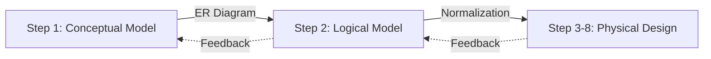

  
1. **Conceptual Design** → **Logical Design** → **Physical Design**.  
2. **Iterative Process**: Steps may loop back as new insights emerge.  

#### **Conceptual Database Design (Step 1)**  
**Goal**: Create an **ER model** independent of implementation.  
**Sub-Steps**:  
1. **Identify Entity Types** (e.g., `Staff`, `Client`).  
2. **Identify Relationship Types** (e.g., `Staff Manages Property`).  
3. **Define Attributes** (e.g., `Staff.staffName`).  
4. **Determine Attribute Domains** (e.g., `staffName: VARCHAR(50)`).  
5. **Keys**: Select candidate/primary keys (e.g., `staffID`).  
6. **Enhanced Modeling** (optional: specialization, aggregation).  
7. **Check for Redundancy** (e.g., duplicated attributes).  
8. **Validate Against Transactions** (e.g., "Can the model support rent collection?").  
9. **User Review** (ensure alignment with business needs).  

#### **Logical Database Design (Step 2)**  
**Goal**: Map conceptual model to **relational schema**.  
**Sub-Steps**:  
1. **Derive Relations** (tables from entities/relationships).  
2. **Normalize Relations** (3NF or higher).  
3. **Validate Transactions** (e.g., query efficiency).  
4. **Define Integrity Constraints** (PKs, FKs, constraints).  
5. **User Review**.  
6. **Merge Models** (optional: integrate multiple user views → global model).  
7. **Plan for Growth** (scalability).  

#### **Physical Database Design (Steps 3–8)**  
**Goal**: Optimize for **target DBMS**.  
**Key Activities**:  
- **Step 3**: Translate to DBMS-specific structures (tables, derived data).  
- **Step 4**: Optimize performance:  
  - Analyze transactions.  
  - Choose file organizations/indexes (e.g., B-tree on `Property.price`).  
- **Steps 5–8**: Security, redundancy, tuning.  

*(Original diagram showing iterative feedback loops.)*  

---

### **Key Notes**:  
- **Flexibility**: Steps may be skipped (e.g., no merging for single-user views).  
- **Validation**: Critical at each stage (user reviews, normalization, transaction testing).  
- **DreamHome Example**:  
  - **StaffClient Views**: Supervisor/Assistant/Client → Local conceptual model.  
  - **Branch Views**: Director/Manager → Merged later (Step 2.6).  

