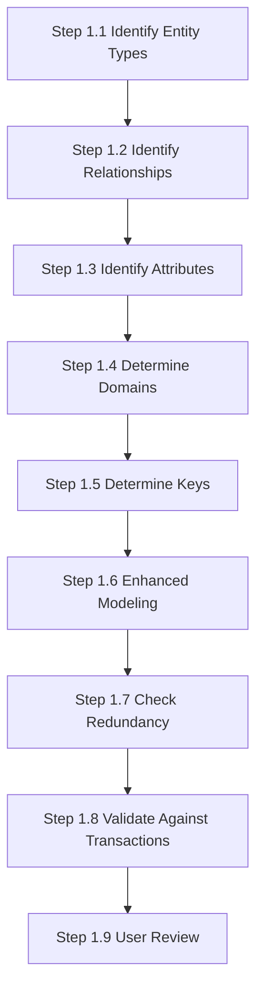

Here's your structured Obsidian notes for **Section 16.3 - Conceptual Database Design Methodology**:

### 16.3 Conceptual Database Design Methodology
**Objective**: Build a conceptual data model representing enterprise data requirements.

#### Key Components of a Conceptual Data Model:
- Entity types
- Relationship types
- Attributes and attribute domains
- Primary keys and alternate keys
- Integrity constraints

#### Supporting Documentation:
- ER diagrams
- Data dictionary (built incrementally)

### Step 1: Build Conceptual Data Model - Detailed Breakdown

**Key Points**:
- The process is iterative - expect to revisit steps
- Documentation is crucial at every stage
- User involvement ensures business requirements are met
- DreamHome case study provides concrete examples throughout
