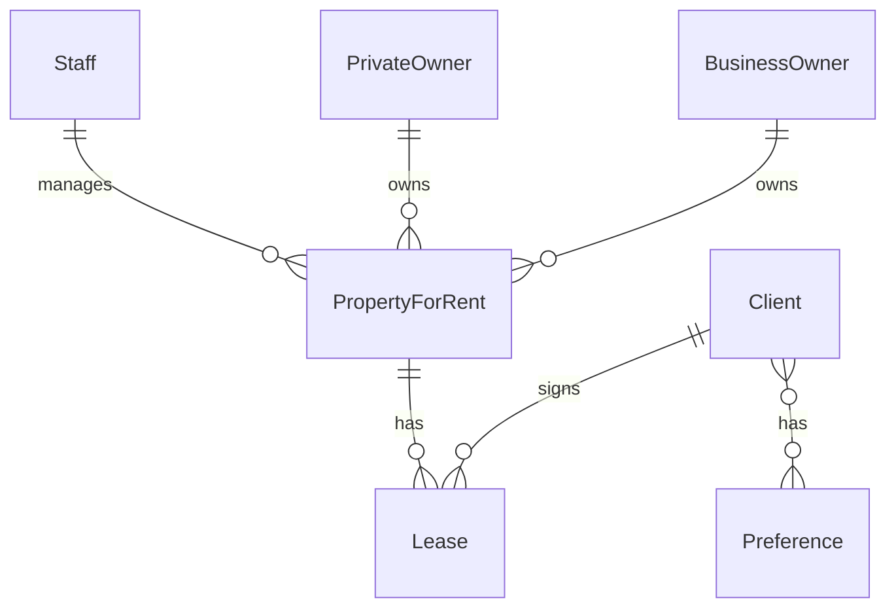

Here's your concise Obsidian-formatted summary for **Step 1.1: Identify Entity Types**:

### Step 1.1: Identify Entity Types  
**Objective**: Determine the main objects (entity types) relevant to user requirements.

#### Methods to Identify Entities:
1. **Noun Analysis**  
   - Scan requirements for nouns/noun phrases (e.g., "staff number," "property address").  
   - Group related attributes into entities (e.g., `Staff` = staff number + staff name).  
   - Exclude qualities that describe other objects.

2. **Independent Existence Test**  
   - Entities must exist autonomously (e.g., `Staff` exists even without knowing names/positions).  

#### Common Challenges:
- **Ambiguities**:  
  - Users may reference examples (specific people) instead of general entities.  
  - Roles (e.g., "Manager") vs. actual entities (e.g., "Staff").  
- **Synonyms/Homonyms**:  
  - "Branch" vs. "Office" (same meaning).  
  - "Program" (multiple meanings).  

#### DreamHome Example Entities:

#### Documentation Standards:
- **Naming**: Use clear, user-friendly terms (e.g., `PropertyForRent`).  
 |

#### Key Takeaways:
- **Subjectivity**: Designers may interpret entities differently (e.g., "marriage" as entity/relationship/attribute).  
- **Iterative Process**: Refine entities through user feedback and later steps.  
- **User Collaboration**: Essential for clarifying ambiguities and validating choices.  
