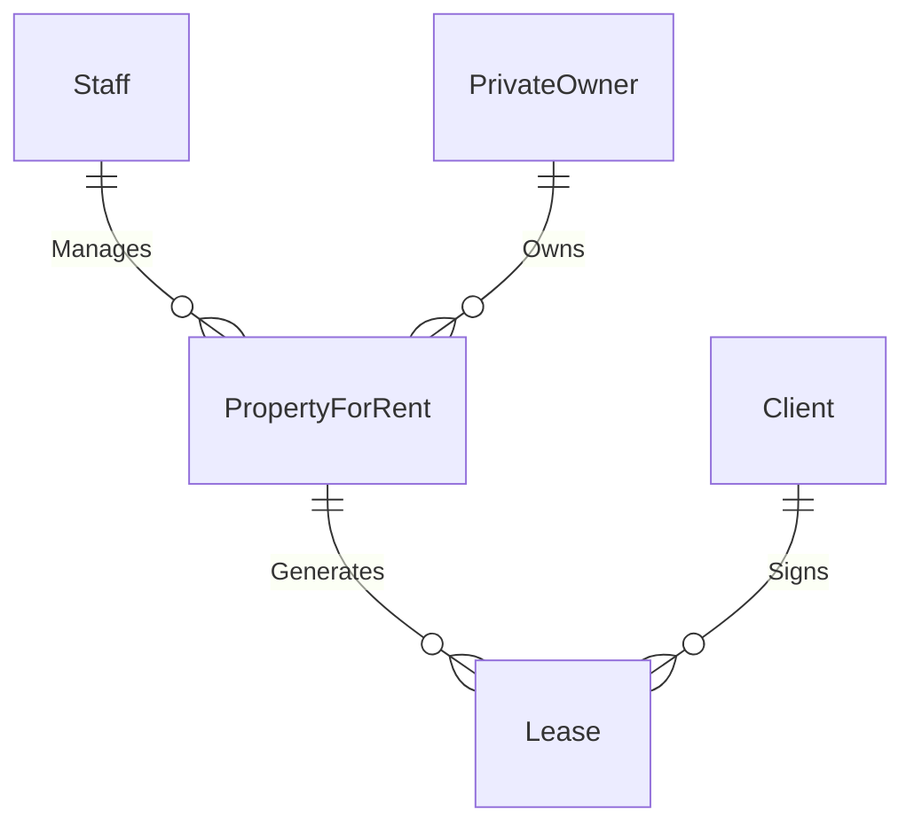

**Objective**: Determine meaningful connections between entity types that reflect business rules.

#### Identification Methods:
1. **Verb Analysis**  
   - Scan requirements for action verbs connecting entities (e.g., "manages", "owns", "signs").
   - Example relationships:
     - `Staff Manages PropertyForRent`
     - `PrivateOwner Owns PropertyForRent`

2. **Entity Pair Checking**  
   - Systematically evaluate potential relationships between entity pairs
   - Focus only on *required* business relationships (exclude incidental connections)

#### Relationship Characteristics:

#### Key Considerations:
- **Multiplicity Constraints** (Cardinality):
  - Document minimum/maximum occurrences (e.g., 1:1, 1:M, M:N)
  - Examples:
    - One staff member manages *many* properties (1:M)
    - One lease is for *one* property (1:1)

- **Complex Relationships**:
  - Ternary relationships (involving 3+ entities)
  - Recursive relationships (e.g., `Staff Supervises Staff`)

- **Trap Detection**:
  - **Fan traps**: Ambiguous paths in relationships
  - **Chasm traps**: Missing mandatory participation

#### Documentation Standards:
**Data Dictionary Extract**:

| Relationship | Entities Involved | Description | Multiplicity |
|--------------|-------------------|-------------|--------------|
| Manages | Staff - PropertyForRent | Staff member responsible for property | One staff to many properties (1:M) |
| Owns | PrivateOwner - PropertyForRent | Ownership record | One owner to many properties (1:M) |

#### Validation Checklist:
1. Does each relationship reflect actual business rules?
2. Are multiplicity constraints accurately defined?
3. Have all traps been eliminated?
4. Can all required transactions be supported?

