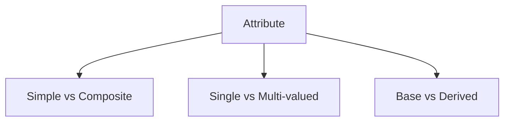
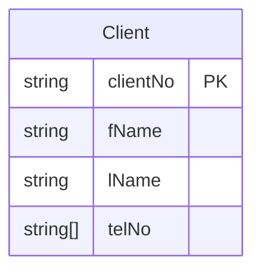

 
# **Objective**: Assign properties to entity/relationship types that capture required data elements.

### Attribute Identification Method:
- **Noun Analysis**:  
  Scan requirements for descriptive nouns/noun phrases representing:  
  - Qualities (e.g., "staff name")  
  - Identifiers (e.g., "property number")  
  - Characteristics (e.g., "rent amount")  
-----
### Attribute Classification:

**1. Simple vs Composite Attributes**

| Type       | Description                          | DreamHome Example          |
|------------|--------------------------------------|----------------------------|
| Simple     | Atomic (indivisible) value           | `Staff.staffNo`            |
| Composite  | Composed of simple sub-attributes    | `Client.name` → `fName`, `lName` |

**2. Single vs Multi-valued Attributes**  
- **Single-valued**: One value per instance (e.g., `PropertyForRent.rooms`)  
- **Multi-valued**: Multiple values allowed (e.g., `Client.telNo` → home/work/mobile)  
  *Note: May alternatively model as separate entity (e.g., `PhoneNumber`)*

**3. Derived Attributes**  
- Calculated from other attributes (marked with `/` in ER diagrams):  
  - `Lease.duration` = `rentFinish` - `rentStart`  
  - `Lease.deposit` = `PropertyForRent.rent` * 2  

#### Common Pitfalls & Solutions:
- **Attribute Duplication**:  
  - *Problem*: Same attribute appears across multiple entities (e.g., `managerName` in both `Staff` and `PropertyForRent`)  
  - *Solution*: Replace with relationship (`Staff Manages PropertyForRent`)

- **Overlapping Entities**:  
  - *Example*: `Assistant` and `Supervisor` both have `staffNo`, `name`, `DOB`  
  - *Solutions*:  
    1. Generalize into `Staff` + `position` attribute  
    2. Keep specialized entities if unique attributes exist  

#### Relationship Attributes:
Some attributes belong to *relationships* rather than entities:  
- `Views(viewDate, comment)` between `Client` and `PropertyForRent`  

#### Documentation Standards:

**Data Dictionary Example**:

| Attribute    | Entity/Relationship | Data Type | Composite? | Derived? | Description           |
|--------------|---------------------|-----------|------------|----------|-----------------------|
| address      | PropertyForRent     | VARCHAR   | Yes (street, city, postcode) | No | Physical location |
| deposit      | Lease               | DECIMAL   | No         | Yes (rent*2) | Security payment |

#### Key Validation Checks:
1. Is every attribute atomic (or properly decomposed if composite)?  
2. Are all multi-valued attributes identified?  
3. Are derived attributes marked and formulas documented?  
4. Do relationship attributes exist where needed?  

---  
**Visual Tip**: For complex composites, consider nested Mermaid diagrams:

