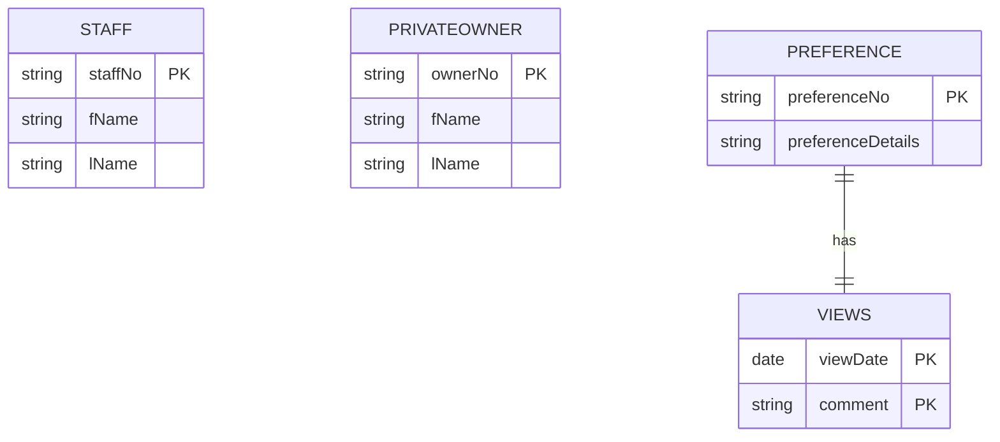

**🎯 Objective:**

- Identify all **candidate keys** for each entity.
    
- Choose one **primary key** from the candidate keys.
    
- Mark any remaining candidate keys as **alternate keys**.
    

---

### 🔑 Key Concepts

- A **candidate key** is the **minimal set of attributes** that uniquely identifies each entity occurrence.
    
- If multiple candidate keys exist:
    
    - Pick **one** as the **primary key**.
        
    - The rest become **alternate keys**.
        
- **Good primary keys** should:
    
    - Use the **fewest attributes possible**.
        
    - Be **stable** (values rarely change).
        
    - Be **compact** (fewest characters or lowest numeric range).
        
    - Be **user-friendly**.
        

---

### ⚠️ Practical Note

- Names alone are **not reliable candidate keys** (e.g., multiple staff with same name).
    
- Better options:
    
    - Use an **existing unique attribute** (e.g., `staffNo`, `ownerNo`).
        
    - Or **create a new unique attribute** if needed.
        

---

### 🏷️ Strong vs Weak Entities

- **Strong entity:** Has its own primary key.
    
- **Weak entity:** Cannot have a primary key without depending on an owner entity — its key is defined when relationships are mapped (Step 2.1).
    

---

### ✅ Good Practice

- **Document** all primary and alternate keys in the **data dictionary**.
    
- Example: In **DreamHome**, `Preference` is a weak entity. Its key depends on its relationship with `Views` (`viewDate` and `comment`).
    

---

## 🗂️ Example: ER Diagram with Primary Keys

---

### 📚 Summary

- Use minimal, stable, simple keys.
    
- Mark unused candidate keys as alternate.
    
- Identify **weak entities** and defer their PKs to relationship mapping.
    
- Keep a clear record in the data dictionary.
    

---
