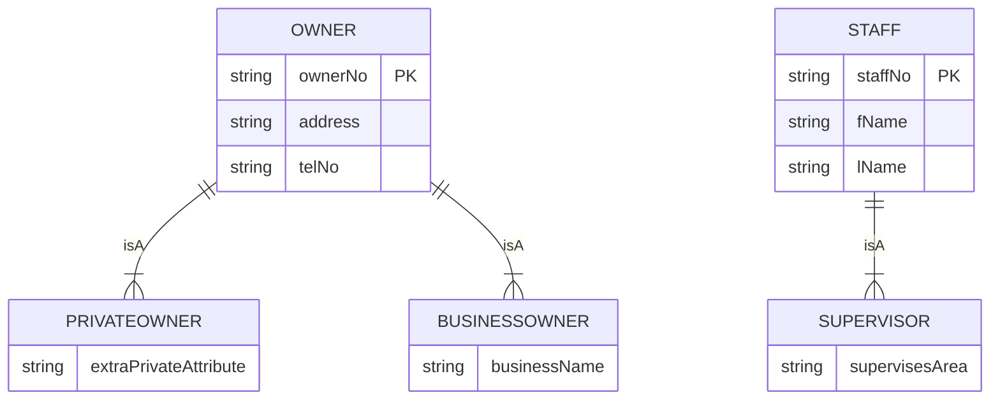

**🎯 Objective:**

- Enhance the ER model (if useful) using advanced concepts like:
    
    - **Specialization/Generalization**
        
    - **Aggregation**
        
    - **Composition**
        

---

### 🗂️ Key Concepts

✅ **Specialization:**

- Define **subclasses** of a superclass to highlight differences.  
    _Example:_ `Owner` → `PrivateOwner` & `BusinessOwner`.
    

✅ **Generalization:**

- Identify **common features** to create a **superclass**.  
    _Example:_ Combine common attributes of `PrivateOwner` and `BusinessOwner` into `Owner`.
    

✅ **Aggregation:**

- Represent a **‘has-a’** or **‘is-part-of’** relationship.  
    _Example:_ `Department` **has** `Staff`.
    

✅ **Composition:**

- Stronger form of aggregation — parts share the **same lifetime** as the whole.  
    _Example:_ `Order` **has** `OrderLineItems`.
    

---

### 📌 Example in _DreamHome_

- `PrivateOwner` and `BusinessOwner` are generalized to an `Owner` superclass (`ownerNo`, `address`, `telNo`).
    
    - The relationship is **mandatory & disjoint** (`{Mandatory, Or}`): each `Owner` must be _either_ `PrivateOwner` _or_ `BusinessOwner`, not both.
        
- `Staff` has a specialization `Supervisor`.
    
    - This subclass is **optional**: not every `Staff` is a `Supervisor`.
        

---

### 📝 Practical Tip

- **No strict rule**: Use enhanced modeling only if it makes the ER diagram **clearer**.
    
- Focus on readability and accurate representation of key relationships.
    
- In _DreamHome_, aggregation and composition were **not used** to keep the design simple.
    

---

## 🗂️ Example: ER Diagram with Generalization

---

## ✅ Summary

- Specialization = subclasses show differences.
    
- Generalization = superclass shows commonalities.
    
- Aggregation & composition = ‘whole-part’ structures (optional).
    
- Keep the ER diagram **clear and readable** — only add complexity if it helps.
    

---

