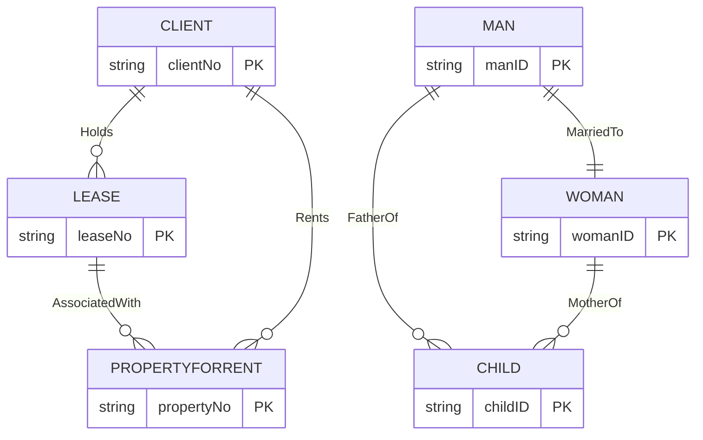

**🎯 Objective:**

- Find and remove **any redundancy** in the conceptual data model.
    
- Keep the model **minimal** and **accurate**.
    

---

### 🗂️ Activities in This Step

1️⃣ **Re-examine One-to-One (1:1) Relationships**

- Sometimes two separate entities actually represent the **same real-world object**.
    
    - Example: `Client` and `Renter` → same thing → merge them.
        
- If they have **different primary keys**, keep one as the primary key and make the other an **alternate key**.
    

---

2️⃣ **Remove Redundant Relationships**

- A relationship is **redundant** if the same information can be found through other valid paths.
    
    - Example:
        
        - Direct: `Client` → `Rents` → `PropertyForRent`
            
        - Indirect: `Client` → `Holds` → `Lease` → `AssociatedWith` → `PropertyForRent`
            
    - If the **indirect path** correctly models the real-world situation (leases link clients and properties), then the direct `Rents` relationship is **redundant** and should be **removed**.
        

---

3️⃣ **Consider Time Dimension**

- Redundancy is not always obvious — **time-based scenarios** can change meaning.
    
    - Example: `Man` → `FatherOf` → `Child` vs. `Man` → `MarriedTo` → `Woman` → `MotherOf` → `Child`.
        
    - These are **not redundant**, because:
        
        - A father can have children outside the current marriage.
            
        - The parents might not be married to each other.
            
- Always check **meaning**, not just structure.
    

---

## ✅ End Result

- A **simplified, non-redundant** conceptual model.
    
- Only keep relationships that add **unique, necessary information**.
    

---

## 🗂️ Example: Redundant vs Non-Redundant

---

## 📌 Best Practice

✔️ Merge synonyms.  
✔️ Remove duplicate paths _unless_ each path represents a **unique meaning**.  
✔️ Always check the **time dimension** and real-world logic.

---

If you’d like, I can help you build a **redundancy checklist** or **data dictionary note** for this step — just say _yes_!