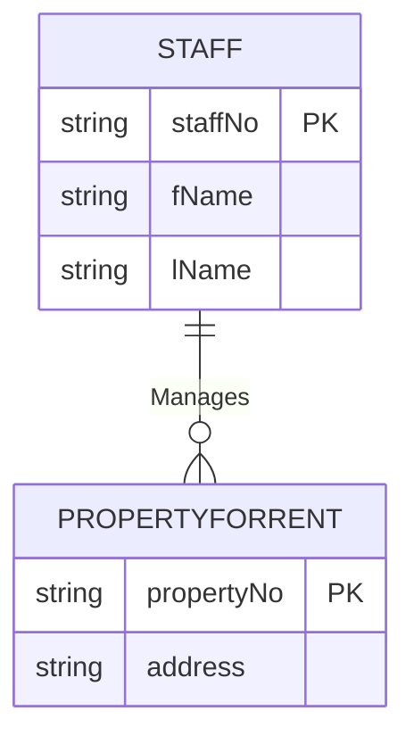

**🎯 Objective:**

- Make sure the conceptual data model **supports all required user transactions**.
    
- Confirm there are **no gaps** in entities, relationships, or attributes needed to perform real-world operations.
    

---

### 🗂️ Why This Step Matters

✅ A model may look technically correct but fail if it **cannot handle actual tasks**.  
✅ Validating now avoids costly problems later in system design or implementation.

---

### 📝 Two Approaches

---

### 1️⃣ **Describing the Transactions**

- **List each transaction** that the system must support.
    
- For each transaction:
    
    - Confirm the **required data** is fully represented in the model.
        
    - Example (_DreamHome_):
        
        - **Transaction:** _List details of properties managed by a named member of staff._
            
        - **Entities:** `Staff` & `PropertyForRent`.
            
        - **Relationship:** `Manages` must exist to link staff to properties.
            

---

### 2️⃣ **Using Transaction Pathways**

- **Draw pathways** on the ER diagram to show how each transaction is **supported**.
    
- This helps:
    
    - Visualize which **parts of the model are used**.
        
    - Spot **unused areas** that might be redundant.
        
    - Spot **missing links** if a transaction cannot be completed.
        
- For complex systems: use **multiple pathway diagrams** to keep them readable.
    

---

### 🗂️ Example: Transaction Pathway

**Explanation:**

- ✅ `Staff` **Manages** `PropertyForRent` → confirms the transaction _“List properties managed by staff member”_ can be done.
    

---

## ⚠️ Key Points

✔️ If a **transaction can’t be resolved manually**, the model is **incomplete** → fix it _now_.  
✔️ If parts of the model are **not used** by any transaction, question if they are really needed.  
✔️ This step can be time-consuming — but fixing issues later is far **more expensive**.

---

## ✅ End Result

- A **validated conceptual model** that fully supports user needs.
    
- Fewer surprises in later design and implementation phases.
    

---
