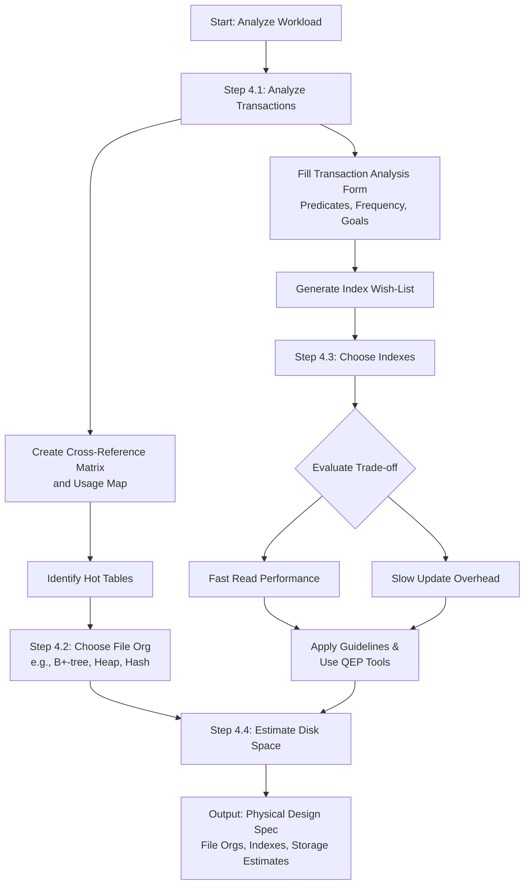

### **18.3 The Physical Database Design Methodology for Relational Databases (Partial)**

#### **Summary**

This section begins a detailed, step-by-step guide to the first major phase of physical design: translating the logical model for a specific DBMS and beginning performance planning.

---

### **Step 3: Translate Logical Data Model for Target DBMS**

**Objective:** To produce a relational database schema from the logical data model that can be implemented in the target DBMS.

This step is the bridge between the DBMS-independent logical model and a specific database system (like Oracle, MySQL, or SQL Server). It requires deep knowledge of the target DBMS's capabilities, such as:
*   How to create tables.
*   Support for primary keys, foreign keys, and alternate keys.
*   Support for data constraints (`NOT NULL`, domains).
*   Support for advanced integrity rules (general constraints).

The step is broken down into three sub-activities.

#### **Step 3.1: Design Base Relations**

**Objective:** To decide how to represent the base relations identified in the logical data model in the target DBMS.

*   **Process:** This involves collating all information from the logical design phase (data dictionary, Data Base Definition Language - DBDL) and defining the precise physical characteristics of each table and column.
*   **Information Used:**
    *   For each **relation**: Name, attributes, primary key, alternate keys, foreign keys, and referential integrity rules.
    *   For each **attribute**: Domain (data type, length, constraints), default value, nullability, and whether it is derived.
*   **Implementation:** The design is formalized using an extended DBDL, which now includes physical details. An example for a `PropertyForRent` relation would define domains for `PropertyType` (single character, must be 'B', 'C', etc.), `PropertyRent` (monetary, range 0–9999.99), and specify `NOT NULL`, `DEFAULT` values, and foreign key actions (`ON UPDATE CASCADE`, `ON DELETE SET NULL`).
*   **Documentation:** The final design and the reasons for all choices (e.g., why a certain data type was selected) must be thoroughly documented.

#### **Step 3.2: Design Representation of Derived Data**

**Objective:** To decide how to represent any derived data present in the logical data model in the target DBMS.

*   **What is Derived Data?** Attributes that can be calculated from other attributes (e.g., `totalSalary`, `numberOfPropertiesManaged`). They are often marked with a `/` in the logical model.
*   **The Critical Trade-off:** The designer must choose between:
    1.  **Storing the data:** This makes retrieval very fast but adds overhead for storage and, more importantly, for maintaining **consistency**. Every time a source attribute changes, the derived attribute must be updated.
    2.  **Calculating on demand:** This avoids storage overhead and consistency issues but can be computationally expensive if the calculation is complex or the query is frequent.
*   **Decision Factors:**
    *   **Frequency of calculation vs. frequency of update:** Store it if it's queried often but changes infrequently.
    *   **Performance criticality:** If a query involving the derived data must be very fast, storing it is preferable.
    *   **DBMS calculation capabilities:** If the calculation is too complex for the DBMS's query language to handle efficiently, storing the result may be necessary.
*   **Documentation:** The decision to store or calculate each derived attribute must be documented, along with the justification.

#### **Step 3.3: Design General Constraints**

**Objective:** To design the general constraints for the target DBMS.

*   **What are General Constraints?** These are business rules that go beyond standard primary key, foreign key, and domain constraints. They enforce complex, real-world rules.
*   **Implementation Methods:** The method depends on the target DBMS's features.
    1.  **CHECK Constraints:** Used for row-level conditions (e.g., `staffCannotManageMoreThan100Properties`).
    2.  **Triggers:** Used for more complex, multi-row constraints or those requiring procedural logic.
    3.  **Application Code:** The last resort if the DBMS does not support the required constraint mechanism. This is less desirable as it decentralizes integrity logic.
*   **Example:** A constraint limiting a staff member to managing 100 properties could be implemented with a `CHECK` constraint that uses a subquery.
*   **Documentation:** All constraints and their chosen implementation method must be documented.

---

### **Step 4: Design File Organizations and Indexes (Introduction)**

**Objective:** To determine the optimal file organizations to store the base relations and the indexes required to achieve acceptable performance.

*   **The Performance Phase:** This step is crucial for ensuring the database meets speed and efficiency requirements.
*   **DBMS Dependence:** The available choices for how data is stored (file organizations like Heap, B+-tree, Hashing) are entirely dependent on the target DBMS. Some systems offer many choices; others (like many desktop DBMSs) are fixed.
*   **The Need for Analysis:** Decisions here cannot be made in a vacuum. They must be guided by a thorough understanding of:
    *   The **workload**: The mix of queries and updates run against the database.
    *   The **performance goals**: How fast specific transactions need to be.
    *   The DBMS's **query optimizer**: How the DBMS decides to execute queries, as this affects whether indexes will be used.
*   **The Upcoming Activities (To be detailed in Step 4.1-4.4):**
    *   **4.1 Analyze Transactions:** Understand the workload.
    *   **4.2 Choose File Organizations:** Select how each table is physically stored.
    *   **4.3 Choose Indexes:** Select which indexes to create to speed up access.
    *   **4.4 Estimate Disk Space:** Forecast storage requirements.

----

### **Step 4: Design File Organizations and Indexes**

#### **Summary**

This is the core performance-tuning phase of physical database design. The goal is to determine how data is stored on disk (file organizations) and how to create efficient access paths to it (indexes) to meet performance requirements. This process is heavily guided by analyzing how the database will be used.

---

### **Step 4.1: Analyze Transactions**

**Objective:** To understand the functionality of the transactions that will run on the database and to analyze the important transactions.

Effective physical design requires deep knowledge of the database's workload. This analysis involves gathering both **qualitative** (what the transaction does) and **quantitative** (how often, when) information.

*   **What to Identify:**
    *   **Frequent transactions** that have a significant impact on performance.
    *   **Critical transactions** essential to business operations.
    *   **Peak load times** when database demand is highest.

*   **The 80/20 Rule:** Focus on the most important 20% of transactions, which typically account for 80% of the total data access.

*   **Process for Analysis:**
    1.  **Map Transaction Paths to Relations:** Identify which tables each transaction accesses. Use a **Transaction/Relation Cross-Reference Matrix** (like Table 18.1) to visualize this. This helps pinpoint heavily used tables (e.g., `Staff` and `PropertyForRent` in the example).
    2.  **Determine Frequency Information:** Understand the volume of data and transaction rates. Use a **Transaction Usage Map** (like Figure 18.3) to diagrammatically show transaction volume against table size. This highlights potential bottlenecks (e.g., a large `PropertyForRent` table being accessed frequently).
    3.  **Analyze Data Usage:** For each important transaction, determine:
        *   **Tables and attributes** accessed and the **type of access** (Insert, Read, Update, Delete). *Note: Avoid indexing attributes that are frequently updated.*
        *   **Predicates** used in `WHERE` clauses. Identify if they are:
            *   **Pattern matches** (e.g., `LIKE '%Smith%'`)
            *   **Range searches** (e.g., `BETWEEN 10000 AND 20000`)
            *   **Exact-match** retrievals (e.g., `salary = 30000`)
            *   *These attributes are prime candidates for indexes.*
        *   **Join attributes** for queries involving multiple tables. *These are also strong index candidates.*
        *   **Attributes** used for `ORDER BY`, `GROUP BY`, and built-in functions (e.g., `SUM`, `AVG`).
        *   **Expected frequency** (e.g., 50 times per hour) and **performance goals** (e.g., must complete in <1 second).

*   **Documentation:** Use a **Transaction Analysis Form** (like Figure 18.4) to meticulously record all this information for each major transaction. This form becomes the primary input for deciding on indexes and storage structures.

---

### **Step 4.2: Choose File Organizations**

**Objective:** To determine an efficient file organization for each base relation.

A file organization defines how tuples are physically stored on disk. The choice has a major impact on performance for data retrieval and loading.

*   **DBMS Dependence:** This step is only relevant if the target DBMS allows a choice of file organizations. Many PC DBMSs (like Microsoft Access) use a fixed structure, while enterprise DBMSs (like Oracle) offer options.
*   **Common Types:** The main types discussed are Heap, Hash, ISAM, **B+-tree** (the most common default), and Clusters.
*   **Trade-offs:** Some organizations are efficient for bulk loading but inefficient for querying, and vice-versa. The choice is a trade-off based on the analyzed transaction mix.
*   **Documentation:** The chosen file organization for each table and the reason for the choice must be documented.

---

### **Step 4.3: Choose Indexes**

**Objective:** To determine whether adding indexes will improve the performance of the system.

Indexes are the most common and powerful tool for improving query performance. However, they introduce overhead on data modification operations (INSERT, UPDATE, DELETE). The key is to find the right balance.

*   **Types of Indexes:**
    *   **Primary Index:** Created on the primary key. Often created automatically by the DBMS.
    *   **Clustering Index:** Defines the physical order of table data based on a non-key attribute. A table can have only one clustering index.
    *   **Secondary Index:** An index on any other attribute to speed up searches.

*   **Guidelines for Creating a "Wish-List" of Indexes:**
    1.  **Don't index small tables.**
    2.  **Index primary keys** (if not already the file organization key).
    3.  **Index foreign keys** that are frequently used in joins.
    4.  **Index attributes** frequently used in `WHERE` clause predicates (exact-match, range searches), `ORDER BY`, `GROUP BY`, and operations involving sorting (`DISTINCT`, `UNION`).
    5.  **Consider "index-only" plans:** Index attributes used in aggregates and grouping so the query can be answered using only the index data.
    6.  **Avoid indexing** attributes that are frequently updated.
    7.  **Avoid indexing** attributes with low cardinality (few unique values) or where queries will return a large percentage (>25%) of the table's rows, as a full table scan is more efficient.
    8.  **Avoid indexing** long character strings.

*   **Removing Indexes from the Wish-List:**
    *   Evaluate the impact of each potential index on update performance. Remove any index that would significantly slow down critical update transactions.
    *   Use the DBMS's **Query Execution Plan (QEP)** tool (e.g., Oracle's `EXPLAIN PLAN`) to test if indexes are actually being used and improving performance.
    *   For large batch inserts, consider dropping indexes first and recreating them afterward to improve load performance.

*   **DBMS-Specific Examples:** The text provides examples of how to create indexes in SQL and discusses specific guidelines for systems like Microsoft Access and Oracle.
*   **Documentation:** The final choice of indexes and the justification for each must be thoroughly documented.

---

### **Step 4.4: Estimate Disk Space Requirements**

**Objective:** To estimate the amount of disk space that will be required by the database.

*   **Purpose:** To ensure the current hardware is sufficient or to procure new hardware if needed. This includes planning for future growth.
*   **Method:** The estimate is based on:
    *   The number of tuples in each relation (including maximum and expected growth).
    *   The average size of each tuple (sum of the byte size of all attributes + overhead).
*   **DBMS Dependence:** The calculation is highly specific to the target DBMS, as storage overhead and data type sizes can vary.

----

### **Step 5: Design User Views**

#### **Summary**

**Objective:** To design the user views that were identified during the requirements collection and analysis stage.

*   **Background:** User views were first identified during the requirements stage (e.g., Director, Manager, Supervisor, Assistant, Client for DreamHome). These were merged using a centralized approach into logical user view groups (e.g., `Branch` and `StaffClient`).
*   **Purpose of Views:** In a multi-user DBMS, views are not just a convenience; they are a critical security and customization mechanism. They provide:
    *   **Data Independence:** Insulating users from changes in the base table structures.
    *   **Reduced Complexity:** Hiding complex queries from users.
    *   **Customization:** Tailoring the database presentation to a user's specific needs.
*   **Implementation:** Views are implemented using the SQL `CREATE VIEW` statement (or equivalent graphical tool in a DBMS like MS Access). This step involves writing the SQL query that defines each view based on the underlying base relations.
*   **Documentation:** The SQL definition for each user view must be fully documented.

---

### **Step 6: Design Security Mechanisms**

#### **Summary**

**Objective:** To design the security mechanisms for the database as specified during the requirements collection stage.

*   **Importance:** A database is a vital corporate resource, and protecting it is paramount. Security requirements should already be specified in the system requirements specification.
*   **Two Types of Security:**
    1.  **System Security:** Controls access to the database system itself (e.g., usernames, passwords, authentication).
    2.  **Data Security:** Controls access to database objects (tables, views, procedures) and the operations users can perform on them (SELECT, INSERT, UPDATE, DELETE).
*   **Implementation (Discretionary Access Control):** Security is primarily implemented using the SQL Data Control Language (DCL) commands `GRANT` and `REVOKE` to assign and remove privileges from users or roles. The specific capabilities are dependent on the target DBMS.
*   **Role of Views:** User views designed in Step 5 are a key part of the security strategy, as they can restrict users to seeing only a subset of the data.
*   **Documentation:** All security measures must be thoroughly documented. This includes:
    *   User roles and their assigned privileges.
    *   The specific `GRANT` statements used.
    *   Any changes to the logical model due to security-driven design decisions.
