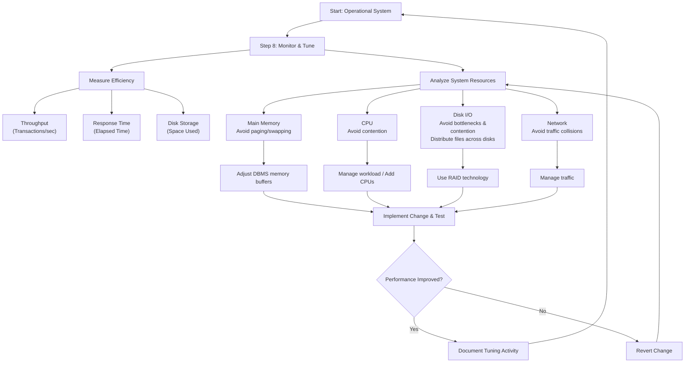

### **Step 8: Monitor and Tune the Operational System**

**Objective:** To monitor the operational system and improve performance to correct inappropriate design decisions or reflect changing requirements.

Tuning is a continuous, ongoing process throughout the system's lifecycle. It involves measuring key metrics and understanding how system resources interact.

*   **Measures of Efficiency (The Tuning Trade-Off):**
    *   **Transaction Throughput:** The number of transactions processed per second.
    *   **Response Time:** The time taken for a single transaction to complete.
    *   **Disk Storage:** The amount of disk space used. Designers often trade this off for better response time or throughput.

*   **Understanding System Resources:**
    1.  **Main Memory:** The goal is to have enough RAM to minimize **paging/swapping** (moving data to/from disk). The DBMS uses memory for caches (e.g., data dictionary cache). Understanding user access patterns is key.
    2.  **CPU:** The goal is to prevent **CPU contention** (processes waiting for CPU time). Bottlenecks are often caused by excessive paging. Monitor workload over 24 hours to handle peak demand.
    3.  **Disk I/O:** The goal is to avoid **I/O bottlenecks** and **disk contention** (multiple processes trying to access the same disk simultaneously).
        *   **Solution:** Distribute I/O by placing OS files, database files, index files, and recovery logs on **separate physical disks**.
        *   **Technology:** **RAID** (Redundant Array of Independent Disks) is used to improve both I/O performance and reliability.
    4.  **Network:** The goal is to avoid **network bottlenecks** caused by excessive traffic or collisions.

*   **Tuning Benefits:**
    *   Avoids costly hardware upgrades.
    *   May allow for downsizing to cheaper hardware.
    *   Improves user productivity and morale.
    *   Increases customer satisfaction.

*   **A Final Word of Caution:** Tuning is a balancing act. A change that improves one area (e.g., adding an index for one query) can negatively impact another (e.g., slow down an update transaction). Always test changes on a non-production system first.

*   **Handling New Requirements:** The system must also evolve. Examples include adding new data types (e.g., pictures, long comments) or enabling new access methods (e.g., Web publishing). These new requirements must be implemented and their impact on performance must be monitored.

