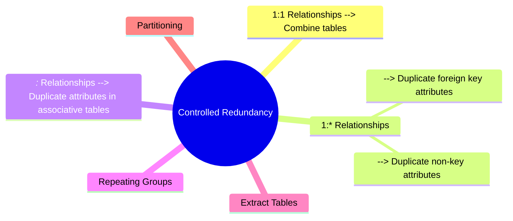

# Chapter 19: Methodology—Monitoring and Tuning the Operational System

---

## 19.1 Denormalizing and Introducing Controlled Redundancy

- **Denormalization** = process of deliberately reversing some normalization rules to improve performance.
    
- **Controlled redundancy** = intentional duplication of data to reduce expensive joins or queries.
    
- Goal: improve performance at the cost of some extra storage and potential update anomalies.
    

### Step 7: Consider the Introduction of Controlled Redundancy

#### Step 7.1 Combining one-to-one (1:1) relationships

- In normalization, 1:1 relationships are often represented as two separate relations.
    
- In practice, combining them into one table:
    
    - **Benefits**: reduces joins and improves query speed.
        
    - **Cost**: possibly more null values if not all attributes apply to both sides.
        
- Example: Staff and StaffDetails could be merged if always used together.
    

#### Step 7.2 Duplicating non-key attributes in one-to-many (1:*) relationships

- Normally, non-key attributes only appear once in the “one” side.
    
- Sometimes it’s useful to duplicate them in the “many” side.
    
- **Benefit**: avoids joins when querying frequently accessed attributes.
    
- **Cost**: redundancy and potential inconsistency if updates are not handled properly.
    

#### Step 7.3 Duplicating foreign key attributes in one-to-many (1:*) relationships

- Example: Storing `branchAddress` in both Branch and Staff tables.
    
- **Benefit**: faster queries when branch details are frequently required with staff data.
    
- **Cost**: redundancy and maintenance overhead.
    

#### Step 7.4 Duplicating attributes in many-to-many (_:_) relationships

- Many-to-many relationships are usually implemented with a separate associative relation.
    
- Sometimes duplicating frequently used attributes into the associative table avoids repeated joins.
    

#### Step 7.5 Introducing repeating groups

- Normally avoided in normalization.
    
- May be reintroduced when queries often need repeated attributes, such as multiple phone numbers.
    
- **Benefit**: faster access for specific use cases.
    
- **Cost**: loss of flexibility and possible anomalies.
    

#### Step 7.6 Creating extract tables

- **Extract tables (summary tables)**: store precomputed results (aggregates, summaries) from base data.
    
- Example: Monthly sales totals table.
    
- **Benefit**: speeds up reporting and aggregation queries.
    
- **Cost**: extra space, must be updated whenever base data changes.
    

#### Step 7.7 Partitioning relations

- Dividing large relations into smaller ones for performance.
    
- **Types of partitioning**:
    
    - Horizontal (rows based on criteria, e.g., region or time).
        
    - Vertical (columns split across tables).
        
- **Benefit**: improves access time and parallelism.
    
- **Cost**: complexity in queries and maintenance.
    

**Diagram: Controlled redundancy options**

---

## 19.2 Monitoring the System to Improve Performance

Even after design, systems must be monitored and tuned to maintain good performance.

### Step 8: Monitor and Tune the Operational System

- **Objective**:
    
    - Identify performance problems.
        
    - Adjust system resources and queries to improve efficiency.
        
- **Performance tuning** is continuous → workload changes over time.
    
- **DBMS tools**: Many systems provide utilities to monitor transactions, CPU usage, buffer usage, disk I/O, and query execution plans.
    

---

### Understanding System Resources

Performance depends on 4 main resources:

1. **Main memory (RAM)**
    
    - Used for caching data, indexes, buffers, and temporary query results.
        
    - Tuning: increase buffer size, adjust cache policies.
        
2. **CPU**
    
    - Handles query processing, optimization, and concurrency control.
        
    - Tuning: rewrite queries, reduce unnecessary computations, balance load.
        
3. **Disk I/O**
    
    - Major bottleneck, since reading/writing to disk is slower than memory.
        
    - Tuning: use indexes, clustering, RAID, denormalization, partitioning.
        
4. **Network**
    
    - Important in client-server and distributed databases.
        
    - Tuning: reduce data transfer, use compression, optimize queries to send less data.
        

---

### New Requirements for DreamHome Case Study

- **Example scenario**: DreamHome must monitor how the system performs with growing data.
    
- Managers may require new reports or queries not anticipated in original design.
    
- Monitoring helps identify if:
    
    - More indexes are needed.
        
    - Queries need rewriting.
        
    - More hardware resources are necessary.
        

---

## Chapter Summary

- Physical design may require denormalization to meet performance goals.
    
- Controlled redundancy techniques include: combining relations, duplicating attributes, repeating groups, extract tables, and partitioning.
    
- Denormalization should always be **controlled** and carefully documented to avoid uncontrolled redundancy problems.
    
- Monitoring and tuning are essential because database workloads evolve over time.
    
- Key resources to watch: **memory, CPU, disk I/O, network**.
    
- Database administrators (DBAs) must continuously balance storage cost, query performance, and update complexity.
    

---

# Key Takeaways

- **Denormalization** is not bad design but a trade-off for performance.
    
- **Controlled redundancy** helps speed up queries but increases update complexity.
    
- **Monitoring** is an ongoing task, not a one-time step.
    
- Tools and techniques differ depending on DBMS, but principles remain the same.
    

---

