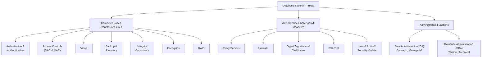

### **Chapter 20: Security and Administration**

#### **Summary**

This chapter provides a comprehensive overview of the critical areas of database security and the administrative roles responsible for it. It covers the mechanisms that protect data from threats, the security features of specific DBMSs, the unique challenges of web security, and the distinct responsibilities of Data Administration (DA) and Database Administration (DBA) functions.

---

### **20.1 Database Security**

**Definition:** Database security encompasses the mechanisms that protect the database against both intentional and accidental threats. It is not just about the data; it involves securing the entire system, including hardware, software, people, and data.

*   **Why it Matters:** Data is a crucial corporate asset. Loss or compromise can lead to theft/fraud, loss of competitiveness, legal action, operational failure, and reputational damage.
*   **Areas of Loss to Prevent:**
    1.  **Theft and Fraud**
    2.  **Loss of Confidentiality** (secrecy of critical organizational data)
    3.  **Loss of Privacy** (protection of personal data about individuals)
    4.  **Loss of Integrity** (data becomes invalid or corrupted)
    5.  **Loss of Availability** (data or system cannot be accessed, e.g., 24/7 operations)

**Threat:** Any situation or event (intentional or accidental) that may adversely affect a system and the organization. Table 20.1 and Figure 20.1 provide extensive lists of examples, categorized by the type of loss they cause and the system component they target (Hardware, Software, Networks, Database, Users, Programmers, Administrators).

---

### **20.2 Countermeasures—Computer-Based Controls**

This section details the primary technical controls available in a multi-user environment to counter the threats identified.

1.  **Authorization & Authentication:**
    *   **Authorization:** Granting a user the right to access the system or specific objects within it.
    *   **Authentication:** Verifying the identity of a user (e.g., via usernames and passwords). Cloud computing often uses automated validation via email or other services.

2.  **Access Controls:** Govern what authorized users can do. Implemented through privileges.
    *   **Discretionary Access Control (DAC):** Managed using SQL `GRANT` and `REVOKE` statements. The owner of an object can grant privileges to others. **Weakness:** An unauthorized user can trick an authorized user into disclosing data.
    *   **Mandatory Access Control (MAC):** A system-wide, policy-based model where users have clearances and data objects have security classifications (e.g., Top Secret, Secret, Confidential, Unclassified).
        *   **Bell-LaPadula Model:** A subject (user) can read an object only if their clearance is **>=** the object's classification (*Simple Security Property*). A subject can write to an object only if their clearance is **<=** the object's classification (*-Property*). This prevents users from writing highly classified data down to a lower level.
        *   **Multilevel Relations & Polyinstantiation:** To avoid inference attacks, the security class can become part of the primary key, leading to a situation where multiple tuples with the same "business key" exist at different security levels (polyinstantiation).

3.  **Views:** A powerful security tool. A virtual relation derived from base tables that can hide sensitive data from users by restricting both the rows and columns they can see.

4.  **Backup and Recovery:**
    *   **Backup:** Periodically copying the database and log files to offline storage.
    *   **Journaling:** Maintaining a log of all changes made to the database (the transaction log). This is crucial for restoring the database to a consistent state after a failure.

5.  **Integrity Constraints:** Enforce data validity and business rules (e.g., primary keys, foreign keys, CHECK constraints), preventing the storage of incorrect data.

6.  **Encryption:** Encoding data so it is unreadable without a decryption key.
    *   **Symmetric Encryption:** Uses the same key for encryption and decryption (e.g., DES, AES). Fast but requires secure key exchange.
    *   **Asymmetric Encryption:** Uses a public/private key pair (e.g., RSA). The public key encrypts, the private key decrypts. Solves the key distribution problem. Often used together with symmetric encryption for efficiency.

7.  **RAID (Redundant Array of Independent Disks):** A hardware solution for fault tolerance and improved performance.
    *   **Purpose:** Protects against disk drive failures, which are common.
    *   **How it works:** Data is striped (spread) across multiple disks. Redundant information (parity or error-correcting codes) is also stored, allowing data to be reconstructed if a disk fails.
    *   **Common Levels:**
        *   **RAID 0:** Striping for performance only. **No redundancy.**
        *   **RAID 1:** Mirroring. Complete redundancy by duplicating all data on a second disk.
        *   **RAID 5:** Block-level striping with distributed parity. Good balance of performance, storage efficiency, and redundancy.

---

### **20.3 & 20.4 Security in Specific DBMSs**

*   **Microsoft Access:** Provides security through:
    *   **Splitting the Database:** Separating tables (back-end) from application objects like forms and reports (front-end).
    *   **Database Passwords:** Encrypting the database file and requiring a password to open it.
    *   **Trust Center:** Managing trusted locations and enabling/disabling content like macros.
    *   **Packaging & Signing:** Wrapping the database in a signed package to prove it hasn't been tampered with.
*   **Oracle:** Provides robust security through:
    *   **System Privileges:** Rights to perform system-wide actions (e.g., `CREATE USER`).
    *   **Object Privileges:** Rights to perform actions on specific objects (e.g., `SELECT ON Staff`). See Table 20.2.
    *   **Roles:** Named groups of privileges that can be granted to users. This simplifies privilege management (e.g., a 'Manager' role). **Best practice is to grant privileges to roles, not individual users.**

---

### **20.5 DBMSs and Web Security**

Web environments introduce unique security challenges as TCP/IP and HTTP were not designed with security in mind. Key technologies and concepts include:

1.  **Proxy Servers:** Sit between a browser and web server. They can **improve performance** (by caching pages) and **filter requests** (by blocking certain websites).
2.  **Firewalls:** Act as a barrier between a trusted internal network and untrusted external networks (like the Internet). They examine all traffic and block anything that doesn't meet defined security rules. Types include packet filters, application gateways, and circuit-level gateways.
3.  **Message Digests & Digital Signatures:**
    *   **Message Digest:** A one-way hash function that creates a unique fingerprint for a message. Verifies **integrity** (the message hasn't changed).
    *   **Digital Signature:** A digest encrypted with the sender's private key. Verifies **authenticity** (who sent it) and provides **non-repudiation** (the sender cannot deny sending it).
4.  **Digital Certificates:** An electronic document issued by a Certificate Authority (CA) that binds a public key to an individual or organization. Used to verify identity and establish trust over a network.
5.  **Kerberos:** A network authentication protocol that provides a centralized security server for verifying user identities.
6.  **Secure Sockets Layer (SSL) / Transport Layer Security (TLS):** Creates an encrypted link between a web server and a browser, ensuring all data passed between them remains private and integral. (HTTPS uses SSL/TLS).
7.  **Secure HTTP (S-HTTP):** An extension to HTTP designed to encrypt individual messages, unlike SSL which encrypts the entire connection.
8.  **Java Security:** The Java "sandbox" model restricts what applets can do (e.g., no file system access). Security is enforced by the **Class Loader**, **Bytecode Verifier**, and **Security Manager**. Applets can be digitally signed to gain elevated "trusted" status.
9.  **ActiveX Security:** Unlike Java, ActiveX places no inherent restrictions on controls. It relies on **Authenticode** digital signatures to identify the publisher. The user is responsible for deciding whether to trust and run the control.

---

### **20.6 Data Administration and Database Administration**

These are two distinct but related organizational functions.

*   **Data Administration (DA):**
    *   **Focus:** Managerial, strategic. Manages the **data resource** itself.
    *   **Responsibilities:** Involved in planning, defining data standards, policies, and corporate data models. Works on **conceptual and logical design**. Focuses on *what* data is needed and *why*. (See Table 20.3 for full task list).
*   **Database Administration (DBA):**
    *   **Focus:** Technical, tactical. Manages the **database system** software and its physical implementation.
    *   **Responsibilities:** DBMS selection, physical database design, implementation, security/integrity enforcement, performance tuning, backup and recovery. Focuses on *how* to store and access the data efficiently and securely. (See Table 20.4 for full task list).

**Key Difference:** DA is **DBMS-independent** and business-focused, while DBA is **DBMS-dependent** and technology-focused. Their main task differences are summarized in Table 20.5.

