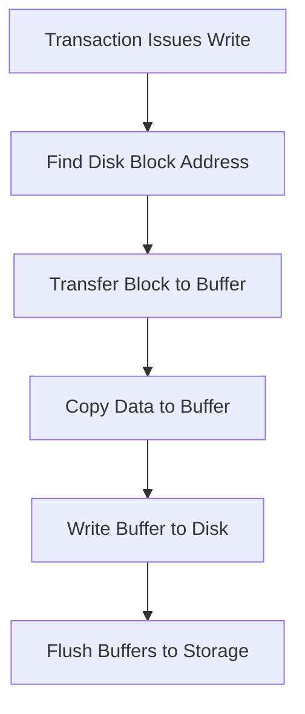
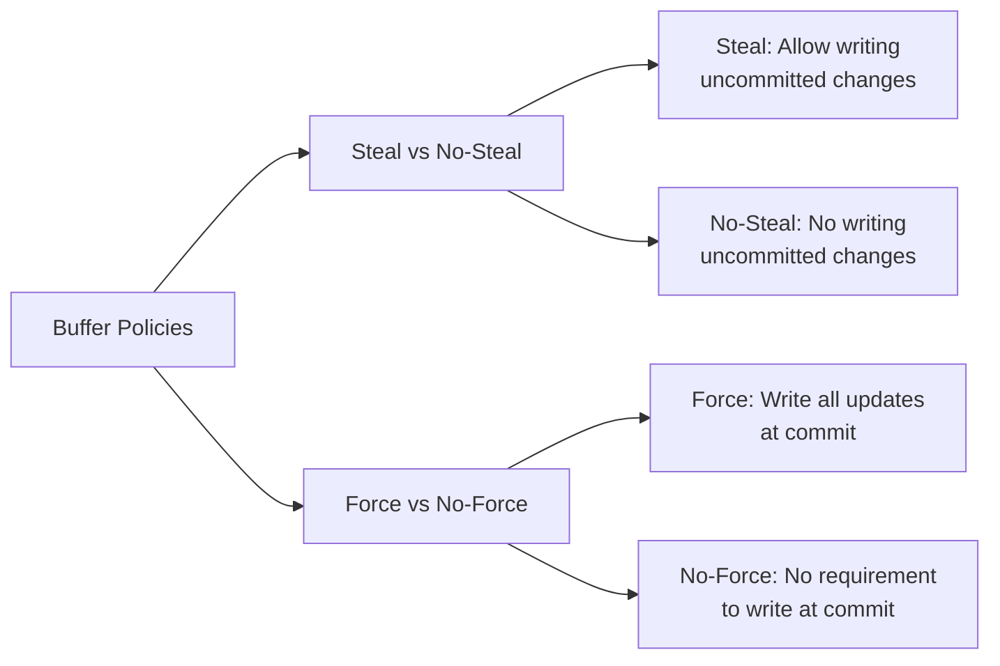
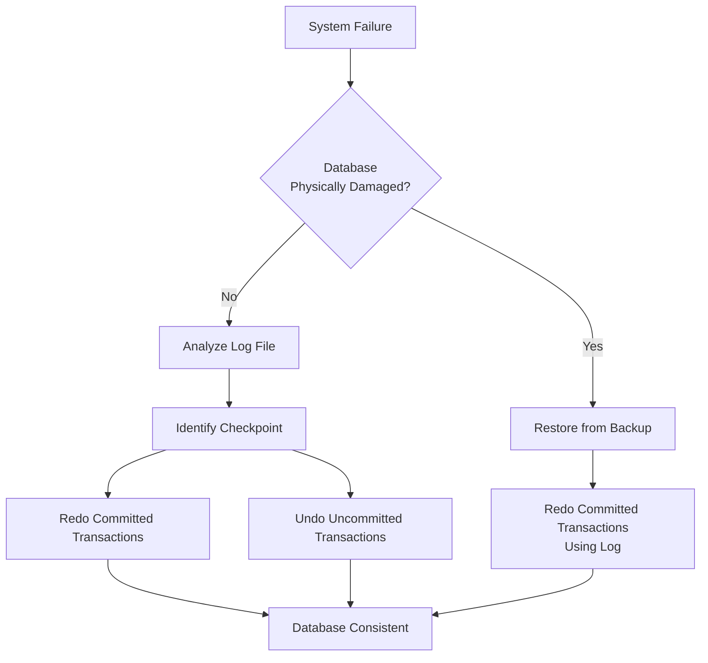

### **22.3 Database Recovery**

#### **Definition**
**Database Recovery:** The process of restoring the database to a correct state after a failure.

---

#### **22.3.1 The Need for Recovery**

**Types of Storage Media:**
- **Volatile Storage:** Main memory (lost on system crash)
- **Nonvolatile Storage:** Magnetic disk, magnetic tape, optical disk
- **Stable Storage:** Replicated nonvolatile storage (e.g., RAID)

**Causes of Failure:**
- System crashes (hardware/software errors)
- Media failures (disk head crashes)
- Application software errors
- Natural physical disasters
- Human error or sabotage
- Carelessness or unintentional destruction

**Principal Effects of Failure:**
1. Loss of main memory (including database buffers)
2. Loss of disk copy of the database

---

#### **22.3.2 Transactions and Recovery**

**Recovery Manager Responsibilities:**
- Guarantees **atomicity** and **durability** (ACID properties)
- Ensures either **all effects** of a transaction are permanently recorded or **none** are

**Database Write Operations:**

**Key Concepts:**
- **Force-writing:** Explicit writing of buffers to secondary storage
- **Redo (Rollforward):** Reapplying updates of committed transactions
- **Undo (Rollback):** Reversing effects of uncommitted transactions
- **Partial Undo:** Single transaction rollback
- **Global Undo:** All active transactions rollback

---

#### **22.3.3 Recovery Facilities**

**Four Essential Recovery Facilities:**

1. **Backup Mechanism**
   - Periodic backup copies of database and log file
   - Complete or incremental backups
   - Stored on offline storage

2. **Log File (Journal)**
   - Contains information about all database updates
   - **Transaction Records:**
     - Transaction identifier
     - Type of log record (start, insert, update, delete, abort, commit)
     - Data item identifier
     - Before-image (old value)
     - After-image (new value)
     - Log management information

   - **Checkpoint Records**
   - Often duplexed/triplexed for reliability

3. **Checkpoint Facility**
   - Point of synchronization between database and log
   - **Checkpoint Operations:**
     - Write all log records to secondary storage
     - Write modified database buffers to secondary storage
     - Write checkpoint record containing active transaction identifiers

4. **Recovery Manager**
   - Restores database to consistent state after failure

**Buffer Management:**
- **pinCount:** Number of transactions using a buffer
- **dirty:** Indicates if buffer has been modified
- **Replacement Strategies:** FIFO, LRU

**Buffer Policies:**

**Common Practice:** Most DBMSs use **steal, no-force** policy

---

#### **22.3.4 Recovery Techniques**

**Two Main Scenarios:**
1. **Database Physically Damaged:** Restore from backup + redo committed transactions
2. **Database Inconsistent:** Use log file to restore consistency

**A. Deferred Update Protocol**
- Updates written to database only **after commit**
- **Steps:**
  1. Write transaction start record to log
  2. Write log records for all operations (excluding before-images)
  3. At commit: write commit record, flush log, then update database
  4. If abort: ignore log records

- **Advantages:** No undo operations needed
- **Disadvantages:** Requires redo of all committed transactions

**B. Immediate Update Protocol**
- Updates applied to database **as they occur**
- **Write-Ahead Log Protocol:** Log record must be written before database update
- **Steps:**
  1. Write transaction start record
  2. Write log record, then update database buffers
  3. At commit: write commit record
  4. Database writes occur when buffers flushed

- **Recovery:**
  - **Redo** transactions with start and commit records
  - **Undo** transactions with start but no commit record

**C. Shadow Paging**
- Maintains two page tables: **current** and **shadow**
- **Advantages:**
  - No log file overhead
  - Faster recovery (no undo/redo)
- **Disadvantages:**
  - Data fragmentation
  - Requires garbage collection

---

#### **22.3.5 Recovery in a Distributed DBMS**

**Challenges:**
- Distributed transactions access data at multiple sites
- Subtransactions must be coordinated
- Need to ensure **atomicity** of global transaction

**Protocols:**
- **Two-Phase Commit (2PC)**
- **Three-Phase Commit (3PC)**
- Ensure all subtransactions commit or all abort

---

#### **Recovery Process Summary**

**Key Points:**
- **Log file** is fundamental to all recovery schemes
- **Checkpoints** reduce recovery time by limiting log search
- **Write-ahead logging** ensures undo capability
- Choice of recovery technique depends on performance requirements and failure characteristics