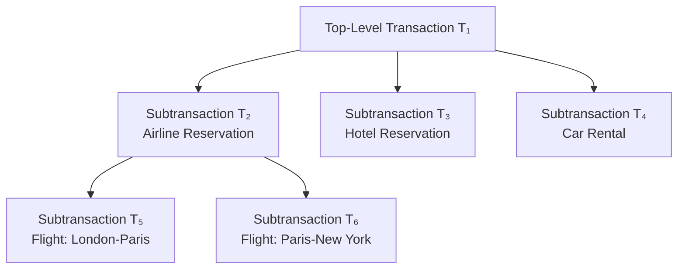
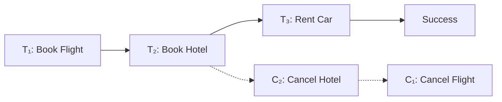
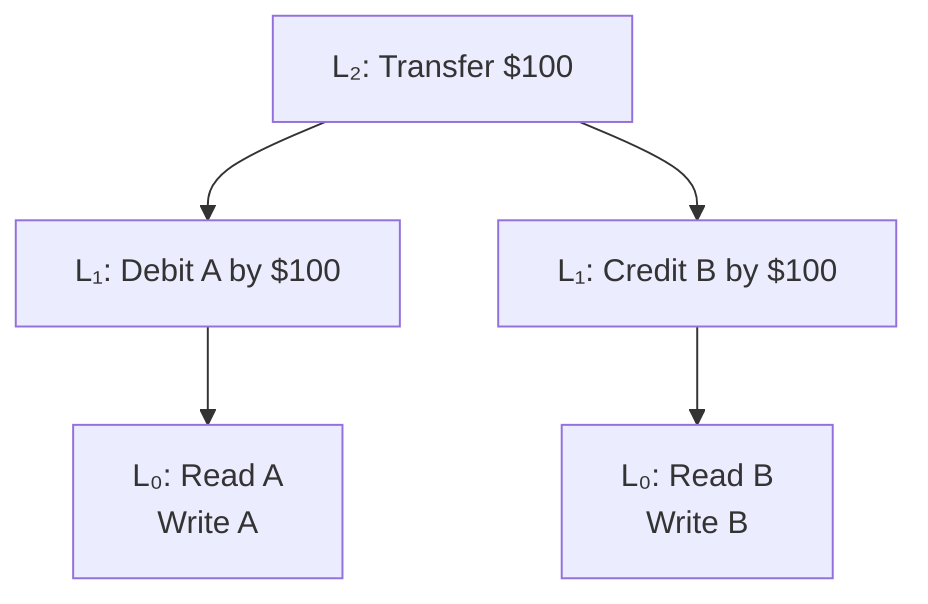
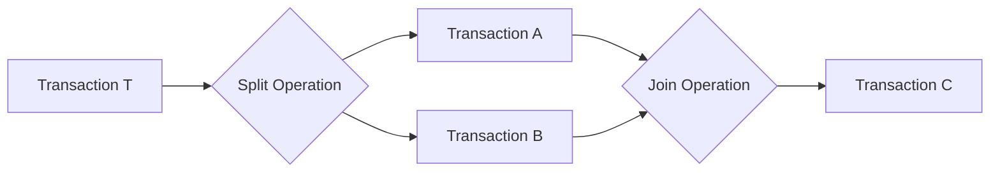
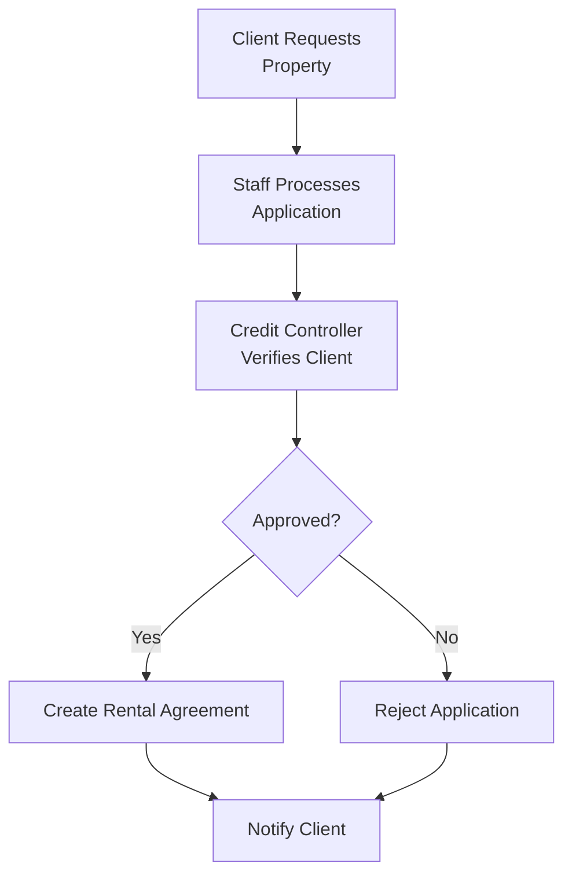
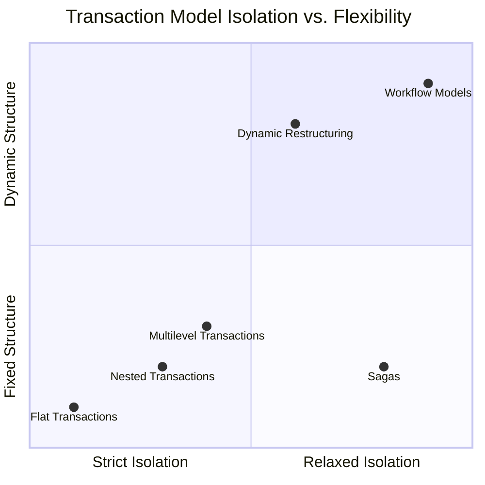

### **22.4 Advanced Transaction Models**

#### **Introduction**
Traditional transaction models (ACID properties) work well for short-duration business transactions but are inadequate for advanced applications like:
- CAD/CAM systems
- Software engineering
- Workflow management

**Problems with Traditional Models for Advanced Applications:**
- **Long duration** (hours to months) increases failure susceptibility
- **High data contention** from locking many items for long periods
- **Increased deadlock** probability
---

#### **22.4.1 Nested Transaction Model**

**Definition:** A transaction structured as a hierarchy of subtransactions (parent-child relationships).



**Key Characteristics:**
- Only **leaf-level** subtransactions perform database operations
- **Bottom-up commit**: Children must commit before parents
- **Partial results** are visible only to immediate parents
- **Independent recovery**: Child failure doesn't necessarily abort parent

**Parent Recovery Options:**
1. **Retry** the failed subtransaction
2. **Ignore failure** (if subtransaction is non-vital)
3. **Run contingency** subtransaction
4. **Abort** the entire transaction

**Advantages:**
- **Modularity** - decomposes complex transactions
- **Finer granularity** for concurrency and recovery
- **Intra-transaction parallelism**
- **Intra-transaction recovery** without side effects

**Savepoints:**
- Identifiable points in a transaction for partial rollback
- Does **not** support intra-transaction parallelism
- Example: `SAVE WORK` and `ROLLBACK WORK <savepoint>`

---

#### **22.4.2 Sagas**

**Definition:** A sequence of flat transactions that can be interleaved with other transactions.

**Structure:**
- Sequence: T₁, T₂, T₃, ..., Tₙ
- Corresponding compensating transactions: C₁, C₂, C₃, ..., Cₙ

**Execution Patterns:**
```
Successful: T₁ → T₂ → T₃ → ... → Tₙ
Failed: T₁ → T₂ → ... → Tᵢ → Cᵢ₋₁ → ... → C₂ → C₁
```

**Example - Travel Reservation Saga:**


**Characteristics:**
- **Relaxes isolation** - partial results visible to other transactions
- Requires **compensating transactions** for each subtransaction
- Useful when subtransactions are **relatively independent**
- May be difficult to define compensating transactions for some operations

---

#### **22.4.3 Multilevel Transaction Model**

**Definition:** A balanced tree of subtransactions where each level represents a different abstraction level.

**Level Structure:**
- Lₙ (root) → Lₙ₋₁ → ... → L₁ → L₀ (leaf level)
- Edges represent implementation of operations at next lower level

**Key Insight:**
- Operations may **not conflict** at higher levels even if their implementations conflict at lower levels

**Example:**


**Advantages:**
- **Higher concurrency** by exploiting level-specific conflict information
- **Semantic knowledge** used to determine commutativity

---

#### **22.4.4 Dynamic Restructuring**

**Purpose:** Address uncertain duration and evolving requirements in design applications.

**Key Operations:**

1. **Split-Transaction**
   - Divides active transaction into two serializable transactions
   - Divides actions and resources between new transactions
   - Conditions:
     - AWriteSet ∩ BWriteSet ⊆ BWriteLast
     - AReadSet ∩ BWriteSet = ∅
     - BReadSet ∩ AWriteSet = ShareSet

2. **Join-Transaction**
   - Merges independent transactions into single transaction
   - Reverse of split-transaction

**Process Example:**


**Advantages:**
- **Adaptive recovery** - commit partial work
- **Reduced isolation** - release resources earlier
- Supports **cooperative work**

---

#### **22.4.5 Workflow Models**

**Definition:** Activity involving coordinated execution of multiple tasks by different processing entities (people or software systems).

**Workflow Example - Property Rental:**


**Workflow Specification Issues:**

1. **Task Specification**
   - Execution states and transitions for each task

2. **Task Coordination Requirements**
   - Inter-task execution dependencies
   - Data-flow dependencies
   - Termination conditions

3. **Execution Requirements**
   - Failure and execution atomicity
   - Concurrency control and recovery requirements

**Workflow Execution Characteristics:**
- **Open nesting semantics** - partial results visible
- Components can be **vital** or **non-vital**
- Supports **compensating** and **contingency** transactions
- Combines features of open and closed nested transactions

---

#### **Comparison of Advanced Models**



**Summary:**
Advanced transaction models address limitations of traditional ACID transactions for complex, long-duration applications. They provide varying degrees of flexibility in isolation, structure, and recovery to support cooperative work, uncertain developments, and evolving requirements in modern database applications.
