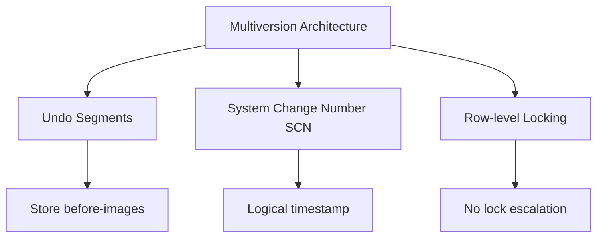
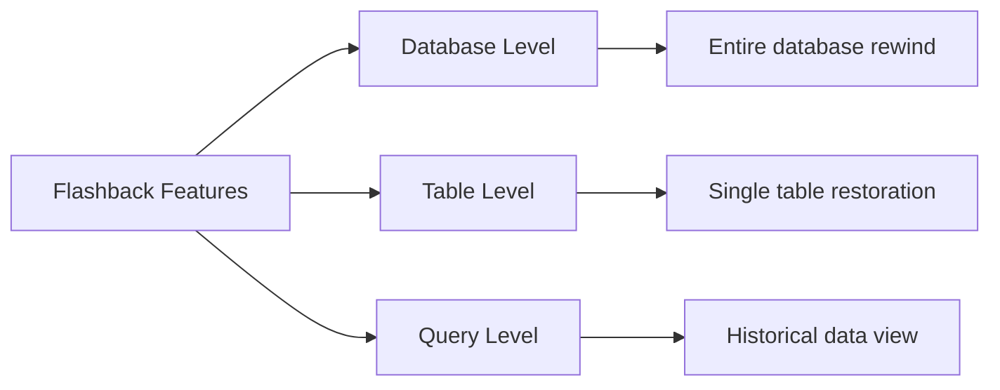

### **22.5 Concurrency Control and Recovery in Oracle**

#### **22.5.1 Oracle's Isolation Levels**

**Three Supported Levels:**
1. **READ COMMITTED (Default)**
   - Sees data committed before **statement** started
   - Allows nonrepeatable reads and phantom reads

2. **SERIALIZABLE**
   - Sees data committed before **transaction** started
   - Returns error if cannot serialize

3. **READ ONLY**
   - Sees data committed before transaction started
   - No modifications allowed

---

#### **22.5.2 Multiversion Read Consistency**

**Core Architecture:**


**Key Features:**
- **Undo Segments**: Store before-images for read consistency and rollback
- **SCN**: Logical timestamp for operation ordering
- **Implicit row-level locking** - no lock escalation
- Readers **never block** writers

**Lock Types:**
- **DDL Locks**: Schema objects (exclusive, share, breakable parse)
- **DML Locks**: Data locks (row-share, row-exclusive, share, exclusive)
- **Internal Locks**: Latches, mutex, distributed locks

---

#### **22.5.3 Deadlock Detection**

- **Automatic detection** and resolution
- Rolls back one statement in deadlock
- Returns error message to transaction
- Transaction should roll back and retry

---

#### **22.5.4 Backup and Recovery**

**Recovery Manager (RMAN):**
- Server-managed backup and recovery
- Complete and incremental backups
- Backup to disk or tape

**Recovery Options:**
- **Instance Recovery**: Automatic after crash (rollforward + rollback)
- **Point-in-time Recovery**: Restore to specific time/SCN
- **Standby Database**: Real-time synchronization to alternative site

---

#### **22.5.5 Flashback Technology**

**Rewind database without traditional restore:**



**Key Commands:**
```sql
-- Restore table to specific time
FLASHBACK TABLE Staff TO TIMESTAMP ...;

-- Restore dropped table
FLASHBACK TABLE Staff TO BEFORE DROP;

-- Query historical data
SELECT ... AS OF TIMESTAMP ...;
```

**Recycle Bin:**
- Dropped tables stored temporarily
- Automatic space management
- View with `SHOW RECYCLEBIN`

---

**Oracle Advantages:**
- No lock escalation = better concurrency
- Multiversion reads = no reader/writer conflicts
- Comprehensive recovery options
- Efficient point-in-time recovery
- Automatic deadlock resolution
