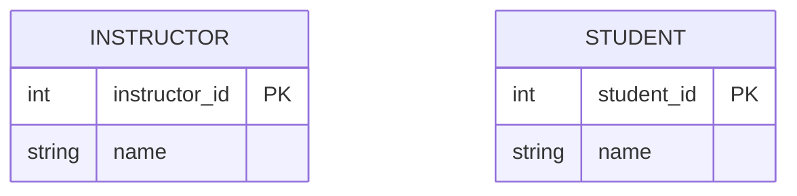
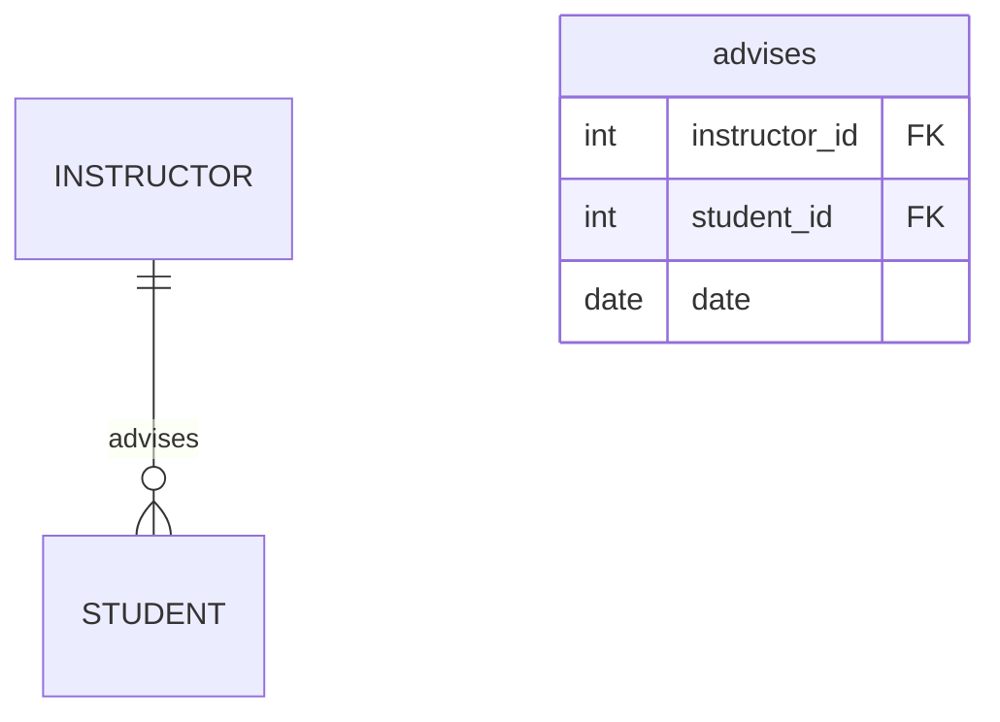

---

### **ER Model Part 2: Key Concepts**

#### **1. Entity Sets**
- **Definition**: Collections of similar entities (objects) with shared attributes.
- **Examples**:
  - `Instructor` entity set: Records like `[ID: 125, Name: John]`, `[ID: 423, Name: J. Prit]`
  - `Student` entity set: Records like `[ID: 10145, Name: Jennifer]`, `[ID: 10122, Name: Tanaka]`
- **Key Points**:
  - All entities in a set must be of the same type (homogeneous).
  - Represented as tables in databases.

**Mermaid Diagram**:

---

#### **2. Relationship Sets**
- **Definition**: Associations between entity sets that describe interactions.
- **Example**: `advises` relationship between `Instructor` and `Student`.
- **Components**:
  - **Roles**: The function an entity plays (e.g., `Instructor` acts as "advisor").
  - **Attributes**: Can describe the relationship itself (e.g., `date` in `advises`).
  
**Cardinality & Degree**:
- **Binary Relationship**: Links 2 entity sets (degree = 2).
- **Cardinality**: 
  - One-to-Many (1:N): One instructor advises many students (e.g., `ramanujam` advises both `Shankar` and `Peter`).

**Mermaid Relationship**:

---

#### **3. Attributes & Domains**
- **Attributes**: Properties describing entities (e.g., `name`, `ID`).
- **Domain**: Set of permitted values for an attribute.
  - **Example 1**: `semester` domain = `{fall, winter, spring, summer}`.
    - Invalid: `even` (not in domain).
  - **Example 2**: `course_id` domain = 7-digit strings (e.g., "CS10123").
    - Invalid: "CS101" (too short).

**Why Domains Matter**:
- Ensure data consistency (e.g., no numbers in `name` attributes).
- Prevent invalid entries (e.g., `semester = "autumn"`).

---

#### **4. Key Terms Summary**
| Concept          | Definition                                | Example                                  |
|------------------|-------------------------------------------|------------------------------------------|
| **Entity Set**   | Collection of similar entities.           | `Instructor`, `Student` tables.          |
| **Relationship** | Association between entities.             | `advises` with `date` attribute.         |
| **Degree**       | Number of linked entity sets.             | Binary (degree=2), Ternary (degree=3).   |
| **Domain**       | Allowed values for an attribute.          | `semester ∈ {fall, spring, ...}`.        |

---

#### **5. Practical Insights**
- **Descriptive Attributes**: Add context to relationships (e.g., `date` in `advises`).
- **Multiplicity**:
  - 1:1 (rare): One instructor advises one student.
  - 1:N (common): One instructor advises many students.
  - M:N: Requires junction tables (not covered here).
> [!warning]  
> Always define domains to enforce data integrity!
