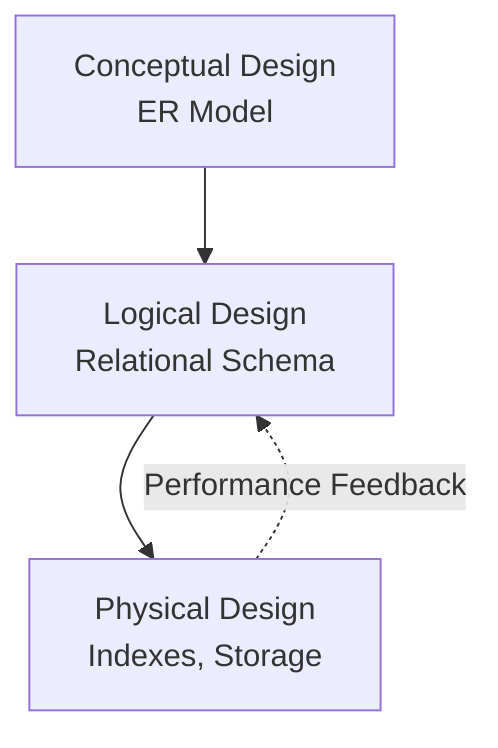
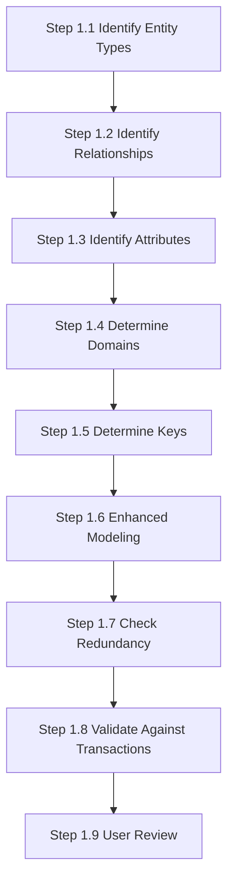

- A **design methodology** is a structured approach using procedures, techniques, and tools to guide the database design process.  
- It ensures standardization, facilitates project management, and supports iterative improvement.  

#### 16.1.1 What Is a Design Methodology?  
- **Definition**: A framework with phases and steps to systematically analyze requirements and model data.  
- **Key Roles**:  
  - Plans, manages, and evaluates database projects.  
  - Uses techniques like ER modeling (Chapters 12–13) and follows three main phases: **conceptual**, **logical**, and **physical** design.  
- **Outputs**:  
  - Conceptual model → Logical model (e.g., relational) → Physical implementation (DBMS-specific).  

#### 16.1.2 Conceptual, Logical, and Physical Database Design  
1. **Conceptual Database Design**:  
   - Focus: **What** data is needed (business rules, entities, relationships).  
   - Independent of DBMS, hardware, or programming.  
   - Output: **Conceptual data model** (e.g., ER diagram).  

2. **Logical Database Design**:  
   - Maps conceptual model to a **specific data model** (e.g., relational tables).  
   - Still DBMS-agnostic but includes normalization, integrity constraints.  

3. **Physical Database Design**:  
   - **How** the database is implemented (indexes, storage, security).  
   - Tailored to a **specific DBMS**; may require feedback to refine the logical model.  

*(Original diagram showing iterative feedback between phases.)*  

#### 16.1.3 Critical Success Factors in Database Design  
- **User Collaboration**: Work interactively with stakeholders.  
- **Structured Approach**: Follow methodology steps rigorously.  
- **Data-Driven**: Prioritize data requirements over processes.  
- **Tools**:  
  - Diagrams (e.g., ER models) for visualization.  
  - **DBDL (Database Design Language)**: Captures additional semantics.  
  - **Data Dictionary**: Documents metadata (definitions, constraints).  
- **Iteration**: Expect to repeat steps for refinement.  

**Key Takeaways**:  
- The methodology is **phase-driven** (conceptual → logical → physical).  
- Success depends on **user involvement**, **documentation**, and **iteration**.  

-----

# 16.3 Conceptual Database Design Methodology

### 16.3 Conceptual Database Design Methodology
**Objective**: Build a conceptual data model representing enterprise data requirements.

#### Key Components of a Conceptual Data Model:
- Entity types
- Relationship types
- Attributes and attribute domains
- Primary keys and alternate keys
- Integrity constraints

#### Supporting Documentation:
- ER diagrams
- Data dictionary (built incrementally)

### Step 1: Build Conceptual Data Model - Detailed Breakdown

**Key Points**:
- The process is iterative - expect to revisit steps
- Documentation is crucial at every stage
- User involvement ensures business requirements are met
- DreamHome case study provides concrete examples throughout
