# **22.1 Transaction Support**

#### **Definition of a Transaction**
- **Transaction:** An action or series of actions carried out by a single user or application program that reads or updates the contents of the database.
- A transaction is a **logical unit of work** that may be:
  - An entire program
  - Part of a program
  - A single SQL statement (e.g., INSERT, UPDATE)
- Transactions transform the database from **one consistent state to another**.

#### **Example Transactions**
1. **Simple Transaction:** Update the salary of a staff member.
   - Operations: `read(staffSalary)`, modify salary, `write(staffSalary)`
2. **Complex Transaction:** Delete a staff member and reassign their properties.
   - Must maintain **referential integrity** by updating related records.

#### **Transaction Outcomes**
- **Commit:** Transaction completes successfully → database reaches a new consistent state.
- **Abort:** Transaction does not execute successfully → database must be restored to its prior consistent state (**rollback**).
- A committed transaction **cannot be aborted**; a compensating transaction is needed to reverse its effects.

#### **Transaction States**
- **Active:** Initial state; transaction is executing.
- **Partially Committed:** After final statement executes but before commit.
- **Failed:** Transaction cannot proceed (e.g., abort due to violation).
- **Aborted:** Transaction is rolled back and restarted.
- **Committed:** Transaction completes successfully.

#### **Transaction Delimiters**
- Keywords: `BEGIN TRANSACTION`, `COMMIT`, `ROLLBACK`
- If not used, the entire program is treated as a single transaction.

---

#### **22.1.1 Properties of Transactions (ACID Properties)**

| Property        | Description                                                          | Responsibility      |
| --------------- | -------------------------------------------------------------------- | ------------------- |
| **Atomicity**   | "All or nothing" – transaction is indivisible.                       | Recovery Subsystem  |
| **Consistency** | Transforms database from one consistent state to another.            | DBMS & Developers   |
| **Isolation**   | Transactions execute independently; partial results are not visible. | Concurrency Control |
| **Durability**  | Effects of a committed transaction are permanent.                    | Recovery Subsystem  |
|                 |                                                                      |                     |

---

#### **22.1.2 Database Architecture for Transaction Support**

Key modules in DBMS architecture:
1. **Transaction Manager:** Coordinates transactions on behalf of applications.
2. **Scheduler (Lock Manager):** Implements concurrency control strategies.
3. **Recovery Manager:** Restores database to a consistent state after failure.
4. **Buffer Manager:** Manages data transfer between disk and main memory.

These components work together to ensure:
- Concurrency control
- Recovery from failures
- Efficient data handling

---

**Summary:**  
Transactions ensure database reliability and consistency. They are defined by ACID properties and managed through a coordinated system of transaction control, concurrency mechanisms, and recovery protocols.

----

# 22.2 Concurrency Control

#### **Definition**
**Concurrency Control:** The process of managing simultaneous operations on the database without having them interfere with one another.

---

#### **22.2.1 The Need for Concurrency Control**

**Goal:** Enable multiple users to access shared data concurrently while maintaining database consistency.

**Problems from Uncontrolled Concurrency:**

1. **Lost Update Problem**
   - **Scenario:** Two transactions read the same data item and update it independently.
   - **Result:** One update overwrites the other, causing data loss.
   - **Example:** T₁ and T₂ both read balance = £100. T₂ adds £100 (balance=£200), then T₁ subtracts £10 (balance=£90). T₂'s update is lost.

2. **Uncommitted Dependency (Dirty Read) Problem**
   - **Scenario:** A transaction reads data that has been updated by another uncommitted transaction.
   - **Result:** If the first transaction rolls back, the second transaction uses inconsistent data.
   - **Example:** T₄ updates balance to £200 but aborts. T₃ reads £200 and subtracts £10, resulting in £190 instead of £90.

3. **Inconsistent Analysis Problem**
   - **Scenario:** A transaction reads multiple values, but another transaction updates some during the read process.
   - **Result:** The first transaction produces incorrect results.
   - **Example:** T₆ sums three account balances while T₅ transfers money between them, causing an incorrect total.

**Additional Issues:**
- **Nonrepeatable Read:** A transaction rereads data and finds it has been modified by another transaction.
- **Phantom Read:** A transaction re-executes a query and finds additional tuples inserted by another transaction.

---

#### **22.2.2 Serializability and Recoverability**

**Key Concepts:**
- **Schedule:** A sequence of operations from a set of concurrent transactions.
- **Serial Schedule:** Operations of each transaction are executed consecutively without interleaving.
- **Nonserial Schedule:** Operations from concurrent transactions are interleaved.
- **Serializable Schedule:** A nonserial schedule that produces the same result as some serial schedule.

**Types of Serializability:**

1. **Conflict Serializability**
   - Based on conflicting operations (read-write, write-read, write-write).
   - Tested using a **precedence graph**.
   - If the graph has **no cycles**, the schedule is conflict serializable.

2. **View Serializability**
   - Less strict than conflict serializability.
   - Allows **blind writes** (writes without prior reads).
   - Testing is **NP-complete** (computationally complex).

**Recoverability:**
- **Recoverable Schedule:** If Tⱼ reads data written by Tᵢ, then Tᵢ commits before Tⱼ.
- **Cascading Rollback:** A single transaction abort forces multiple other transactions to roll back.
- **Avoidance:** Use **strict** or **rigorous** two-phase locking.

---

#### **22.2.3 Locking Methods**

**Basic Lock Types:**
- **Shared Lock (Read Lock):** Allows multiple transactions to read but not update.
- **Exclusive Lock (Write Lock):** Allows one transaction to both read and update.

**Locking Rules:**
- Must lock item before accessing it.
- If item is locked, transaction waits until lock is released.
- Locks are released when transaction commits or aborts.

**Problems with Basic Locking:**
- Does not guarantee serializability by itself.

**Two-Phase Locking (2PL) Protocol:**
- **Growing Phase:** Acquire all locks; cannot release any.
- **Shrinking Phase:** Release locks; cannot acquire new ones.
- **Guarantees conflict serializability.**

**Variants of 2PL:**
- **Strict 2PL:** Hold exclusive locks until transaction commit/abort.
- **Rigorous 2PL:** Hold all locks until transaction commit/abort.
- Prevents cascading rollbacks.

**Problems with Locking:**
- **Deadlock:** Two transactions wait for locks held by each other.
- **Livelock:** Transaction waits indefinitely for locks.

---

#### **22.2.4 Deadlock**

**Definition:** Two or more transactions are each waiting for locks held by the other.

**Deadlock Handling Techniques:**

1. **Timeouts**
   - Wait for a set period; if lock not granted, abort and restart.

2. **Deadlock Prevention**
   - **Wait-Die:** Older transactions wait for younger; younger abort.
   - **Wound-Wait:** Younger transactions wait for older; younger abort.
   - **Conservative 2PL:** Acquire all locks at start (not practical).

3. **Deadlock Detection and Recovery**
   - Use **Wait-for Graph (WFG)**.
   - Cycle in WFG indicates deadlock.
   - **Recovery:** Abort one or more transactions (victim selection).

**Victim Selection Criteria:**
- How long transaction has been running.
- Number of data items updated.
- Number of data items still to update.
- Avoid **starvation** (same transaction always chosen).

---

#### **22.2.5 Timestamping Methods**

**Timestamp:** Unique identifier indicating transaction start time.

**Basic Timestamp Ordering Protocol:**
- Each data item has read and write timestamps.
- **Read Rule:** Transaction can read if its timestamp ≥ write timestamp of item.
- **Write Rule:** Transaction can write if its timestamp ≥ read and write timestamps of item.
- Otherwise, transaction is aborted and restarted.

**Thomas's Write Rule:**
- Ignore obsolete writes (if transaction writes an outdated value).
- Increases concurrency.

**Advantages:**
- No deadlock.
- No locks required.

**Disadvantages:**
- May cause frequent restarts.

---

#### **22.2.6 Multiversion Timestamp Ordering**

- Maintain multiple versions of data items.
- Each version has:
  - Value
  - Read timestamp
  - Write timestamp
- Transaction reads the version with the largest write timestamp ≤ its timestamp.
- Never fails on read operations.

---

#### **22.2.7 Optimistic Techniques**

**Assumption:** Conflicts are rare.

**Three Phases:**
1. **Read Phase:** Read data and make changes to local copies.
2. **Validation Phase:** Check for conflicts before commit.
3. **Write Phase:** Apply changes to database if validation successful.

**Advantages:**
- No locking overhead.
- High concurrency when conflicts are rare.

**Disadvantages:**
- Costly restarts if conflicts frequent.

---

#### **22.2.8 Granularity of Data Items**

**Granularity:** Size of data items chosen for locking.

**Levels (Coarse to Fine):**
- Entire database
- File
- Page (disk section)
- Record
- Field

**Trade-offs:**
- **Coarse granularity:** Less concurrency, lower overhead.
- **Fine granularity:** More concurrency, higher overhead.

**Multiple-Granularity Locking:**
- Use **intention locks** (IS, IX, SIX) to indicate locking at a lower level.
- **Compatibility Table** determines if locks can be granted.
- Follows **two-phase locking protocol** across granularity levels.

**Lock Compatibility Table:**

|      | IS  | IX  | S   | SIX | X   |
|------|-----|-----|-----|-----|-----|
| IS   | ✓   | ✓   | ✓   | ✓   | ✗   |
| IX   | ✓   | ✓   | ✗   | ✗   | ✗   |
| S    | ✓   | ✗   | ✓   | ✗   | ✗   |
| SIX  | ✓   | ✗   | ✗   | ✗   | ✗   |
| X    | ✗   | ✗   | ✗   | ✗   | ✗   |

---

**Summary:**  
Concurrency control ensures correct interleaving of transactions through locking, timestamping, or optimistic methods. The goal is to maximize concurrency while preventing interference, deadlock, and inconsistencies.

----


# **22.3 Database Recovery**

#### **Definition**
**Database Recovery:** The process of restoring the database to a correct state after a failure.

---

#### **22.3.1 The Need for Recovery**

**Types of Storage Media:**
- **Volatile Storage:** Main memory (lost on system crash)
- **Nonvolatile Storage:** Magnetic disk, magnetic tape, optical disk
- **Stable Storage:** Replicated nonvolatile storage (e.g., RAID)

**Causes of Failure:**
- System crashes (hardware/software errors)
- Media failures (disk head crashes)
- Application software errors
- Natural physical disasters
- Human error or sabotage
- Carelessness or unintentional destruction

**Principal Effects of Failure:**
1. Loss of main memory (including database buffers)
2. Loss of disk copy of the database

---

#### **22.3.2 Transactions and Recovery**

**Recovery Manager Responsibilities:**
- Guarantees **atomicity** and **durability** (ACID properties)
- Ensures either **all effects** of a transaction are permanently recorded or **none** are

**Database Write Operations:**
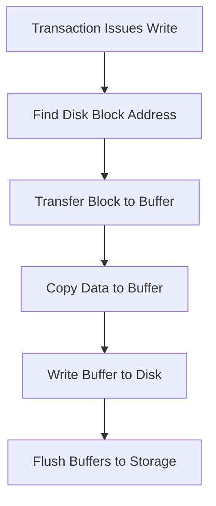

**Key Concepts:**
- **Force-writing:** Explicit writing of buffers to secondary storage
- **Redo (Rollforward):** Reapplying updates of committed transactions
- **Undo (Rollback):** Reversing effects of uncommitted transactions
- **Partial Undo:** Single transaction rollback
- **Global Undo:** All active transactions rollback

---

#### **22.3.3 Recovery Facilities**

**Four Essential Recovery Facilities:**

1. **Backup Mechanism**
   - Periodic backup copies of database and log file
   - Complete or incremental backups
   - Stored on offline storage

2. **Log File (Journal)**
   - Contains information about all database updates
   - **Transaction Records:**
     - Transaction identifier
     - Type of log record (start, insert, update, delete, abort, commit)
     - Data item identifier
     - Before-image (old value)
     - After-image (new value)
     - Log management information

   - **Checkpoint Records**
   - Often duplexed/triplexed for reliability

3. **Checkpoint Facility**
   - Point of synchronization between database and log
   - **Checkpoint Operations:**
     - Write all log records to secondary storage
     - Write modified database buffers to secondary storage
     - Write checkpoint record containing active transaction identifiers

4. **Recovery Manager**
   - Restores database to consistent state after failure

**Buffer Management:**
- **pinCount:** Number of transactions using a buffer
- **dirty:** Indicates if buffer has been modified
- **Replacement Strategies:** FIFO, LRU

**Buffer Policies:**
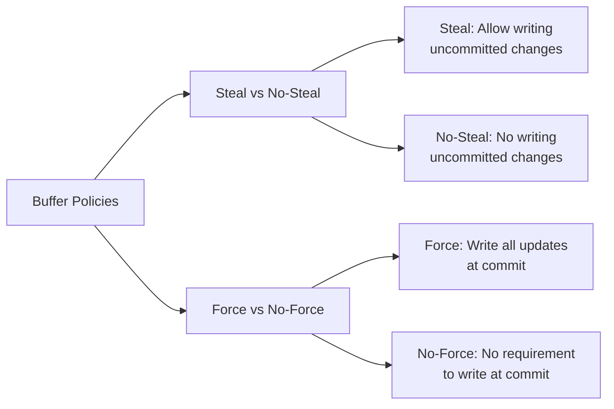

**Common Practice:** Most DBMSs use **steal, no-force** policy

---

#### **22.3.4 Recovery Techniques**

**Two Main Scenarios:**
1. **Database Physically Damaged:** Restore from backup + redo committed transactions
2. **Database Inconsistent:** Use log file to restore consistency

**A. Deferred Update Protocol**
- Updates written to database only **after commit**
- **Steps:**
  1. Write transaction start record to log
  2. Write log records for all operations (excluding before-images)
  3. At commit: write commit record, flush log, then update database
  4. If abort: ignore log records

- **Advantages:** No undo operations needed
- **Disadvantages:** Requires redo of all committed transactions

**B. Immediate Update Protocol**
- Updates applied to database **as they occur**
- **Write-Ahead Log Protocol:** Log record must be written before database update
- **Steps:**
  1. Write transaction start record
  2. Write log record, then update database buffers
  3. At commit: write commit record
  4. Database writes occur when buffers flushed

- **Recovery:**
  - **Redo** transactions with start and commit records
  - **Undo** transactions with start but no commit record

**C. Shadow Paging**
- Maintains two page tables: **current** and **shadow**
- **Advantages:**
  - No log file overhead
  - Faster recovery (no undo/redo)
- **Disadvantages:**
  - Data fragmentation
  - Requires garbage collection

---

#### **22.3.5 Recovery in a Distributed DBMS**

**Challenges:**
- Distributed transactions access data at multiple sites
- Subtransactions must be coordinated
- Need to ensure **atomicity** of global transaction

**Protocols:**
- **Two-Phase Commit (2PC)**
- **Three-Phase Commit (3PC)**
- Ensure all subtransactions commit or all abort

---

#### **Recovery Process Summary**

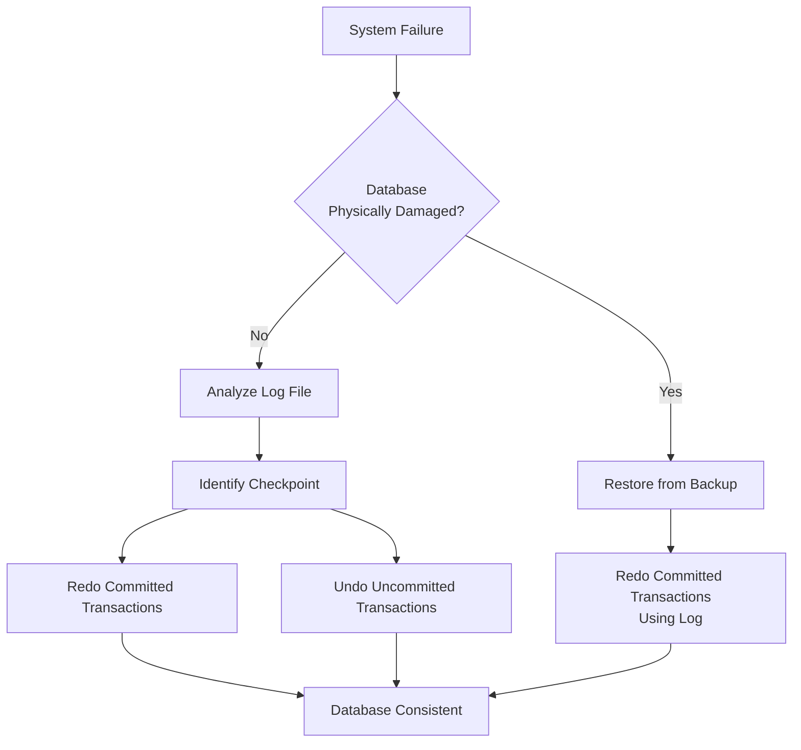

**Key Points:**
- **Log file** is fundamental to all recovery schemes
- **Checkpoints** reduce recovery time by limiting log search
- **Write-ahead logging** ensures undo capability
- Choice of recovery technique depends on performance requirements and failure characteristics

----

# **22.4 Advanced Transaction Models**

#### **Introduction**
Traditional transaction models (ACID properties) work well for short-duration business transactions but are inadequate for advanced applications like:
- CAD/CAM systems
- Software engineering
- Workflow management

**Problems with Traditional Models for Advanced Applications:**
- **Long duration** (hours to months) increases failure susceptibility
- **High data contention** from locking many items for long periods
- **Increased deadlock** probability
---

#### **22.4.1 Nested Transaction Model**

**Definition:** A transaction structured as a hierarchy of subtransactions (parent-child relationships).

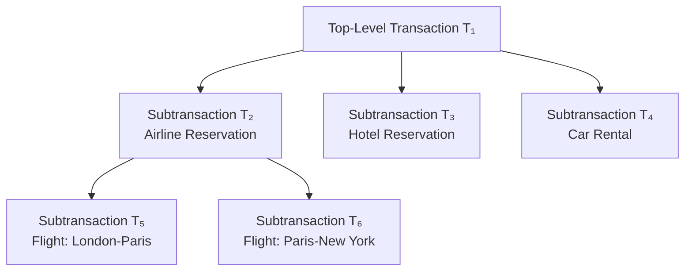

**Key Characteristics:**
- Only **leaf-level** subtransactions perform database operations
- **Bottom-up commit**: Children must commit before parents
- **Partial results** are visible only to immediate parents
- **Independent recovery**: Child failure doesn't necessarily abort parent

**Parent Recovery Options:**
1. **Retry** the failed subtransaction
2. **Ignore failure** (if subtransaction is non-vital)
3. **Run contingency** subtransaction
4. **Abort** the entire transaction

**Advantages:**
- **Modularity** - decomposes complex transactions
- **Finer granularity** for concurrency and recovery
- **Intra-transaction parallelism**
- **Intra-transaction recovery** without side effects

**Savepoints:**
- Identifiable points in a transaction for partial rollback
- Does **not** support intra-transaction parallelism
- Example: `SAVE WORK` and `ROLLBACK WORK <savepoint>`

---

#### **22.4.2 Sagas**

**Definition:** A sequence of flat transactions that can be interleaved with other transactions.

**Structure:**
- Sequence: T₁, T₂, T₃, ..., Tₙ
- Corresponding compensating transactions: C₁, C₂, C₃, ..., Cₙ

**Execution Patterns:**
```
Successful: T₁ → T₂ → T₃ → ... → Tₙ
Failed: T₁ → T₂ → ... → Tᵢ → Cᵢ₋₁ → ... → C₂ → C₁
```

**Example - Travel Reservation Saga:**
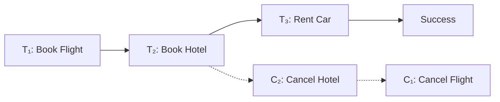

**Characteristics:**
- **Relaxes isolation** - partial results visible to other transactions
- Requires **compensating transactions** for each subtransaction
- Useful when subtransactions are **relatively independent**
- May be difficult to define compensating transactions for some operations

---

#### **22.4.3 Multilevel Transaction Model**

**Definition:** A balanced tree of subtransactions where each level represents a different abstraction level.

**Level Structure:**
- Lₙ (root) → Lₙ₋₁ → ... → L₁ → L₀ (leaf level)
- Edges represent implementation of operations at next lower level

**Key Insight:**
- Operations may **not conflict** at higher levels even if their implementations conflict at lower levels

**Example:**
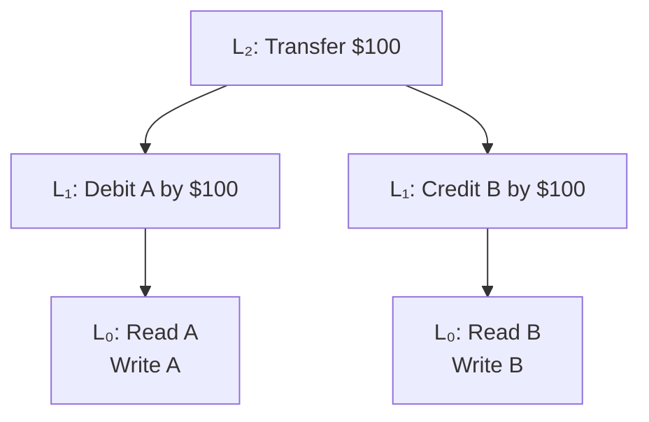

**Advantages:**
- **Higher concurrency** by exploiting level-specific conflict information
- **Semantic knowledge** used to determine commutativity

---

#### **22.4.4 Dynamic Restructuring**

**Purpose:** Address uncertain duration and evolving requirements in design applications.

**Key Operations:**

1. **Split-Transaction**
   - Divides active transaction into two serializable transactions
   - Divides actions and resources between new transactions
   - Conditions:
     - AWriteSet ∩ BWriteSet ⊆ BWriteLast
     - AReadSet ∩ BWriteSet = ∅
     - BReadSet ∩ AWriteSet = ShareSet

2. **Join-Transaction**
   - Merges independent transactions into single transaction
   - Reverse of split-transaction

**Process Example:**
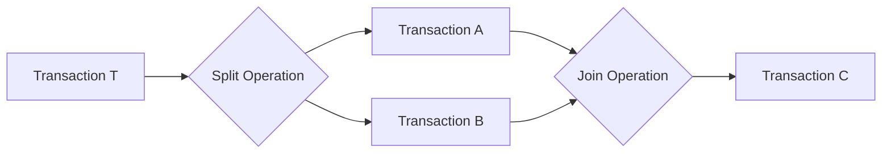

**Advantages:**
- **Adaptive recovery** - commit partial work
- **Reduced isolation** - release resources earlier
- Supports **cooperative work**

---

#### **22.4.5 Workflow Models**

**Definition:** Activity involving coordinated execution of multiple tasks by different processing entities (people or software systems).

**Workflow Example - Property Rental:**
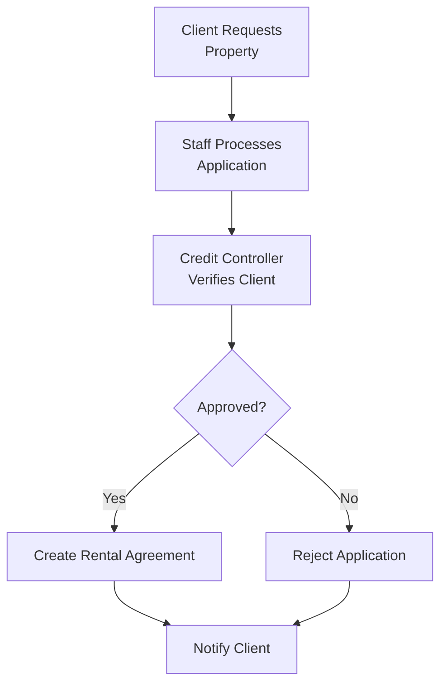

**Workflow Specification Issues:**

1. **Task Specification**
   - Execution states and transitions for each task

2. **Task Coordination Requirements**
   - Inter-task execution dependencies
   - Data-flow dependencies
   - Termination conditions

3. **Execution Requirements**
   - Failure and execution atomicity
   - Concurrency control and recovery requirements

**Workflow Execution Characteristics:**
- **Open nesting semantics** - partial results visible
- Components can be **vital** or **non-vital**
- Supports **compensating** and **contingency** transactions
- Combines features of open and closed nested transactions

---

#### **Comparison of Advanced Models**

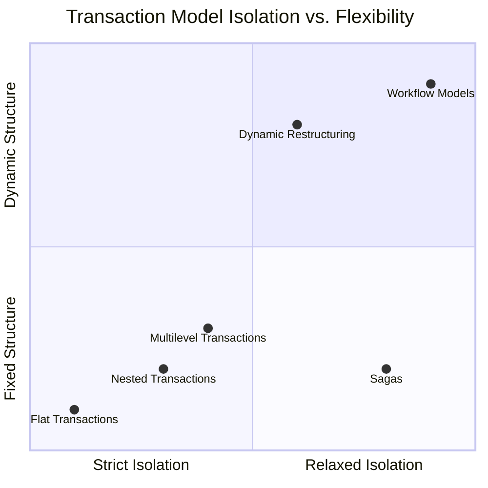

**Summary:**
Advanced transaction models address limitations of traditional ACID transactions for complex, long-duration applications. They provide varying degrees of flexibility in isolation, structure, and recovery to support cooperative work, uncertain developments, and evolving requirements in modern database applications.

----

# **22.5 Concurrency Control and Recovery in Oracle**

#### **22.5.1 Oracle's Isolation Levels**

**Three Supported Levels:**
1. **READ COMMITTED (Default)**
   - Sees data committed before **statement** started
   - Allows nonrepeatable reads and phantom reads

2. **SERIALIZABLE**
   - Sees data committed before **transaction** started
   - Returns error if cannot serialize

3. **READ ONLY**
   - Sees data committed before transaction started
   - No modifications allowed

---

#### **22.5.2 Multiversion Read Consistency**

**Core Architecture:**
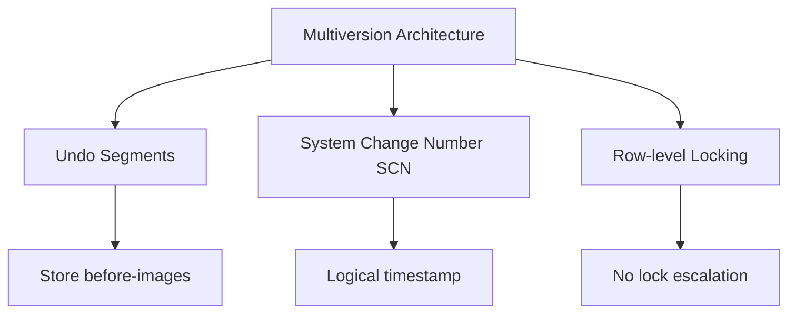

**Key Features:**
- **Undo Segments**: Store before-images for read consistency and rollback
- **SCN**: Logical timestamp for operation ordering
- **Implicit row-level locking** - no lock escalation
- Readers **never block** writers

**Lock Types:**
- **DDL Locks**: Schema objects (exclusive, share, breakable parse)
- **DML Locks**: Data locks (row-share, row-exclusive, share, exclusive)
- **Internal Locks**: Latches, mutex, distributed locks

---

#### **22.5.3 Deadlock Detection**

- **Automatic detection** and resolution
- Rolls back one statement in deadlock
- Returns error message to transaction
- Transaction should roll back and retry

---

#### **22.5.4 Backup and Recovery**

**Recovery Manager (RMAN):**
- Server-managed backup and recovery
- Complete and incremental backups
- Backup to disk or tape

**Recovery Options:**
- **Instance Recovery**: Automatic after crash (rollforward + rollback)
- **Point-in-time Recovery**: Restore to specific time/SCN
- **Standby Database**: Real-time synchronization to alternative site

---

#### **22.5.5 Flashback Technology**

**Rewind database without traditional restore:**

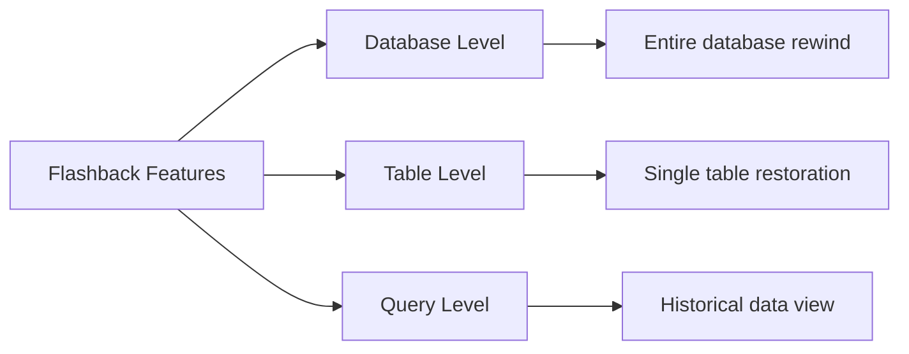

**Key Commands:**
```sql
-- Restore table to specific time
FLASHBACK TABLE Staff TO TIMESTAMP ...;

-- Restore dropped table
FLASHBACK TABLE Staff TO BEFORE DROP;

-- Query historical data
SELECT ... AS OF TIMESTAMP ...;
```

**Recycle Bin:**
- Dropped tables stored temporarily
- Automatic space management
- View with `SHOW RECYCLEBIN`

---

**Oracle Advantages:**
- No lock escalation = better concurrency
- Multiversion reads = no reader/writer conflicts
- Comprehensive recovery options
- Efficient point-in-time recovery
- Automatic deadlock resolution
