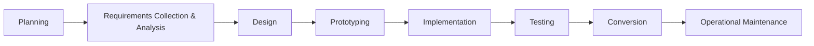

## 10.2 IS & Database Lifecycle

> The lifecycle of a database system is **embedded** within the lifecycle of the broader information system.

---

### 🏁 Typical Lifecycle Stages

- **Planning:** Define scope, feasibility, and initial resource estimates.
    
- **Requirements Collection & Analysis:** Gather business rules, functional needs, data requirements.
    
- **Design:**
    
    - **Conceptual** (ER/EER models)
        
    - **Logical** (relational schemas, constraints)
        
    - **Physical** (indexes, storage structures)
        
- **Prototyping:** Build a small-scale model to validate requirements and design.
    
- **Implementation:** Create the actual database and application code.
    
- **Testing:** Verify correctness, performance, security, and integration.
    
- **Conversion:** Migrate existing data and systems to the new database.
    
- **Operational Maintenance:** Routine updates, tuning, backups, user support.
    

---

### 📌 Functional/Application Areas

- **Functional Area** (or **Application Area**): A specific enterprise domain such as **Marketing**, **Personnel**, or **Stock Control**.
    
- Each may drive its own database requirements and modules, but all integrate into the overall IS.
    
