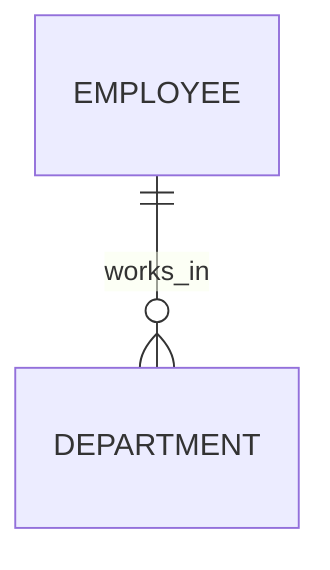
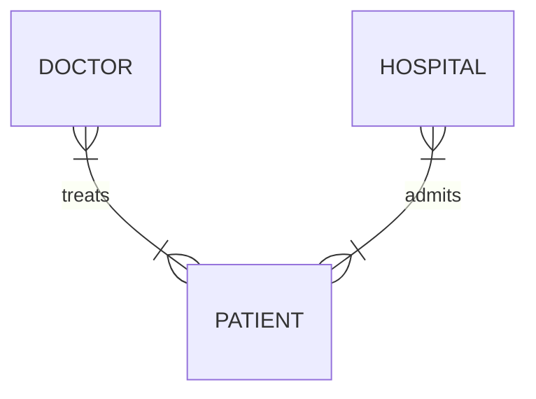

### **Understanding Relationship Types in ER Modeling**

#### **1. Relationship Basics**
Relationships define how entities interact in a database. They represent real-world connections like "employees manage departments" or "students take courses." Each relationship has:
- **Participants**: The entities involved
- **Degree**: Number of participating entities
- **Cardinality**: How many instances can relate (one-to-one, one-to-many)

#### **2. Relationship Degrees**
| Degree | Name      | Description                     | Common Example               |
|--------|-----------|---------------------------------|------------------------------|
| 2      | Binary    | Links two entities              | Employee → Department        |
| 3      | Ternary   | Connects three entities         | Student → Course → Professor |
| 4+     | Complex   | Rare, for specialized cases     | Order → Supplier → Shipper → Payment |

**Binary relationships** are most common, handling about 80% of database needs. For example:

**Ternary relationships** appear when three entities jointly describe an event:

#### **3. Practical Applications**
- **Business systems**: Customer → Order → Product
- **Education**: Student → Class → Instructor
- **Healthcare**: Doctor → Patient → Treatment

#### **4. Design Considerations**
1. **Clarity**: Ensure each relationship has a clear purpose
2. **Avoid redundancy**: Don't create overlapping relationships
3. **Validation**: Check if the relationship reflects real-world logic

#### **5. Common Mistakes**
- **Fan traps**: Creating ambiguous many-to-many paths
- **Overcomplicating**: Using ternary when binary suffices
- **Missing relationships**: Forgetting critical connections

#### **Key Takeaways**
1. Start with binary relationships for most cases
2. Use higher degrees only when necessary
3. Always validate against business requirements

