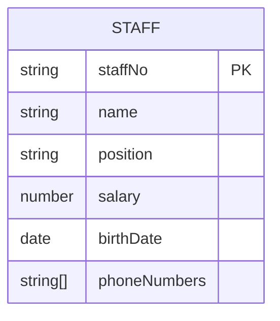
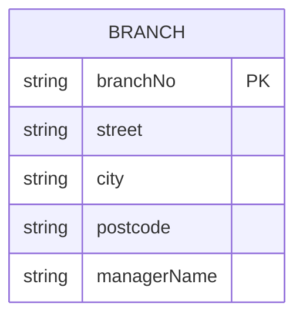
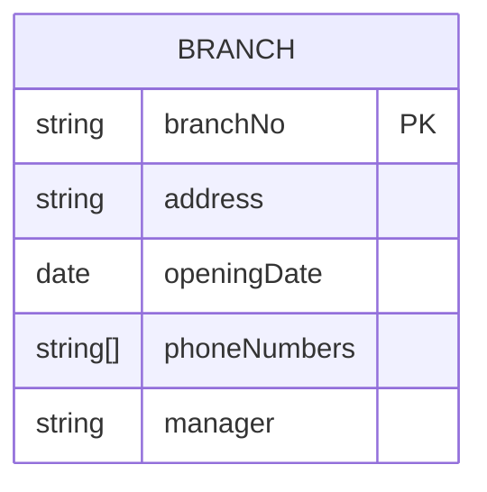

### **Attributes in ER Diagrams**
Attributes are the specific properties that describe entities or relationships (e.g., a `Staff` entity has attributes like `staffNo`, `name`, and `salary`).

---

### **1. Attribute Types**
| Type          | Description                                                                 | Example                          |
|---------------|-----------------------------------------------------------------------------|----------------------------------|
| **Simple**    | Cannot be divided into smaller parts (atomic values).                       | `age`, `salary`                  |
| **Composite** | Made of multiple sub-attributes.                                            | `address` → {street, city, zip}  |
| **Single-Valued** | Holds exactly one value per entity.                                    | `staffNo` (each staff has one ID)|
| **Multi-Valued** | Can hold multiple values per entity.                                    | `phoneNumbers` (a person may have several) |
| **Derived**   | Calculated from other attributes (not stored directly).                     | `age` (derived from `birthDate`) |

---

### **2. Attribute Domains**
- A **domain** defines the allowed values for an attribute (like a "value range").
- **Examples**:
  - `rooms` (in `PropertyForRent`): Integers from 1 to 15.
  - `salary`: Positive numbers up to $200,000.
  - `name`: Text with letters/hyphens (no numbers).
- **Shared Domains**: Different attributes can share the same domain (e.g., `Branch.address` and `Staff.address` both use "valid addresses").


### **3. Key Rules**
1. **Identify Attributes Early**: List all properties of each entity (e.g., for `Student`: `studentID`, `name`, `major`).
2. **Classify Them**:  
   - Is `birthDate` simple or composite? *(Simple)*  
   - Is `email` single- or multi-valued? *(Usually single, but could be multi-valued)*  
3. **Document Domains**: Note value constraints (e.g., `rating` must be 1–5).

---

### **Example: Staff Entity**

- **PK**: Primary key (`staffNo`).
- **Composite Example**: `name` could be split into `firstName`, `lastName`.
- **Derived Example**: `age` (calculated from `birthDate`).

---

### **Why This Matters**
- **Data Integrity**: Domains prevent invalid entries (e.g., negative salary).
- **Clarity**: Composite attributes organize related data (e.g., address parts).
- **Efficiency**: Derived attributes reduce storage (e.g., calculate `age` instead of storing it).

---
# 12.3.1 Simple and Composite Attributes 413


### **Simple vs. Composite Attributes**  

#### **1. Simple (Atomic) Attributes**  
- **Definition**: Cannot be broken down further.  
- **Examples**:  
  - `salary` (e.g., $50,000)  
  - `position` (e.g., "Manager")  
  - `age` (e.g., 30)  
- **Why Use Them?**  
  - For standalone data that doesn’t need splitting (e.g., a single numeric/string value).  

#### **2. Composite Attributes**  
- **Definition**: Made of smaller, meaningful parts.  
- **Examples**:  
  - `address` → `street`, `city`, `postcode`  
  - `fullName` → `firstName`, `lastName`  
- **Why Use Them?**  
  - When users need to query/modify parts individually (e.g., filter by `city`).  
  - Avoids redundancy (e.g., storing "163 Main St, Glasgow, G11 9QX" repeatedly).  


### **Key Differences**  
| Feature          | Simple Attribute          | Composite Attribute          |  
|------------------|--------------------------|------------------------------|  
| **Structure**    | Single value             | Multiple sub-components      |  
| **Example**      | `salary = 50000`         | `address = {street, city, postcode}` |  
| **Query Flexibility** | Limited (whole value only) | Can filter by sub-parts (e.g., `city = "Glasgow"`) |  
| **Storage**      | Efficient for atomic data | May use more space           |  


### **When to Choose Which?**  
1. **Use Simple Attributes If**:  
   - The data is atomic (e.g., `employeeID`).  
   - No need to query parts separately.  

2. **Use Composite Attributes If**:  
   - The data has logical subdivisions (e.g., dates → `day`, `month`, `year`).  
   - Users need to search/sort by components (e.g., find all branches in "Glasgow").  


### **ER Diagram Example**  

- **Composite**: `address` (split into parts).  
- **Simple**: `managerName` (treated as one unit).  


### **Real-World Analogy**  
- **Simple**: Like a "price tag" ($20) — no smaller parts.  
- **Composite**: Like a "mailing label" (street, city, ZIP) — broken down for precision.  

**Next**: Single-valued vs. multi-valued attributes → How many values an attribute can hold.


----


# 12.3.2 Single-valued and Multi-valued Attributes 414 


### Understanding Attribute Types

#### Single-Valued Attributes
- **Definition**: Store exactly one piece of data per entity instance
- **Characteristics**:
  - Most common attribute type
  - Represent core identifying or descriptive information
  - Simple to store and query
- **Examples**:
  - `employee_id = "E1001"`
  - `birth_date = "1990-05-15"`
  - `salary = 75000`

#### Multi-Valued Attributes
- **Definition**: Can store multiple related values per entity instance
- **Characteristics**:
  - Represent real-world cases where multiple values exist
  - Often have practical limits (min/max values)
  - Require special database handling
- **Examples**:
  - `phone_numbers = ["555-1234", "555-5678"]`
  - `email_addresses = ["work@email.com", "personal@email.com"]`
  - `certifications = ["PMP", "AWS", "CISSP"]`

### Key Differences Illustrated

| Aspect          | Single-Valued               | Multi-Valued                  |
|-----------------|----------------------------|------------------------------|
| **Cardinality** | One value per entity        | 1-N values per entity        |
| **Storage**     | Direct column in table      | Separate table or array type |
| **Querying**    | Simple equality checks      | Requires joins or array ops  |
| **Example**     | Social Security Number      | Phone numbers                |

### Database Implementation Options

1. **For Multi-Valued Attributes**:
   - **Relational Databases**:
     ```mermaid
     erDiagram
         BRANCH ||--o{ BRANCH_PHONE : "has"
         BRANCH {
             string branchNo PK
         }
         BRANCH_PHONE {
             string branchNo FK
             string phoneNumber
         }
     ```
   - **Document Databases**:
     ```json
     {
       "branchNo": "B003",
       "phoneNumbers": ["0141-339-2178", "0141-339-4439"]
     }
     ```

2. **For Single-Valued Attributes**:
   ```sql
   CREATE TABLE Branch (
       branchNo VARCHAR(10) PRIMARY KEY,
       managerName VARCHAR(50)  -- Single-valued
   );
   ```

### Practical Recommendations

1. **Use Single-Valued When**:
   - The attribute conceptually represents a single fact
   - You need simple, fast queries on the attribute
   - The value uniquely identifies the entity

2. **Use Multi-Valued When**:
   - The real-world concept naturally has multiple values
   - You need to maintain historical or alternative values
   - The values have independent significance

3. **Implementation Tips**:
   - Always document minimum/maximum occurrences
   - Consider search requirements when choosing storage
   - Normalize multi-valued attributes in relational designs

### Real-World Example: Branch Management System



- **Single-valued**: branchNo, address, openingDate, manager
- **Multi-valued**: phoneNumbers (typically 1-3 numbers per branch)


-----

# 12.3.3 Derived Attributes 414 

### Derived Attributes in ER Modeling  

#### Definition  
*"An attribute whose value is calculated from other attributes or entities, rather than stored directly in the database."*  

#### Core Concept  
Derived attributes are:  
- 🧮 **Calculated dynamically** from source data  
- 🔄 **Always current** (automatically update when sources change)  
- 🖋️ **Notation**: Typically shown with `/forward slashes/` or dotted underline in diagrams  

#### Key Characteristics  
1. **Data Sources**:  
   - 🔗 *Same entity*: `duration = rentFinish - rentStart`  
   - ↔️ *Related entities*: `deposit = 2 × Property.monthlyRent`  
   - 🔢 *Aggregates*: `totalStaff = COUNT(Staff)`  


#### Implementation Guide  
1. **When to Derive**:  
   - ✅ Values that change frequently  
   - ✅ Business rules (e.g., "deposit = 2×rent")  
   - ✅ Aggregate metrics (counts, sums)  

2. **Performance Tips**:  
   - 🚀 Materialize frequently-used derived values  
   - 📊 Create indexes on source attributes  
   - ⚠️ Avoid over-complex derivations in queries  

#### Best Practices  
- 📝 *Document* all derivation formulas  
- 🏷️ *Clearly label* in diagrams  
- ⚖️ *Balance* calculation cost vs storage savings  


### SQL Implementation Examples  

1. **Using Virtual Columns (MySQL)**:  
   ```sql  
   ALTER TABLE leases  
   ADD COLUMN duration INT GENERATED ALWAYS AS (DATEDIFF(rentFinish, rentStart)) STORED;  
   ```  


----

# 12.3.4 Keys 415 

### **Keys in ER Modeling**

#### **1. Candidate Key**
- **Definition**: Minimal set of attributes that uniquely identifies each entity occurrence  
- **Rules**:
  - Must be **unique** (no duplicates)
  - Must be **minimal** (no unnecessary attributes)
  - Cannot contain **NULL** values
- **Example**:  
  - `branchNo` for `Branch` entity (e.g., "B003")  
  - `staffNo` and `NIN` (National Insurance Number) for `Staff` entity  

#### **2. Primary Key**
- **Definition**: The selected candidate key used to uniquely identify entities  
- **Selection Criteria**:
  - Shortest length (e.g., `staffNo` (5 chars) vs `NIN` (9 chars))  
  - Guaranteed future uniqueness  
  - Minimal attributes (prefer single-attribute keys)  
- **Example**:  
  - Chosen: `staffNo`  
  - Alternate Key: `NIN`  
  - Therefore, we select staffNo as the primary key of the Staff entity type and NIN is then referred to as the alternate key.

#### **3. Composite Key**
- **Definition**: A primary key made of **multiple attributes**  
- **When Used**:  
  - When no single attribute is unique  
  - Natural business keys (e.g., flight number + date)  
- **Example**:  
  - `Advert` entity: (`propertyNo`, `newspaperName`, `dateAdvert`)  


### **MySQL Implementation**

#### **1. Single-Attribute Primary Key**
```sql
CREATE TABLE Branch (
    branchNo VARCHAR(10) PRIMARY KEY,  -- Primary key
    branchName VARCHAR(50) UNIQUE,     -- Alternate key
    address VARCHAR(100)
);
```

#### **2. Composite Primary Key**
```sql
CREATE TABLE Advert (
    propertyNo VARCHAR(10),
    newspaperName VARCHAR(50),
    dateAdvert DATE,
    cost DECIMAL(10,2),
    PRIMARY KEY (propertyNo, newspaperName, dateAdvert)  -- Composite key
);
```

#### **3. Alternate Key Enforcement**
```sql
CREATE TABLE Staff (
    staffNo CHAR(5) PRIMARY KEY,       -- Selected primary key
    NIN CHAR(9) UNIQUE,               -- Alternate key
    name VARCHAR(50)
);
```


### **Real-World Examples**
1. **University Database**:
   - `Student` entity:  
     - Candidate keys: `studentID` (PK), `email` (AK)  
   - `Course` entity:  
     - Composite key: (`courseCode`, `semester`)  

2. **E-Commerce**:
   - `Order` entity:  
     - Natural key: `orderNumber` (PK)  
     - Alternate key: (`customerID`, `orderDate`)  


### **Common Pitfalls**
1. **Using Volatile Attributes**:  
   - ❌ Email as PK (may change) → Use surrogate ID instead.  
2. **Overusing Composites**:  
   - ❌ (`firstName`, `lastName`, `dob`) → Prone to duplicates.  
3. **Allowing NULLs**:  
   - ❌ `ALTER TABLE Staff MODIFY NIN CHAR(9) NULL` → Violates key rules.  


### **Key Takeaways**
1. All entities must have ≥1 **candidate key**.  
2. Choose the **primary key** based on:  
   - Uniqueness guarantee  
   - Minimalism  
   - Stability  
3. **Composite keys** are acceptable when necessary but add complexity.  


### **ER Diagram Attribute Notation Guide**


#### **2. Attribute Types and Notation**
| Attribute Type       | Notation Example               | Rules                                                                 |
|----------------------|--------------------------------|-----------------------------------------------------------------------|
| **Primary Key**      | `staffNo {PK}`                 | First listed attribute, tagged with `{PK}`                            |
| **Composite**        | `address {street, city, zip}`  | Parent attribute with indented sub-attributes                         |
| **Multi-Valued**     | `telNo [1..3]`                 | Range notation shows min/max values (e.g., `[1..*]` for unlimited)    |
| **Derived**          | `/totalStaff/`                 | Prefixed with slash                                                  |
| **Alternate Key**    | `NIN {AK}`                    | Tagged with `{AK}`                                                   |


#### **5. When to Simplify**
- **Basic Diagrams**: Show only primary keys (omit `{PK}` tags).  
- **Detailed Diagrams**: Include all attributes with proper notation.  

#### **Key Takeaways**
- Use **slashes (/)** for derived attributes.  
- Use **square brackets [ ]** for multi-valued ranges.  
- **Indent** composite sub-attributes.  
- Primary keys are **always first** and **unique**.  


#### **Key Elements Explained**
1. **Entity Structure**:
   - Divided into **upper section** (entity name) and **lower section** (attributes)
   - `PK` = Primary Key (always listed first)

2. **Attribute Types**:
   - **Composite** (`address`): 
     - Shown with nested sub-attributes (street, city)
   - **Multi-valued** (`telNo`): 
     - Labeled with `[]` and cardinality `"1..3"` (1-3 phone numbers)
   - **Derived** (`/totalStaff/`): 
     - Prefixed with `/` (calculated from other data)

3. **Relationships**:
   - `Manages`: One staff member manages many branches
   - `Has`: One branch has many staff members


#### **MySQL Implementation Snippets**
```sql
-- Staff Table
CREATE TABLE Staff (
    staffNo VARCHAR(5) PRIMARY KEY,
    name VARCHAR(50),
    position VARCHAR(50),
    salary DECIMAL(10,2)
);

-- Branch Table (with composite address)
CREATE TABLE Branch (
    branchNo VARCHAR(10) PRIMARY KEY,
    street VARCHAR(100),
    city VARCHAR(50),
    postcode VARCHAR(10)
);

-- Multi-valued phones (separate table)
CREATE TABLE BranchPhones (
    branchNo VARCHAR(10),
    telNo VARCHAR(15),
    PRIMARY KEY (branchNo, telNo),
    FOREIGN KEY (branchNo) REFERENCES Branch(branchNo)
);
```

