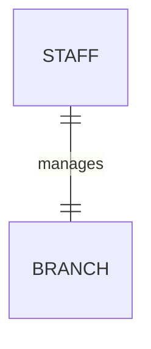
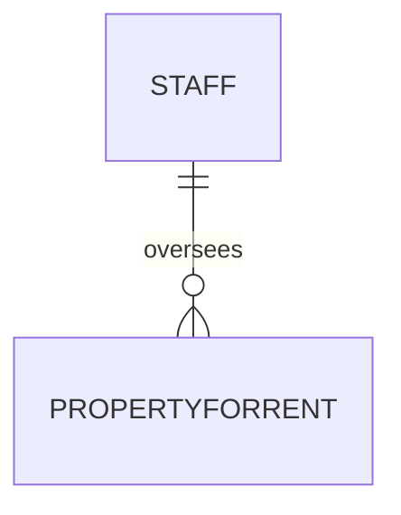
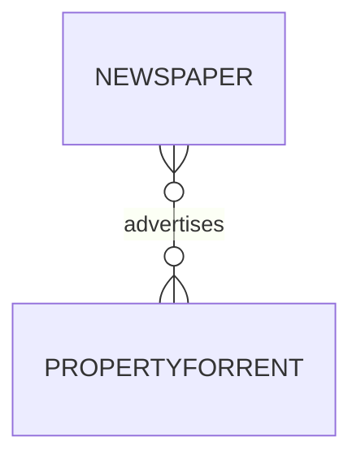

## 🔐 Structural Constraints

### ❓ What Are They?

- Rules that define **how entities can be associated** in a relationship.
    
- These rules reflect **real-world restrictions** or **business policies**.
    

🧠 Example:

- Every `PropertyForRent` **must** have an `Owner`.
    
- Every `Branch` **must** have at least one `Staff` member.
    

---

## 🔁 Multiplicity (Cardinality)

> Describes **how many instances** of one entity can/must be associated with another through a relationship.

### 🧩 Types of Binary Multiplicity

1. **One-to-One (1:1)**
    
    - One entity relates to **exactly one** of the other.
        
    - 📌 Example: One `Staff` member manages **one** `Branch`.
        
2. **One-to-Many (1:N or 1:*)**
    
    - One entity can relate to **many** of the other, but not vice versa.
        
    - 📌 Example: One `Staff` oversees **many** `PropertyForRent` listings.
        
3. **Many-to-Many (_:_)**
    
    - Many entities relate to **many** others.
        
    - 📌 Example: `Newspaper` advertises **many** `PropertyForRent` listings, and each property may appear in **many** newspapers.
        

---

## 📐 Importance of Multiplicity

- Multiplicity captures **business rules**.
    
- Helps avoid logical errors in the design (like a property without an owner).
    
- While most relationships are binary, **higher-degree relationships** are also possible (covered in later sections).
    

---

## 🖼️ Mermaid ER Diagrams (Obsidian)

### One-to-One (1:1): Staff manages Branch



### One-to-Many (1:*) Staff oversees Properties



### Many-to-Many (_:_) Newspapers advertise Properties



----
# 12.6.1 One-to-One (1:1) Relationships 420 


### One-to-One (1:1) Relationship: Staff Manages Branch

#### Diagram Analysis

![[Pasted image 20250526195836.png]]
- **Entities**:
  - `Staff` (identified by `staffNo`)
  - `Branch` (identified by `branchNo`)
  
- **Relationship**:
  - `Manages` (1:1 cardinality)
  - Multiplicity notations:
    - Staff side: `0..1` (a staff member manages **zero or one** branch)
    - Branch side: `1..1` (a branch is managed by **exactly one** staff member)

#### Key Rules from the Text


 **1:1 Relationship Characteristics**:
   - Maximum of one entity on either side participates
   - Optional on one side (here, staff may manage *zero* branches)
   - Mandatory on the other (each branch *must* have a manager)

#### Database Implementation
```sql
CREATE TABLE Staff (
    staffNo VARCHAR(5) PRIMARY KEY,
    -- other attributes...
);

CREATE TABLE Branch (
    branchNo VARCHAR(4) PRIMARY KEY,
    managerStaffNo VARCHAR(5) UNIQUE NOT NULL,
    FOREIGN KEY (managerStaffNo) REFERENCES Staff(staffNo)
);
```
*Why `UNIQUE NOT NULL`?* Ensures:
- Each branch has exactly one manager (`NOT NULL`)
- No staff member manages multiple branches (`UNIQUE`)

#### Real-World Analogies
| Scenario | 1:1 Relationship | Optional Side |
|----------|------------------|---------------|
| Employee-CompanyCar | "Assigns" | Employee (not all get cars) |
| Country-Capital | "Designates" | None (mandatory both sides) |

---
# 12.6.2 One-to-Many (1:*) Relationships 421 

### 📘 Concept Definition:

A **one-to-many relationship** exists when:

- One entity instance is associated with **many** instances of another entity,
    
- But each of those other instances is related to **at most one** instance of the first.
    

This is written as *_1:_ (or 1-to-many)**.


### 🧠 Real-World Example: `Oversees` Relationship

- Entities involved:
    
    - `Staff`
        
    - `PropertyForRent`
        
- Relationship:
    
    - A **staff member** can oversee **many** properties for rent.
        
    - A **property for rent** can be overseen by **at most one** staff member.
        

✅ This is a **one-to-many** relationship.

### 📊 Multiplicity Details

- A staff member may oversee:
    
    - **Zero** properties (if they are new or not assigned).
        
    - **Many** properties (if they are experienced or in charge of a large region).
        
- A property:
    
    - May have **zero** staff overseeing it (unassigned).
        
    - May have **only one** staff member overseeing it.
        

So, we represent:

- On the `PropertyForRent` side → `0..*` (zero or many properties).
    
- On the `Staff` side → `0..1` (each property is overseen by at most one staff member).
    

If actual limits are known (e.g., a staff member can oversee up to 100 properties), we can show:

- `0..100` instead of `0..*`.
    
### 🖼️ Diagram Explanation (Figure 12.15b)

![[Pasted image 20250526201221.png]]

The ER diagram shows the `Oversees` relationship between `Staff` and `PropertyForRent`.

- Near the `PropertyForRent` entity:  
    `0..*` indicates that one staff member can be related to **many** properties.
    
- Near the `Staff` entity:  
    `0..1` indicates that each property is related to **zero or one** staff member.
    

This correctly shows a **one-to-many** relationship going from `Staff` → `PropertyForRent`.


----
# 12.6.3 Many-to-Many (*:*) Relationships 422


### 📘 Concept Definition:

A **many-to-many** relationship is when:

- One entity can be associated with **many** instances of another entity,
    
- And vice versa.
    

We write this as **(_:_)**.


### 🧠 Real-World Example: `Advertises` Relationship

- Entities involved:
    
    - `Newspaper`
        
    - `PropertyForRent`
        
- Relationship:
    
    - A **newspaper** can advertise **many** properties for rent.
        
    - A **property for rent** can be advertised in **many** newspapers.
        

✅ This mutual many-sided relationship is a **many-to-many**.


## 🔍 Key Points

- This type of relationship is common in real-world systems.
    
- Both sides of the relationship can have **multiple links** to the other.
    
- Example situations:
    
    - A property listed in multiple papers.
        
    - A newspaper running multiple property ads.
        

## 📊 Multiplicity Representation

If actual limits are known (e.g. a newspaper can carry a max of 50 property ads), we can express that as:

- `0..50` instead of `0..*`.
    

Otherwise, we typically represent:

- `0..*` for both sides.
    

## 🖼️ Diagram Explanation

![[Pasted image 20250526201350.png]]

In the diagram showing the **Advertises** relationship:

- The `Newspaper` entity is connected to `PropertyForRent` using a relationship labeled `Advertises`.
    
- Near **both** entities, you’ll see the multiplicity `0..*`.
    
    - This means **a newspaper can advertise many properties**, and **a property can appear in many newspapers**.
        

This clearly reflects a **many-to-many** relationship.


---


#  12.6.4 Multiplicity for Complex Relationships

### 📘 Concept Definition:

**Multiplicity** in complex (n-ary) relationships refers to:

> The number (or range) of possible occurrences of one entity **when all other (n–1) entities in the relationship are fixed**.

This is especially relevant when the relationship involves **more than two entities** (e.g., ternary relationships).

### 🧠 Real-World Example: `Registers` Relationship

Entities involved:

- `Staff`
    
- `Branch`
    
- `Client`
    

Relationship:

- A staff member **registers** a client at a specific branch.
    

To understand multiplicity in this **ternary** relationship, we look at different combinations of fixed entities:

#### ➤ Case 1: Fixing Staff and Branch

- We determine how many Clients each Staff–Branch pair can register.
    
- Result: **0 or more Clients** → Represented as `0..*` beside the `Client` entity.
    

#### ➤ Case 2: Fixing Staff and Client

- We determine at how many branches this Staff–Client pair registers.
    
- Result: **Exactly one Branch** → Represented as `1..1` beside the `Branch` entity.
    

#### ➤ Case 3: Fixing Client and Branch

- We check how many staff members registered that Client at the Branch.
    
- Result: **Exactly one Staff** → Represented as `1..1` beside the `Staff` entity.
    


### 🖼️ Diagram Explanation (Figure 12.17b)

![[Pasted image 20250526202151.png]]

This ER diagram of the `Registers` ternary relationship shows:

- `0..*` near `Client` → A Staff–Branch pair may register many or no clients.
    
- `1..1` near `Branch` → Each Staff–Client pair is associated with exactly one branch.
    
- `1..1` near `Staff` → Each Client–Branch pair is registered by exactly one staff member.
    

This diagram captures **how the role of each entity varies** depending on the combination of the other two.

---

# 12.6.5 Cardinality and Participation Constraints

### 📘 Concept Definitions:

#### 🔸 **Cardinality**

> The **maximum** number of relationship instances an entity can participate in.

- Examples:
    
    - `0..1`: Zero or one occurrence
        
    - `1..1`: Exactly one occurrence
        
    - `0..*` (or `*`): Zero or many
        
    - `1..*`: One or more
        
    - `5..10`: Between 5 and 10 occurrences
        
    - `0, 3, 6–8`: Specific fixed occurrences
        

The **cardinality** appears as the **maximum value** in the multiplicity notation.

#### 🔸 **Participation**

> Indicates whether **all or only some** entity instances participate in a relationship.

- **Mandatory participation**: Minimum is `1`
    
- **Optional participation**: Minimum is `0`
    

The **participation** appears as the **minimum value** in the multiplicity notation.

✅ **Important:**  
In the ER diagram, the **participation of an entity** is reflected by the **minimum multiplicity value placed beside the _related_ entity**.

---

### 🖼️ Diagram Explanation (Figure 12.18)

![[Pasted image 20250526202339.png]]

The diagram shows the `Manages` relationship between `Staff` and `Branch`:

- `0..1` beside `Branch`:  
    Each branch is **managed by at most one staff member** (maximum = 1) → Cardinality is 1:1  
    Minimum = 0 → **Staff may not manage any branch** (optional participation).
    
- `1..1` beside `Staff`:  
    Each branch **must be managed by a staff member** (minimum = 1) → Mandatory participation.
    

---
