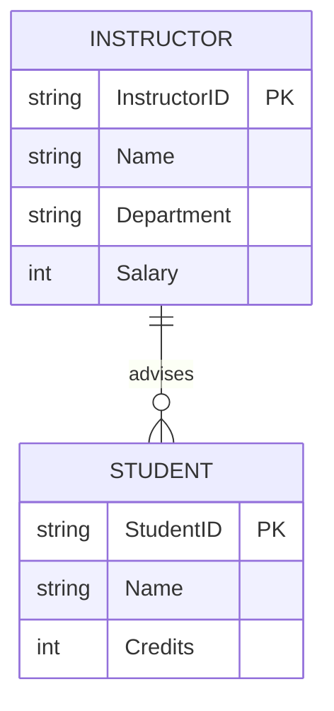

Here’s a **simplified breakdown** of the Neso Academy video transcript on **ER Models (Part 1)**—structured for easy note-taking in Obsidian, with key concepts and diagrams.

---

### **1. What is an ER Model?**  
- **Definition**: A visual blueprint for database design.  
- **Purpose**: Represents the **logical structure** of a database before implementation.  
- **Analogy**: Like an architect’s blueprint for a building.  

---

### **2. Key Components of ER Model**  
#### **(A) Entity**  
- **What?** A real-world object (e.g., `Student`, `Instructor`, `Course`).  
- **Example**:  
  - In a university database:  
    - Entities: `Student` (with ID, Name), `Instructor` (with ID, Salary).  

#### **(B) Entity Set**  
- **What?** A collection of similar entities (same type/attributes).  
- **Example**:  
  - `Instructor_Set` = All instructors in a university.  
  - `Student_Set` = All students.  
- **Note**: Entity sets can overlap (e.g., a person can be both a student and instructor).  

#### **(C) Attributes**  
- **What?** Properties describing an entity.  
- **Types**:  
  - **Key Attribute**: Unique identifier (e.g., `StudentID`).  
  - **Composite**: Can be split (e.g., `Address` → City, Street).  
  - **Multivalued**: Multiple values (e.g., `PhoneNumbers`).  
  - **Derived**: Calculated (e.g., `Age` from `BirthDate`).  

#### **(D) Relationship Sets**  
- **What?** How entities interact.  
- **Example**:  
  - `Instructor` → **advises** → `Student`.  
  - `Customer` → **borrows** → `Loan` (banking system).  
- **Cardinality**:  
  - **1:1** (One-to-One), **1:N** (One-to-Many), **M:N** (Many-to-Many).  

---

### **3. Example ER Diagram (Mermaid.js for Obsidian)**  

**Explanation**:  
- **Entities**: `INSTRUCTOR`, `STUDENT`.  
- **Relationship**: `advises` (1 instructor advises many students → **1:N**).  
- **Key Attributes**: `InstructorID`, `StudentID`.  

---

### **Key Takeaways**  
✔ **Entity** = Object (e.g., `Student`).  
✔ **Entity Set** = Group of similar entities (e.g., all students).  
✔ **Attributes** = Properties (e.g., `Name`, `ID`).  
✔ **Relationship** = Connection (e.g., `teaches`, `enrolls`).  

---
