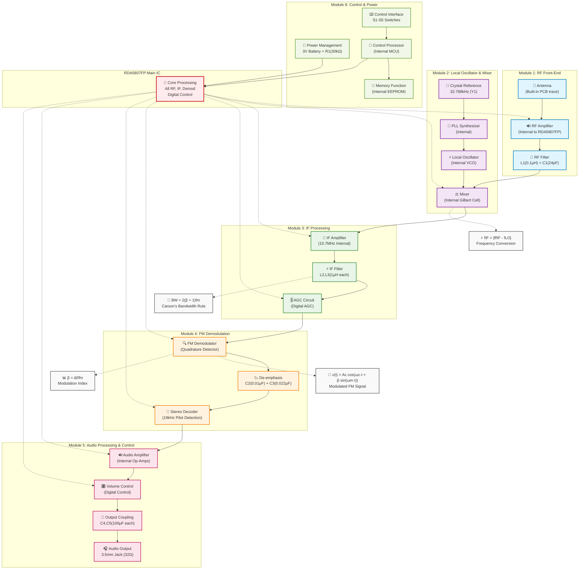

```mermaid
graph TB
    subgraph "Module 1: RF Front-End"
        ANT["📡 Antenna<br/>(Built-in PCB trace)"]
        RF_AMP["🔊 RF Amplifier<br/>(Internal to RDA5807FP)"]
        RF_FILT["🔀 RF Filter<br/>L1(0.1μH) + C1(24pF)"]
    end
    
    subgraph "Module 2: Local Oscillator & Mixer"
        LO["⚡ Local Oscillator<br/>(Internal VCO)"]
        XTAL["💎 Crystal Reference<br/>32.768kHz (Y1)"]
        MIXER["⚖️ Mixer<br/>(Internal Gilbert Cell)"]
        PLL["🔄 PLL Synthesizer<br/>(Internal)"]
    end
    
    subgraph "Module 3: IF Processing"
        IF_AMP["📢 IF Amplifier<br/>(10.7MHz Internal)"]
        IF_FILT["⚡ IF Filter<br/>L2,L3(1μH each)"]
        AGC["🎚️ AGC Circuit<br/>(Digital AGC)"]
    end
    
    subgraph "Module 4: FM Demodulation"
        DEMOD["🔍 FM Demodulator<br/>(Quadrature Detector)"]
        DEEMPH["📉 De-emphasis<br/>C2(0.01μF) + C3(0.022μF)"]
        STEREO_DEC["🎵 Stereo Decoder<br/>(19kHz Pilot Detection)"]
    end
    
    subgraph "Module 5: Audio Processing & Control"
        AUDIO_AMP["🔊 Audio Amplifier<br/>(Internal Op-Amps)"]
        VOL_CTRL["🎛️ Volume Control<br/>(Digital Control)"]
        COUPLING["🔗 Output Coupling<br/>C4,C5(100μF each)"]
        OUTPUT["🎧 Audio Output<br/>3.5mm Jack (32Ω)"]
    end
    
    subgraph "Module 6: Control & Power"
        CTRL["⌨️ Control Interface<br/>S1-S5 Switches"]
        POWER["🔋 Power Management<br/>3V Battery + R1(30kΩ)"]
        MEMORY["💾 Memory Function<br/>(Internal EEPROM)"]
        CPU["🧠 Control Processor<br/>(Internal MCU)"]
    end
    
    subgraph "RDA5807FP Main IC"
        CORE["🎯 Core Processing<br/>All RF, IF, Demod<br/>Digital Control"]
    end
    
    %% Signal Flow Connections
    ANT --> RF_AMP
    RF_AMP --> RF_FILT
    RF_FILT --> MIXER
    
    XTAL --> PLL
    PLL --> LO
    LO --> MIXER
    
    MIXER --> IF_AMP
    IF_AMP --> IF_FILT
    IF_FILT --> AGC
    
    AGC --> DEMOD
    DEMOD --> DEEMPH
    DEEMPH --> STEREO_DEC
    
    STEREO_DEC --> AUDIO_AMP
    AUDIO_AMP --> VOL_CTRL
    VOL_CTRL --> COUPLING
    COUPLING --> OUTPUT
    
    POWER --> CORE
    CTRL --> CPU
    CPU --> MEMORY
    CPU --> CORE
    
    %% Internal IC connections
    CORE -.-> RF_AMP
    CORE -.-> MIXER
    CORE -.-> IF_AMP
    CORE -.-> AGC
    CORE -.-> DEMOD
    CORE -.-> STEREO_DEC
    CORE -.-> AUDIO_AMP
    CORE -.-> VOL_CTRL
    
    %% Mathematical Relationships
    classDef mathLabel fill:#f9f9f9,stroke:#666,stroke-width:2px,color:#333
    
    MATH1["📐 v(t) = Ac cos(ωc·t + β·sin(ωm·t))<br/>Modulated FM Signal"]
    MATH2["📊 β = Δf/fm<br/>Modulation Index"]
    MATH3["⚡ fIF = |fRF - fLO|<br/>Frequency Conversion"]
    MATH4["🔢 BW ≈ 2(β + 1)fm<br/>Carson's Bandwidth Rule"]
    
    MIXER -.-> MATH3
    DEMOD -.-> MATH1
    DEMOD -.-> MATH2
    IF_FILT -.-> MATH4
    
    class MATH1,MATH2,MATH3,MATH4 mathLabel
    
    %% Module Styling
    classDef rfModule fill:#e1f5fe,stroke:#0277bd,stroke-width:2px
    classDef mixerModule fill:#f3e5f5,stroke:#7b1fa2,stroke-width:2px
    classDef ifModule fill:#e8f5e8,stroke:#388e3c,stroke-width:2px
    classDef demodModule fill:#fff3e0,stroke:#f57c00,stroke-width:2px
    classDef audioModule fill:#fce4ec,stroke:#c2185b,stroke-width:2px
    classDef controlModule fill:#f1f8e9,stroke:#689f38,stroke-width:2px
    classDef coreModule fill:#ffebee,stroke:#d32f2f,stroke-width:3px
    
    class ANT,RF_AMP,RF_FILT rfModule
    class LO,XTAL,MIXER,PLL mixerModule
    class IF_AMP,IF_FILT,AGC ifModule
    class DEMOD,DEEMPH,STEREO_DEC demodModule
    class AUDIO_AMP,VOL_CTRL,COUPLING,OUTPUT audioModule
    class CTRL,POWER,MEMORY,CPU controlModule
    class CORE coreModule
```
