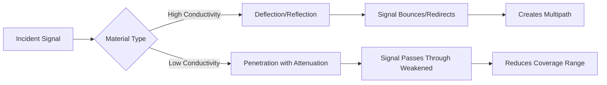
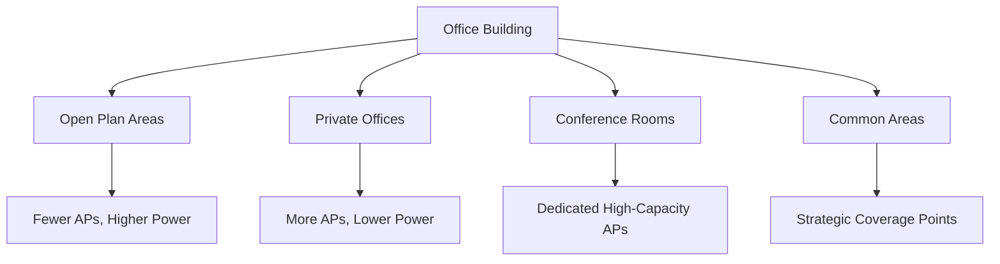

# Wave Effects and Applications in Enterprise Networks

## Overview

Understanding how electromagnetic waves propagate through different environments is **critical** for effective wireless network planning and deployment. Each building presents unique challenges that significantly impact radio wave behavior and, consequently, network performance.

---

## 1. Building Profile Impact on Wave Propagation

### Key Concept

**Building-Specific Network Design**

- A network design optimized for one building cannot simply be transferred to another building
- Each building has unique characteristics that affect wave propagation:
    - Physical layout and dimensions
    - Construction materials used


### Why Building Profiles Matter

- **Physical structure** determines how radio waves travel, reflect, and attenuate
- **Material composition** affects signal penetration and absorption

---

## 2. Wave Propagation Effects

Understanding the three primary wave propagation effects is essential for network planning:

### 2.1 Reflection

**Definition:**

- Occurs when electromagnetic waves encounter surfaces (metallic, earth's surface)
- The incident wave bounces back at an angle equal to the incident angle

**Key Characteristics:**

- **Phase Change:** Reflected waves are 180° out of phase with incident waves
- **Reflection Coefficient:** Ratio of reflected field intensity to incident field intensity
    - Value of 1 = complete reflection (ideal case)
    - Value < 1 = partial reflection with energy absorption (realistic case)

**Impact on Enterprise Networks:**

- Creates **multipath propagation** - signals arrive at receiver via multiple paths
- Can cause **constructive interference** (signal strengthening) or **destructive interference** (signal weakening)
- Metallic surfaces (steel beams, metal doors) are highly reflective
- Smooth surfaces reflect more effectively than rough surfaces

---

### 2.2 Refraction

**Definition:**

- Occurs when electromagnetic waves pass between media with different refractive indices
- Wave direction changes as it enters the new medium

**Governing Principle - Snell's Law:**

```
n₁ sin(θᵢ) = n₂ sin(θᵣ)
```

where:

- n₁, n₂ = refractive indices of the two media
- θᵢ = incident angle
- θᵣ = refracted angle

**Key Characteristics:**

- **Reflection coefficient < 1** (some energy propagates through second medium)
- Creates both reflected and refracted wave components
- Depends on material properties and wave frequency

**Impact on Enterprise Networks:**

- Signals bend when passing through walls, doors, and windows
- Different materials cause varying degrees of refraction
- Can redirect signals around obstacles
- Affects coverage predictions and signal strength calculations

---

### 2.3 Diffraction

**Definition:**

- Occurs when electromagnetic waves encounter obstacles in their propagation path
- Allows waves to "bend" around obstacles and reach areas behind them

**Governing Principle - Huygens' Principle:**

- Each point on a wavefront acts as a source of secondary spherical wavelets
- These secondary wavelets combine to form the propagated wave

**Key Characteristics:**

- Creates a **shadow zone** behind obstacles
- Shadow zone size varies with frequency:
    - **Lower frequencies** → smaller shadow zones (better penetration)
    - **Higher frequencies** → larger shadow zones (more blockage)
- Enables signal reception in non-line-of-sight (NLOS) conditions

**Impact on Enterprise Networks:**

- Allows wireless signals to reach areas without direct line of sight
- Critical for coverage in complex building layouts
- Frequency-dependent behavior affects network design choices
- Structural elements (columns, beams) create diffraction points

---

## 3. Material-Specific Propagation Characteristics

### 3.1 Steel and Metallic Materials

**Properties:**

- **High absorption** of radio frequency energy
- **Strong reflection** characteristics
- Minimal signal penetration

**Impact:**

- Steel-reinforced concrete creates significant signal attenuation
- Metal doors and partitions block signals effectively


**Network Planning Implications:**

- Requires more access points in steel-intensive environments
- Strategic placement to avoid steel structural elements
- May need higher transmit power levels
- Consider alternative paths around steel obstacles

---

### 3.2 Brick Walls

**Properties:**

- **Moderate to high absorption** depending on thickness and moisture content
- **Partial reflection** of radio waves
- **Frequency-dependent attenuation**

**Impact:**

- Signal loss ranges from 10-30 dB depending on:
    - Wall thickness
    - Brick density
    - Mortar composition
    - Moisture content
- Multiple brick walls compound signal loss
- Load-bearing brick walls typically thicker (more attenuation)

**Network Planning Implications:**

- Consider wall thickness in coverage calculations
- Multiple brick walls may require intermediate access points
- Older buildings with thicker brick walls need denser AP deployment

---

### 3.3 Wooden Walls and Partitions

**Properties:**

- **Low to moderate absorption** of radio signals
- **Minimal reflection**
- Best penetration characteristics among common building materials

**Impact:**

- Signal loss typically 5-15 dB per wooden partition
- Dry wood allows better penetration than wet wood
- Plywood and engineered wood may have different characteristics
- Furniture and wooden fixtures contribute to overall attenuation

**Network Planning Implications:**

- Wooden structures generally RF-friendly
- Still requires proper planning for multi-floor wooden buildings
- Wooden furniture and partitions create cumulative effects

---

### 3.4 Glass and Windows

**Properties:**

- **Clear glass:** Low attenuation (2-3 dB)
- **Tinted/coated glass:** Moderate to high attenuation (10-30 dB)
- **Low-E (energy-efficient) glass:** Very high attenuation (20-40 dB)

**Impact:**

- Modern energy-efficient windows can significantly block signals
- Creates challenges for signal propagation between indoor/outdoor
- May affect coverage near building perimeter

---

### 3.5 Concrete

**Properties:**

- **Moderate to high absorption** depending on reinforcement
- **Reinforced concrete:** Higher attenuation due to steel rebar
- **Pre-cast concrete:** May include metallic mesh (high attenuation)

**Impact:**

- Signal loss ranges from 15-40 dB depending on:
    - Thickness
    - Reinforcement density
    - Moisture content
- Floor-to-ceiling concrete creates significant vertical attenuation
# 🏢 Building Materials and Their Impact on Wireless Network Planning

## 📊 Comparative Analysis of Material Properties and Network Implications

| Material Type                           | Properties                                                                                                               | Signal Impact                                                                                                                                                                          | Network Planning Implications                                                                                                                                                                |
| --------------------------------------- | ------------------------------------------------------------------------------------------------------------------------ | -------------------------------------------------------------------------------------------------------------------------------------------------------------------------------------- | -------------------------------------------------------------------------------------------------------------------------------------------------------------------------------------------- |
| **🔩 3.1 Steel and Metallic Materials** | • 🛑 High absorption of RF energy<br>• 🔄 Strong reflection characteristics<br>• 🚫 Minimal signal penetration           | • 🏗️ Steel-reinforced concrete = significant attenuation<br>• 🚪 Metal doors/partitions block signals effectively<br>• 🌑 Creates RF shadows and dead zones                           | • 📡 Requires more APs in steel-intensive areas<br>• 🎯 Strategic placement to avoid steel elements<br>• ⚡ Higher transmit power needed<br>• 🛣️ Consider alternative paths around obstacles |
| **🧱 3.2 Brick Walls**                  | • 🟡 Moderate to high absorption<br>• 🔄 Partial reflection<br>• 📶 Frequency-dependent attenuation                      | • 📉 Signal loss: 10-30 dB based on:<br>  - 📏 Wall thickness<br>  - ⚖️ Brick density<br>  - 🧪 Mortar composition<br>  - 💧 Moisture content<br>• 🧱 Multiple walls = compounded loss | • 📐 Account for wall thickness in planning<br>• 🔁 Intermediate APs for multiple walls<br>• 🏛️ Denser deployment in older buildings<br>• 🌧️ Consider moisture in calculations             |
| **🌲 3.3 Wooden Walls and Partitions**  | • 🟢 Low to moderate absorption<br>• ✅ Minimal reflection<br>• 🏆 Best penetration among materials                       | • 📊 Signal loss: 5-15 dB per partition<br>• ☀️ Dry wood > wet wood penetration<br>• 🪚 Plywood varies in characteristics<br>• 🛋️ Furniture = cumulative effects                      | • 👍 Generally RF-friendly<br>• 🏢 Still plan multi-floor coverage<br>• 📦 Account for furniture effects<br>• 🎯 Minimal extra AP requirements                                               |
| **🪟 3.4 Glass and Windows**            | • 👁️ Clear glass: Low loss (2-3 dB)<br>• 🕶️ Tinted: Moderate loss (10-30 dB)<br>• 💎 Low-E glass: High loss (20-40 dB) | • 🏢 Energy-efficient windows block signals<br>• 🏠 Indoor/outdoor propagation challenges<br>• 📍 Perimeter coverage affected<br>• 🔁 Reflection = multipath issues                    | • 🔍 Identify glass types in survey<br>• 📶 Extra APs near energy-efficient windows<br>• 🔁 Repeaters for perimeter areas<br>• 🌊 Plan for multipath effects                                 |
| **🏗️ 3.5 Concrete**                    | • 🟡 Moderate to high absorption<br>• 🔩 Reinforced: Higher loss (steel rebar)<br>• 🕸️ Pre-cast: May have metallic mesh | • 📉 Signal loss: 15-40 dB based on:<br>  - 📏 Thickness<br>  - 🔩 Reinforcement density<br>  - 💧 Moisture content<br>• ↕️ Vertical attenuation challenges                            | • 📡 Dense AP deployment required<br>• 🏢 Plan vertical propagation<br>• ⚡ Higher power APs needed<br>• 🛣️ Alternative signal paths                                                         |

## 🎯 Key Planning Considerations Across Materials

### 📶 Attenuation Hierarchy (Highest to Lowest):
1. **🔩 Steel/Metallic Materials** 🚫 (Highest attenuation)
2. **🏗️ Reinforced Concrete** 📉
3. **🧱 Brick Walls** 🟡
4. **🏗️ Concrete (non-reinforced)** 📊
5. **💎 Energy-Efficient Glass** 🪟
6. **👁️ Standard Glass** ✅
7. **🌲 Wooden Structures** 🏆 (Lowest attenuation)

### 🚀 Deployment Strategy Based on Material Dominance:

| Material Dominance | AP Density | Power Requirements | Additional Considerations |
|-------------------|------------|-------------------|--------------------------|
| **🔩 Steel/Metal Intensive** | 📶📶📶 Very High | ⚡⚡⚡ High | 🛣️ Signal routing, 📡 directional antennas |
| **🏗️ Concrete/Brick Dominant** | 📶📶 High | ⚡⚡ Medium-High | ↕️ Vertical planning, 🌧️ moisture accounting |
| **🎨 Mixed Materials** | 📶📶 Medium-High | ⚡⚡ Medium | 🗺️ Zone-specific planning |
| **🌲🪟 Wood/Glass Dominant** | 📶 Medium | ⚡ Low-Medium | ✅ Minimal extra considerations |

## 💡 Pro Tips for Network Planners

### 🚨 Red Flag Materials:
- 🔩 **Steel frames** = Major signal blockers
- 💎 **Low-E glass** = Invisible barriers
- 🏗️ **Reinforced concrete** = 3D coverage challenges

### ✅ Green Light Materials:
- 🌲 **Dry wood** = Easy penetration
- 👁️ **Clear glass** = Minimal interference
- 🪚 **Standard drywall** = Predictable coverage

### 🎯 Smart Strategies:
- 🔍 **Always conduct site surveys** 📝
- 📡 **Test signal penetration** in different areas
- 🗺️ **Create material maps** for accurate planning
- 🔄 **Iterate and optimize** based on real performance
---

## 4. Environmental Influence on Radio Wave Propagation

### 4.1 Indoor Environmental Factors

**Physical Layout:**

- **Open floor plans:** Better signal propagation, fewer obstacles
- **Cubicle farms:** Moderate attenuation, complex multipath
- **Enclosed offices:** Higher attenuation, requires more APs
- **Corridor layouts:** Can act as waveguides, channeling signals

**Dynamic Obstacles:**

- **People:** Human bodies absorb 2.4 GHz signals effectively (high water content)
- **Elevators:** Moving metal obstacles create variable attenuation
- **Doors:** Open vs. closed significantly affects propagation
- **Furniture:** Office equipment and furnishings contribute to clutter

**Environmental Conditions:**

- **Temperature:** Affects air density and refraction
- **Humidity:** Influences signal absorption
- **Atmospheric pressure:** Minor effects on propagation

---

### 4.2 Material Penetration and Deflection

**High Penetration Materials:**

- Drywall (gypsum board): 3-5 dB loss
- Wood: 5-15 dB loss
- Clear glass: 2-3 dB loss

**Moderate Penetration Materials:**

- Brick: 10-30 dB loss
- Concrete (non-reinforced): 15-25 dB loss
- Tinted glass: 10-20 dB loss

**Low Penetration Materials:**

- Steel: 30-50 dB loss (often complete blockage)
- Reinforced concrete: 20-40 dB loss
- Low-E glass: 20-40 dB loss
- Metal mesh/screens: 25-50 dB loss

**Signal Deflection vs. Penetration:**



---

## 5. Importance of Site-Specific Network Planning

### 5.1 Why Generic Designs Fail

**Unique Building Characteristics:**

- No two buildings are identical in RF propagation behavior
- Construction materials vary by:
    - Building age
    - Regional construction practices
    - Building purpose (office, industrial, residential)
    - Architectural style

**Variable Factors:**

- Floor plans and spatial arrangements differ
- Obstacle density and distribution varies
- Material combinations create unique signatures
- Environmental conditions are location-specific

---

### 5.2 Consequences of Inadequate Planning

**Performance Issues:**

- **Dead zones:** Areas with insufficient coverage
- **Interference zones:** Areas with excessive overlapping coverage
- **Capacity bottlenecks:** Insufficient APs for user density
- **Poor roaming:** Inadequate coverage overlap

**Cost Implications:**

- Over-deployment: Unnecessary equipment and operating costs
- Under-deployment: Expensive remediation and upgrades
- User dissatisfaction: Productivity losses and complaints
- Network troubleshooting: Ongoing operational costs

---

### 5.3 Elements of Proper Network Planning

**Site Survey Requirements:**

1. **Physical Survey:**
    
    - Building blueprints and floor plans
    - Material identification (walls, ceilings, floors)
    - Structural element mapping (beams, columns)
    - Obstacle inventory (furniture, equipment)
2. **RF Survey:**
    
    - Signal strength measurements
    - Interference source identification
    - Channel utilization analysis
    - Multipath characterization
3. **Capacity Planning:**
    
    - User density analysis
    - Application bandwidth requirements
    - Peak usage patterns
    - Future growth projections
4. **Predictive Modeling:**
    
    - RF propagation simulation
    - Coverage heat maps
    - Capacity modeling
    - What-if scenario analysis

---

## 6. Different Buildings Require Different Network Architectures

### 6.1 Building-Specific Architecture Considerations

**Office Buildings:**



**Characteristics:**

- Mixed environments (open/closed spaces)
- High user density in specific areas
- Variable capacity requirements
- Need for seamless roaming

**Architecture Approach:**

- Micro-cell design with dense AP placement
- Capacity-focused deployment
- Dual-band (2.4 GHz + 5 GHz) coverage
- Consider 6 GHz (Wi-Fi 6E) for high-density areas

---

**Industrial Facilities:**

**Characteristics:**

- Large open spaces with high ceilings
- Significant metallic obstacles (machinery, storage)
- Harsh environmental conditions
- Lower user density but critical applications

**Architecture Approach:**

- High-gain directional antennas
- Industrial-grade ruggedized equipment
- Lower frequency bands for better penetration
- Redundant coverage for mission-critical areas

---

**Healthcare Facilities:**

**Characteristics:**

- Mix of materials (lead-lined rooms, thick concrete)
- Critical application requirements
- Regulatory compliance needs
- Interference-sensitive medical equipment

**Architecture Approach:**

- Very dense AP deployment
- Careful channel planning to avoid medical device interference
- Multiple SSIDs for different user classes
- Redundancy for life-critical applications

---

**Retail Environments:**

**Characteristics:**

- Variable layouts (seasonal changes)
- Mix of customer and employee use
- High capacity in specific zones
- Need for location services

**Architecture Approach:**

- Flexible, modular design
- Location-aware AP placement
- Separate networks for POS, customer, and management
- Analytics-focused deployment

---

**Educational Institutions:**

**Characteristics:**

- Very high user density in classrooms
- Variable demand (class schedules)
- Mix of building types and ages
- Budget constraints

**Architecture Approach:**

- Classroom-focused high-capacity APs
- Time-based capacity planning
- Outdoor coverage for campus areas
- Phased deployment by priority

---

### 6.2 Common Architectural Patterns

**Centralized Architecture:**

- Lightweight APs controlled by central controller
- Suitable for campus environments
- Easier management and updates
- Single point of failure risk

**Distributed Architecture:**

- Autonomous APs with local intelligence
- Better for distributed facilities
- More resilient to controller failures
- More complex to manage at scale

**Cloud-Managed Architecture:**

- APs managed via cloud platform
- Scalable for multi-site deployments
- Requires reliable internet connectivity
- Subscription-based cost model

**Hybrid Architecture:**

- Combines elements of centralized and distributed
- Flexibility for mixed environments
- Can balance local autonomy with central control
- More complex initial design

---

## 7. Practical Network Planning Process

### Step-by-Step Methodology:

**1. Requirements Gathering**

- User density and distribution
- Application types and bandwidth needs
- Coverage area requirements
- Performance objectives (throughput, latency)
- Budget constraints

**2. Site Assessment**

- Physical walkthrough
- Building material identification
- Blueprint verification
- Interference source identification
- Existing infrastructure inventory

**3. RF Design**

- Propagation modeling
- AP placement planning
- Channel assignment strategy
- Power level optimization
- Coverage validation

**4. Capacity Planning**

- User-to-AP ratio calculation
- Channel width selection
- Frequency band allocation
- QoS configuration planning

**5. Implementation Planning**

- Phasing strategy
- Installation logistics
- Cabling requirements
- Power provisioning (PoE budget)
- Testing procedures

**6. Validation**

- Post-installation survey
- Performance testing
- Coverage verification
- Capacity validation
- User acceptance testing

---

## 8. Key Takeaways for Enterprise Network Planning

### Critical Success Factors:

1. **No Universal Design**
    
    - Each building requires unique planning
    - Material composition is critical
    - Generic designs lead to poor performance
2. **Understanding Propagation Effects**
    
    - Reflection creates multipath
    - Refraction affects signal direction
    - Diffraction enables NLOS coverage
    - All three interact simultaneously
3. **Material Awareness**
    
    - Steel: Maximum absorption and reflection
    - Brick: Moderate to high attenuation
    - Wood: Best penetration characteristics
    - Glass: Variable depending on type
    - Concrete: Highly dependent on reinforcement
4. **Environmental Dynamics**
    
    - Building layout significantly impacts propagation
    - Dynamic obstacles (people, doors) create variability
    - Environmental conditions affect performance
    - Furniture and fixtures contribute to attenuation
5. **Architecture Customization**
    
    - Building type determines architecture approach
    - User density drives capacity planning
    - Application requirements influence design
    - Future growth must be considered
6. **Proper Planning Investment**
    
    - Site surveys are essential
    - Predictive modeling saves costs
    - Validation testing ensures success
    - Documentation enables future optimization

---

## 9. Common Planning Mistakes to Avoid

- **Using another building's design without modification**
- **Ignoring building material composition**
- **Underestimating the impact of steel and metal**
- **Failing to account for dynamic obstacles**
- **Not considering vertical propagation (multi-floor)**
- **Inadequate capacity planning for peak usage**
- **Ignoring interference sources**
- **Insufficient coverage overlap for roaming**
- **Not planning for future growth**
- **Skipping post-installation validation**

---

## Conclusion

Effective enterprise wireless network planning requires **deep understanding** of how electromagnetic waves interact with the physical environment. The unique characteristics of each building—from construction materials to spatial layout—create distinct propagation patterns that cannot be addressed with generic solutions.

**Success requires:**

- Comprehensive site assessment
- Material-aware propagation modeling
- Building-specific architecture design
- Proper validation and testing
- Ongoing monitoring and optimization

By recognizing that **reflection, refraction, and diffraction** interact with building materials in complex ways, network planners can design deployments that deliver reliable, high-performance wireless connectivity tailored to each unique environment.