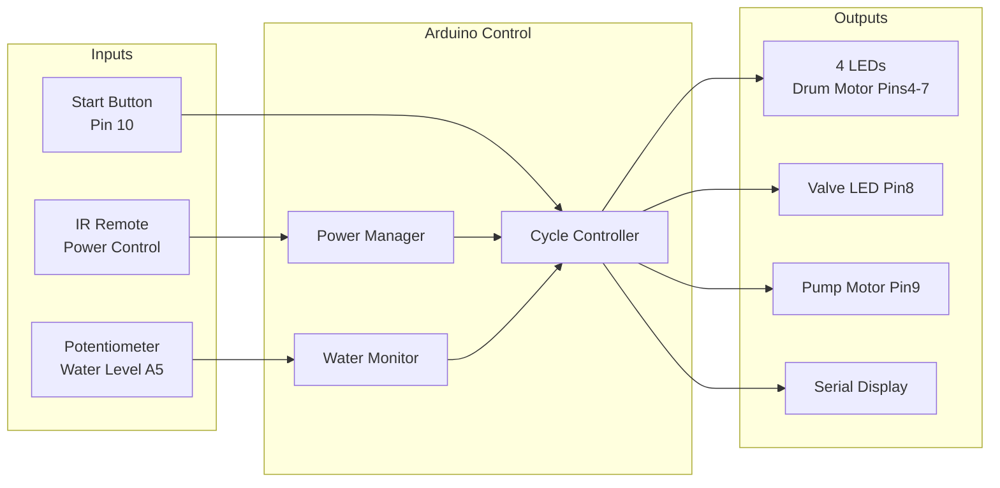

```
// C++ code
// 222170972 Chrinovic Raya Tshiwaya
int alarmIn_1,tiltIn_1;
void setup()
{
  pinMode(2,INPUT);
  pinMode(3,INPUT);
  Serial.begin(9600);
}

void loop()
{
  tiltIn_1 = digitalRead(2);
  alarmIn_1 = digitalRead(3);
  Serial.print("alarm = ");
  Serial.print(alarmIn_1);
  Serial.print(" tilt = ");
  Serial.println(tiltIn_1);
}
```

[Circuit link](https://www.tinkercad.com/things/a6mHeSPQzHh-assignment-1-222170972)



