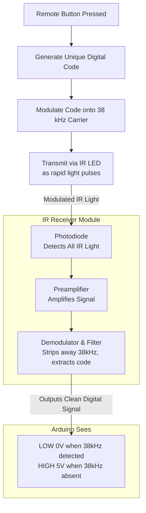

# **Theory** 

## **Notes: How IR Remote & Receiver Work with Arduino**

#### **1. Core Components & Their Theory**

*   **Infrared Receiver:**
    *   **What it is:** A component containing a **photodiode** and a **pre-amplifier**.
    *   **Function:** It detects infrared light and converts it into an electrical signal.
    *   **How it works:** It is tuned to scan for IR signals in specific, standardized frequency ranges. It filters out noise and outputs a clean digital signal on its output pin for the Arduino to read.

*   **Infrared Transmitter (Remote):**
    *   **What it is:** Essentially an **LED** that emits light in the **infrared spectrum** instead of the visible spectrum.
    *   **Function:** When a button is pressed, it generates a unique signal (a code) and transmits it via modulated IR light.

*   **Infrared Light:**
    *   A form of electromagnetic radiation that is **invisible to the human eye**.
    *   **Pro Tip:** It can be seen using a **phone's camera**, which can detect IR light.

#### **2. Communication Protocol**

*   The remote and receiver use a standardized **protocol** to communicate.
*   **Example:** The **NEC protocol** is mentioned as one of the most common standards.
*   **Purpose:** The protocol defines the rules for how the data (the button press) is **modulated** into a light signal and then demodulated back into a digital code.

#### **3. How a Button Press is Transmitted**

1.  **Press a Button:** On the remote control.
2.  **Generate a Code:** The remote generates a **unique hexadecimal code** corresponding to that specific button.
3.  **Transmit the Signal:** The IR LED blinks rapidly (modulates) in the pattern defined by the protocol to send this code.
4.  **Receive and Decode:** The IR receiver detects the modulated light, filters it, and outputs the electrical signal.
5.  **Arduino Reads Signal:** The Arduino reads this signal and, using a library, decodes it back into the original hexadecimal code.

#### **4. Practical Application Circuit (Turning on an LED)**

*   **Goal:** Turn on a red LED only when the "5" button on the remote is pressed.
*   **Circuit Setup:**
    *   **LED:** Anode (positive leg) connected to **Arduino Pin 10**. Cathode (negative leg) connected to GND through a **1 kΩ resistor** (used to limit current).
      
    *   **IR Receiver:**
        *   **Pin 1 (Output)** -> **Arduino Pin 7**
        *   **Pin 2 (GND)** -> **GND**
        *   **Pin 3 (VCC)** -> **5V**
*   **Code Logic:**
    1.  The code constantly checks for incoming IR signals.
    2.  When a signal is received, it decodes it and prints the hex code to the Serial Monitor.
    3.  It then compares the received code to the known code for the "5" button.
    4.  **If they match:** It sets Pin 10 to `HIGH`, turning the LED on for 2 seconds.
    5.  **If they don't match (e.g., button "0"):** Nothing happens to the LED; only the code is printed.

#### **5. Key Takeaways**

*   **Library is Essential:** The `IRremote.h` library is required to easily decode the complex signals from the receiver.
*   **Hex Codes are Unique:** Each button on a remote has a unique hexadecimal code that the Arduino can be programmed to recognize and act upon.
*   **Foundation for Control:** This basic principle (read a code -> perform an action) can be expanded to control motors, servos, relays, and more, all wirelessly via a remote.
---

## **Which pins can you use for the IR-Receiver output?**

You can use **any digital pin** on the Arduino for the data output from the IR receiver _in your wiring_. However, the specific library you use often restricts which pin you can _actually_ use in your code.

### The Detailed Explanation:

#### 1. For the Common `IRremote.h` Library (Default in Tinkercad)

The standard `IRremote.h` library, which is pre-installed in Tinkercad and very common in tutorials, **does not allow you to use any pin**. This is a hardware limitation it imposes.

- **On Arduino Uno, Nano, and other ATmega328-based boards:** The library is hardcoded to only work on **Pin 3, 9, 10, or 11**.
    
- **Why?** The library uses a hardware feature of the Arduino called **timer interrupts** to precisely read the fast, modulated signal from the receiver. These specific pins are tied to the timers the library is programmed to use. Using any other pin will simply not work.


### **Summary & Best Practice for Tinkercad**

|Question|Answer for Tinkercad|
|---|---|
|**Can I physically wire it to any digital pin?**|Yes, you can connect the wire to any digital pin.|
|**Will it work if I do?**|**No.** It will only work if you use one of the pins the library supports.|
|**Which pins should I use?**|Use **Pin 3, 9, 10, or 11** to guarantee it works with the `IRremote.h` library.|
|**What is the most common pin?**|**Pin 11** is very commonly used in examples and tutorials.|

---


## **The Code (The Magic Decoder)**

The Arduino needs a special library to understand the complex patterns from the receiver. Tinkercad has this library pre-installed.

**Key Steps in the Code:**

1. **Include the Library:** `#include <IRremote.h>`
    
2. **Define the Pins:** Tell the code which pin the receiver is connected to.
    
3. **Create a Receiver Object:** `IRrecv irrecv(receiverPin)`
    
4. **Create a Decoder Object:** `decode_results results` to store the decoded signal.
    
5. **Start the Receiver:** `irrecv.enableIRIn()`
    
6. **Check for a Signal:** `if (irrecv.decode(&results)) { ... }`
    
7. **Get the Code:** `unsigned long value = results.value;`
    
8. **Resume Listening:** `irrecv.resume();`

---
## **What does the IR receiver phsically output is voltage signals or???**

### The Short Answer

Yes, the IR receiver outputs a **clean, digital signal** (a series of **5V** and **0V** levels) that the Arduino can directly read on a digital input pin. It's not a simple analog voltage that varies; it's a precise on/off signal that represents the modulated code from the remote.

---

### The Detailed Explanation: From Light to Logic

Think of the receiver as a smart translator. Its job is to convert the complex, flickering IR light pattern into a simple digital language the Arduino understands.

#### 1. The Input: Modulated Infrared Light

The remote doesn't just hold its IR LED on. It **blinks it on and off at a very high frequency** (usually **38 kHz**) to represent the data. This is called **modulation**.

*   **Why modulate?** To avoid interference from other IR sources like sunlight, light bulbs, or heaters, which produce constant, slow-changing IR light. The receiver is specifically designed to listen *only* for this fast, 38 kHz blinking.

#### 2. The Magic Inside the Receiver

The receiver module has three main parts:
1.  **Photodiode:** Detects incoming IR light.
2.  **Preamplifier:** Boosts the very weak signal from the photodiode.
3.  **Band-Pass Filter & Demodulator:** This is the key. It's tuned to the **38 kHz frequency**. It filters out everything that *isn't* blinking at 38 kHz. Then, it **demodulates** the signal, which means it strips away the 38 kHz carrier wave and extracts the original data pattern.

#### 3. The Output: A Clean Digital Signal

The output pin presents this extracted data pattern as a clean, digital waveform.

*   **When it detects the 38 kHz signal:** The output pin goes **LOW (0V)**.
*   **When there is no 38 kHz signal:** The output pin goes **HIGH (~5V)**.

This seems backwards at first, but it's standard for these modules. The remote's LED blinking *on* (sending the 38 kHz signal) causes the receiver's output to go *low*.

**Here is a visualization of the process:**



### What the Arduino Sees

The Arduino's digital input pin reads this series of HIGH (5V) and LOW (0V) states. The timing of these pulses how long they are HIGH and how long they are LOW—encodes the specific protocol (NEC, Sony, etc.) and the unique button code.

The `IRremote.h` library's job is to:
1.  **Measure the timing** of these HIGH and LOW pulses.
2.  **Compare the timing** to known protocols.
3.  **Decode** the timing pattern into a simple hexadecimal number that represents the button pressed.

### Analogy: Morse Code over a Noisy Room

*   The **remote** is a person with a flashlight blinking **Morse code** very quickly (**modulation**).
*   The **sunlight and lamps** are other people in a noisy room talking constantly.
*   Your **eyes** are the **photodiode**, seeing all the light.
*   Your **brain** is the **receiver's demodulator**. You've decided to only pay attention to the fast, specific blinking of the flashlight. You ignore all the other constant light and voices (**filtering**). You translate the fast blinking back into slow, understandable Morse code dots and dashes (**demodulation**).
*   The **Morse code message** itself (e.g, "SOS") is the **digital signal** you output for someone else to act on.

So, in summary: **The receiver outputs a clean, digitally perfect, 5V/0V waveform that perfectly mirrors the data sent by the remote, free from any interfering IR noise.**

---


# **18.1 Basic IR-Remote & Reciever

## Circuit link 

https://www.tinkercad.com/things/66KM00LhT33-181-basic-ir-remote-reciever

## Code

```C++
#include <IRremote.hpp>

const int IR_PIN = 3;
unsigned long inputVal;

void setup()
{
    IrReceiver.begin(IR_PIN, ENABLE_LED_FEEDBACK); // Start the receiver on pin 3
    Serial.begin(9600);
    Serial.println("IR Receiver Ready");
}

void loop() {
    if (IrReceiver.decode()) {
        inputVal = IrReceiver.decodedIRData.decodedRawData;
        Serial.println(inputVal, HEX); // Display as hexadecimal
        IrReceiver.resume(); // Receive the next value
    }
}
```

## Notes

The line `inputVal = IrReceiver.decodedIRData.decodedRawData;` does the following:

#### What it extracts:
**The complete, raw IR code** - This is the full numerical value that represents the entire IR signal received from the remote control.

#### Technical breakdown:
- `IrReceiver` - The IR receiver object
- `.decodedIRData` - A structure that contains all the decoded IR information
- `.decodedRawData` - A 32-bit unsigned long that holds the complete raw IR code

#### What this raw data represents:
The raw data is typically a **32-bit value** that includes:
- **Protocol identifier** - Which IR protocol was used (NEC, Sony, RC5, etc.)
- **Device address** - Which device the remote is controlling
- **Command** - Which specific button was pressed
- **Inverted bits** - Some protocols include inverted command bits for error checking

#### Example:
If you press a button and see `0xFFA25D` in hexadecimal, this might break down as:
- `0xFF` - Device address
- `0xA2` - Command/inverted command
- `0x5D` - Inverted command/checksum

#### Alternative approach:
Instead of using the raw data, you might want to use:
```cpp
// Get just the command portion (often more useful)
uint8_t command = IrReceiver.decodedIRData.command;

// Get the protocol type
uint8_t protocol = IrReceiver.decodedIRData.protocol;

// Get the device address
uint16_t address = IrReceiver.decodedIRData.address;
```

#### When to use raw data vs command:
- **Use raw data** (`decodedRawData`) when you want the complete signal or need to handle multiple protocols
- **Use command** (`command`) when you only care about which button was pressed (simpler)

The raw data gives you the most complete information but may require more processing to extract the specific button press you're looking for.

## Output

The zeros you're seeing in the output are **IR repeat codes** - they indicate that you're holding down a button on the remote control.

---

# 18.2 Registering specific buttons
## Circuit link 

https://www.tinkercad.com/things/4sEBi8V0SSp-182-registering-specific-buttons

## Code

```C++
#include <IRremote.hpp>

const int IR_PIN = 3;
unsigned long inputVal;

void setup()
{
    IrReceiver.begin(IR_PIN, ENABLE_LED_FEEDBACK); // Start the receiver on pin 3
    Serial.begin(9600);
    Serial.println("IR Receiver Ready");
}

void loop() {
    if (IrReceiver.decode()) {
        inputVal = IrReceiver.decodedIRData.decodedRawData;
        Serial.println(inputVal); // Display as hexadecimal
        IrReceiver.resume(); // Receive the next value
      
        switch(inputVal){
        case 4261527296:
        Serial.println(" = Forward");
        break;
       
          case 4127833856:
          Serial.println(" = Backwards");
          break;
          case 4177968896:
          Serial.println(" = Right");
          break;
          case 4211392256:
          Serial.println(" = Left");
          break;
          
          case 4194680576:
          Serial.println(" = Enter");
          break;
          
          default:
          Serial.println(" = not valid");
          break;
			
    	}	
	}
  
}  
```


---

# 18.3 Controlling motors

## Circuit link 

## Code

```C++
```

## Notes

---

# 18.4

## Circuit link 

## Code

```C++
```

## Notes

---

# 18.5

## Circuit link 

## Code

```C++
```

## Notes

---


001 = 1 
010 = 2
011 = 3 
100 = 4 

101 = 5  
110 = 6

111 = 7

1000 = 8 

1001 = 9

1010 = 10

1011 = 11

1100 = 12

1101 = 13

1110 = 14

1111  = 15

10000 = 16
