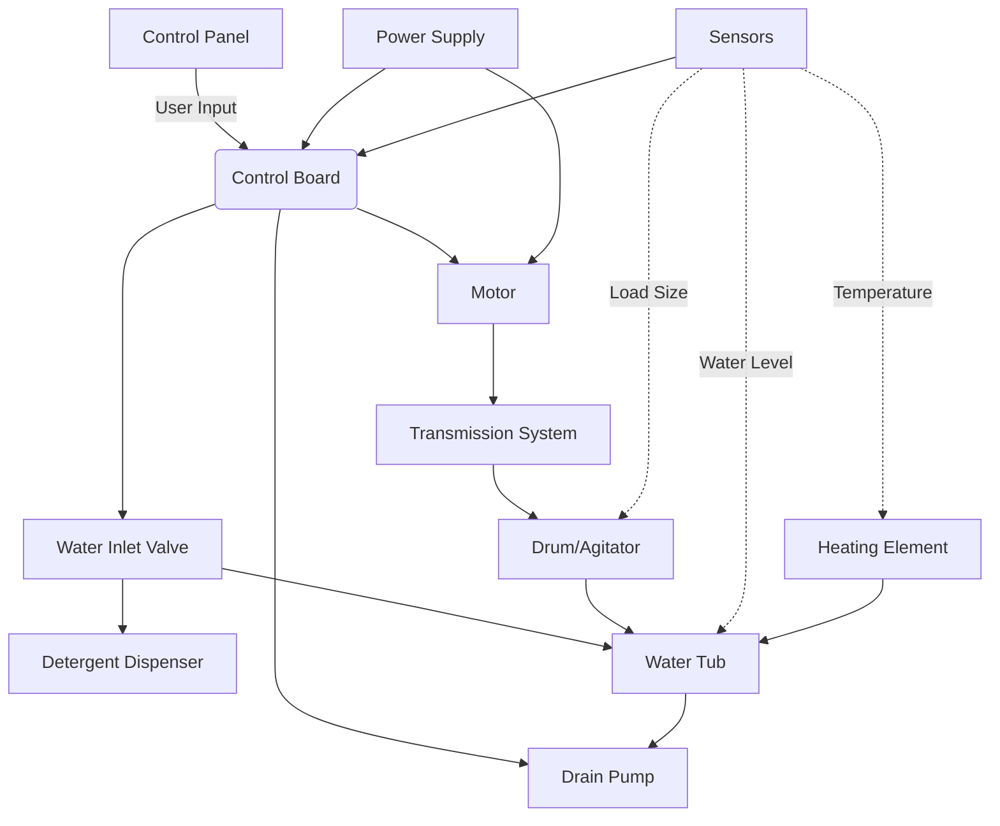
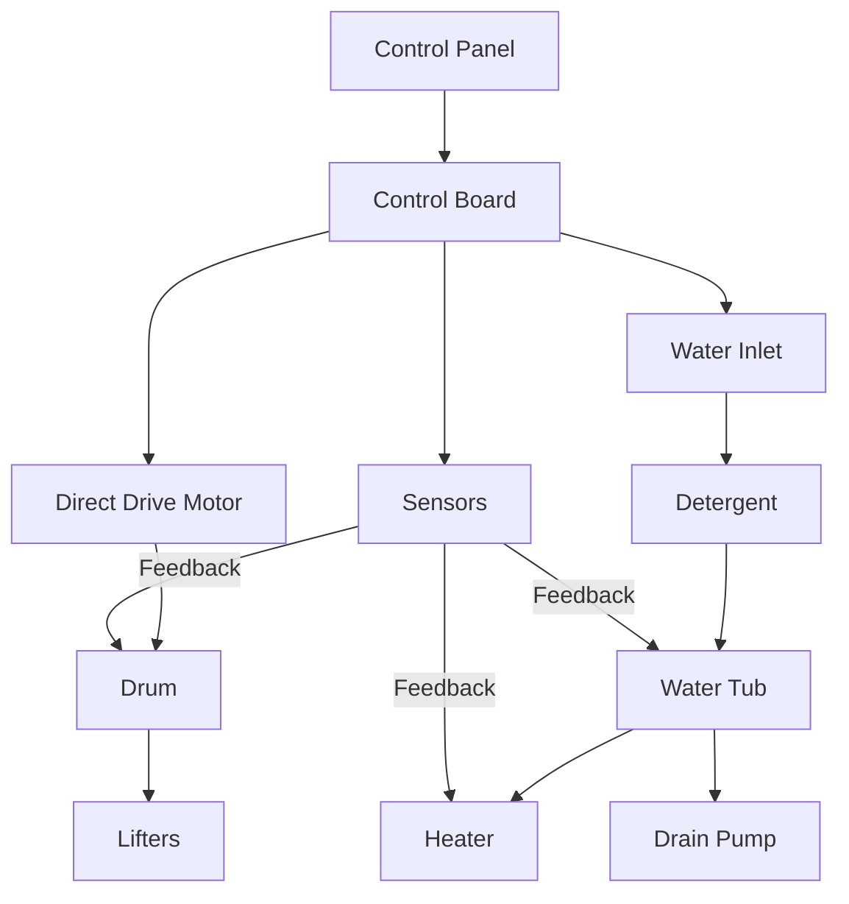
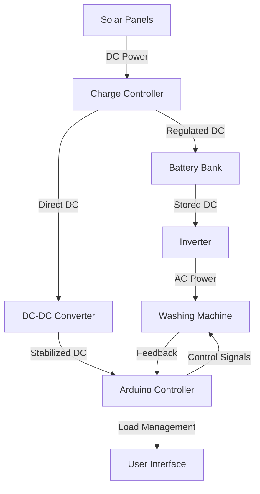
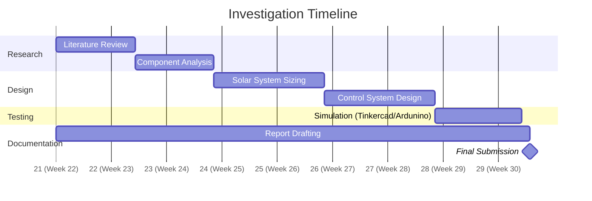

```mermaid

graph TD
    A[Control Panel] -->|User Input| B(Control Board)
    B --> C[Motor]
    B --> D[Water Inlet Valve]
    B --> E[Drain Pump]
    C --> F[Transmission System]
    F --> G[Drum/Agitator]
    D --> H[Detergent Dispenser]
    D --> I[Water Tub]
    G --> I
    I --> E
    J[Power Supply] --> B
    J --> C
    K[Sensors] --> B
    K -.->|Load Size| G
    K -.->|Water Level| I
    K -.->|Temperature| L[Heating Element]
    L --> I

 
```

# V2

```mermaid

flowchart TD
    A[Control Panel] --> B[Control Board]
    B --> C[Direct Drive Motor] --> D[Drum]
    B --> E[Water Inlet] --> F[Detergent] --> G[Water Tub]
    G --> H[Heater] & I[Drain Pump]
    D --> J[Lifters]
    B --> K[Sensors] -->|Feedback| D & G & H
```

# 5

```mermaid
graph TD
    A[Solar Panels] -->|DC Power| B[Charge Controller]
    B -->|Regulated DC| C[Battery Bank]
    B -->|Direct DC| D[DC-DC Converter]
    C -->|Stored DC| E[Inverter]
    D -->|Stabilized DC| F[Arduino Controller]
    E -->|AC Power| G[Washing Machine]
    F -->|Control Signals| G
    G -->|Feedback| F
    F -->|Load Management| H[User Interface]
```

# GANT

```mermaid
gantt
    title Investigation Timeline
    dateFormat  YYYY-MM-DD
    axisFormat %W (Week %U)
    
    section Research
    Literature Review           :a1, 2025-06-01, 10d
    Component Analysis          :a2, after a1, 10d
    
    section Design
    Solar System Sizing         :a3, after a2, 14d
    Control System Design       :a4, after a3, 14d
    
    section Testing
    Simulation (Tinkercad/Ardunino)      :a5, after a4, 11d
    
    section Documentation
    Report Drafting             :2025-06-01, 60d
    Final Submission            :milestone, 2025-07-31, 0d
```
