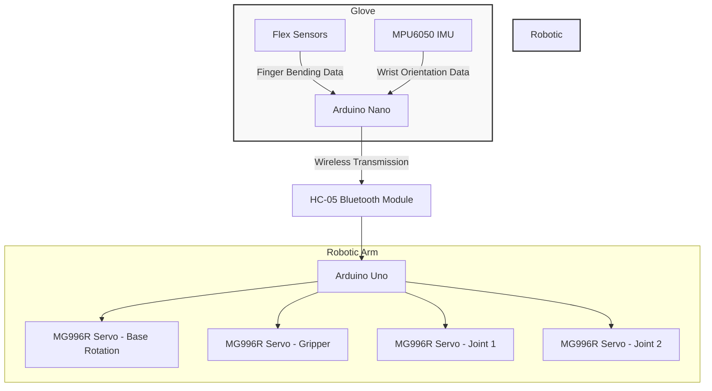
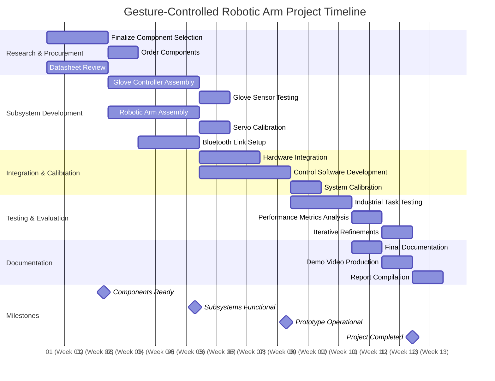

```mermaid
flowchart TB
    subgraph Glove
        A[Flex Sensors] -->|Finger Bending Data| B[Arduino Nano]
        C[MPU6050 IMU] -->|Wrist Orientation Data| B
    end

    B -->|Wireless Transmission| D[HC-05 Bluetooth Module]
    D --> E[Arduino Uno]

    subgraph Robotic Arm
        E --> F[MG996R Servo - Base Rotation]
        E --> G[MG996R Servo - Gripper]
        E --> H[MG996R Servo - Joint 1]
        E --> I[MG996R Servo - Joint 2]
    end

    style Glove fill:#f9f9f9,stroke:#333,stroke-width:2px
    style Robotic Arm fill:#f0f8ff,stroke:#333,stroke-width:2px
```

```mermaid
gantt
    title Gesture-Controlled Robotic Arm Project Timeline
    dateFormat  YYYY-MM-DD
    axisFormat  %U (Week %U)

    section Research & Procurement
    Finalize Component Selection       :a1, 2025-01-01, 14d
    Order Components                  :a2, after a1, 7d
    Datasheet Review                  :a3, 2025-01-01, 14d

    section Subsystem Development
    Glove Controller Assembly         :b1, 2025-01-15, 21d
    Glove Sensor Testing              :b2, after b1, 7d
    Robotic Arm Assembly              :b3, 2025-01-15, 21d
    Servo Calibration                 :b4, after b3, 7d
    Bluetooth Link Setup              :b5, 2025-01-22, 14d

    section Integration & Calibration
    Hardware Integration              :c1, 2025-02-05, 14d
    Control Software Development      :c2, 2025-02-05, 21d
    System Calibration                :c3, after c2, 7d

    section Testing & Evaluation
    Industrial Task Testing           :d1, 2025-02-26, 14d
    Performance Metrics Analysis      :d2, after d1, 7d
    Iterative Refinements             :d3, after d2, 7d

    section Documentation
    Final Documentation               :e1, 2025-03-12, 7d
    Demo Video Production             :e2, after e1, 7d
    Report Compilation                :e3, after e2, 7d

    section Milestones
    Components Ready                  :milestone, m1, 2025-01-14, 0d
    Subsystems Functional            :milestone, m2, 2025-02-04, 0d
    Prototype Operational            :milestone, m3, 2025-02-25, 0d
    Project Completed                :milestone, m4, 2025-03-26, 0d
```
