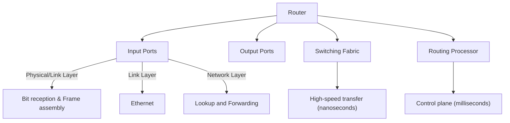
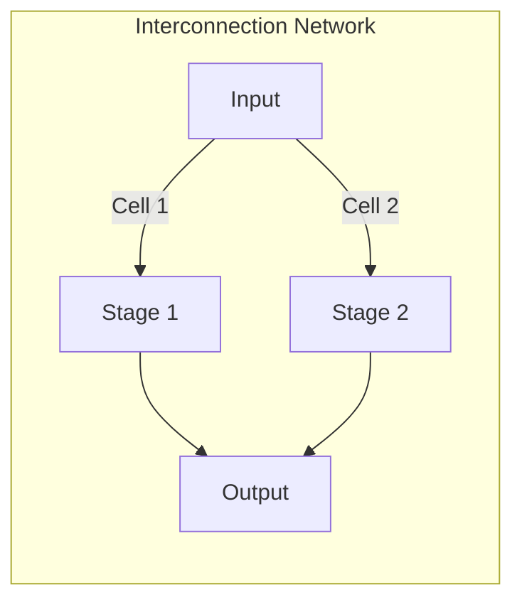

### **1. Router Architecture Overview**  
**Kurose's explanation**:  
*"Packets move from input ports to output ports through a switching fabric - the heart of the router. There's also a routing processor (CPU) handling control plane functions."*  

**Key Components**:  

- The **switching fabric** is the router's core, directing all packet traffic.
    
- It acts like a **network within a network**.
    
- Routers are controlled through the switching fabric.
    
- A **routing processor** (usually a CPU) manages control tasks.
    
- It controls the switching fabric and sets up **forwarding tables**.

**Implementation**:  
- **Data Plane**: Hardware-accelerated (ASICs/TCAMs)  
- **Control Plane**: Software-based (routing protocols)  

---

### **2. Input Port Processing**  

- The key **network layer function** at the input port is **lookup and forwarding**.
    
- It determines the correct **output port** for each incoming packet.
    
- This process uses a **match plus action** method.
    
- The **destination IP address** in the packet header guides the forwarding decision.
    
- The selected output port sends the packet through the **switching fabric**.
**Three Layer Processing**:  
1. **Physical Layer**:  
   - *"Receives bit-level transmissions over copper/fiber/wireless"*  
2. **Link Layer**:  
   - *"Assembles bits into frames (e.g., Ethernet)"*  
3. **Network Layer**:  
   - **Critical Function**: *"Lookup/output port determination via forwarding table"*  

**Match+Action Types**:  

| **Type**               | **Matching Criteria**                |
| ---------------------- | ------------------------------------ |
| Destination-Based      | Only destination IP address          |
| Generalized Forwarding | Any header field (IP, TCP/UDP, etc.) |
- **Generalized forwarding** allows output port decisions based on multiple fields.
    
- These fields can come from the **network layer header**, **link layer frame header**, or **transport layer**.
    
- This approach provides more flexible and complex **packet forwarding** than traditional methods.
---

### **3. Destination-Based Forwarding**  
**Problem**:  
- *"With 4B possible IPv4 addresses, we can't store individual entries."*  

**Solution**: **Prefix Aggregation**  
Example from slide 5:  

| **Destination Range**               | **Interface** |  
|-------------------------------------|--------------|  
| 11001000 00010111 00010000 00000000 | 0            |  
| 11001000 00010111 00010000 00000111 | 3            |  

- The **stars** (asterisks) represent **wildcards** or "don’t care" bits in an address.
    
- These bits are **not part of the prefix**, but help define an **address range**.
    
- Wildcards allow flexibility in **matching multiple addresses** within a range.

- The **longest prefix matching rule** applies to 32-bit IP addresses.
    
- A prefix match requires all **leftmost bits** to align with the prefix’s bits.
    
- If multiple prefixes match, the one with the **most matching bits** (i.e., the longest prefix) is selected.
---

### **4. Longest Prefix Matching (LPM)**  
**Slide 6 Example**: 

| **Prefix**               | **Interface** |  
|--------------------------|--------------|  
| 11001000 00010111 00010*** | 0            |  
| 11001000 00010111 00011000 | 1            |  

**Kurose's Explanation**:  
*"For address `11001000 00010111 00011000 10101010`, the 24-bit prefix matches interface 1 (longer than the 21-bit match)."*  

**Hardware Acceleration**:  
- **TCAMs (Ternary Content-Addressable Memories)**:  
  - *"Retrieves matches in one clock cycle, regardless of table size."* (Slide 10)  
  - Cisco Catalyst: ~1M entries in TCAM.  

---

### **5. Switching Fabrics**  
**Three Types (Slides 13-16)**:  

- The **switching fabric** is the core of a router.
    
- Its role is to move packets from the **input port** to the **output port**.
    
- The output port is chosen based on the **longest prefix match**.
    
- A key feature is the **switching rate** — the maximum speed at which packets are transferred.
- If there are **n inputs** each with rate **R**, and the switch has a rate of **n × R**,
    
- Then all incoming packets can be transferred to their **output ports** within the same time unit.
    
- This setup avoids significant **queuing delays** at the input ports.
    
- Such a switch is called a **non-blocking switch**.
  
- **High-speed non-blocking switches** are costly compared to switches that may occasionally block packets.
    
- Not all routers use **non-blocking switch fabrics** due to these higher costs.
    
- In **blocking switches**, packets may need to **wait at the input** before being transferred.
    
- This waiting leads to **input port queuing**, where packets are held temporarily before forwarding.

#### **A. Memory Switching**  

*"First-gen routers copied packets to CPU memory (2 bus crossings → slow)."*  
**Limitation**: Memory bandwidth bottleneck.  

- When a packet arrives at an **input port**, it triggers a **CPU interrupt**.
    
- The packet is then **copied into processor memory** from the input buffer.
    
- The CPU uses the **destination address** to find the correct **output port** via the forwarding table.
    
- It then writes the packet into the **output port’s buffer**.
    
- This shows that **network ports function like I/O devices** in this setup.
#### **B. Bus Switching**  

*"Packets bypass CPU memory but contend for shared bus bandwidth."*  
**Example**: Cisco 5600 with 32 Gbps bus.  

#### **C. Interconnection Networks**  

- The third type of switching fabric is the **interconnection network**.
    
- These are commonly used in both **routers** and **multiprocessor systems**.
    
- One example is the **crossbar switch**, which uses **N² interconnection points** to directly connect inputs and outputs.
    
- More often, routers use **multistage switching networks**, generally known as **Clos networks**, to connect **n inputs to n outputs** efficiently.

- **Multistage interconnection networks** consist of smaller switch elements.
    
- These elements are connected **serially** across multiple stages.
    
- They are also connected **in parallel** within each stage.
    
- This structure enables efficient and scalable **packet switching** in routers.
**Key Techniques**:  
1. **Crossbar/Clos Networks**:  
   - *"Multistage switches (e.g., 8x8 from 2x2 elements)."*  
     
1. **Cell Switching**:  
   - *"Fragment datagrams into fixed-length cells for parallel routing."*  
- Some switching fabrics have **parallel paths** from input to output.
    
- To use these paths effectively, a **data gram** is divided into smaller, fixed-length units called **cells**.
    
- These cells are switched **in parallel** through the fabric.
    
- At the output port, the cells are **reassembled** back into the original data gram.
**Real-World**:  
- *"Cisco CRS uses 8 parallel planes → 100s of Tbps capacity."* (Slide 16)  

---

### **Key Takeaways**  
1. **LPM is critical for scalable forwarding tables**.  
2. **Switching fabrics determine router performance**:  
   - Memory → Bus → Interconnection (parallelism wins).  
3. **TCAMs enable nanosecond lookups**.  
 

--- 

