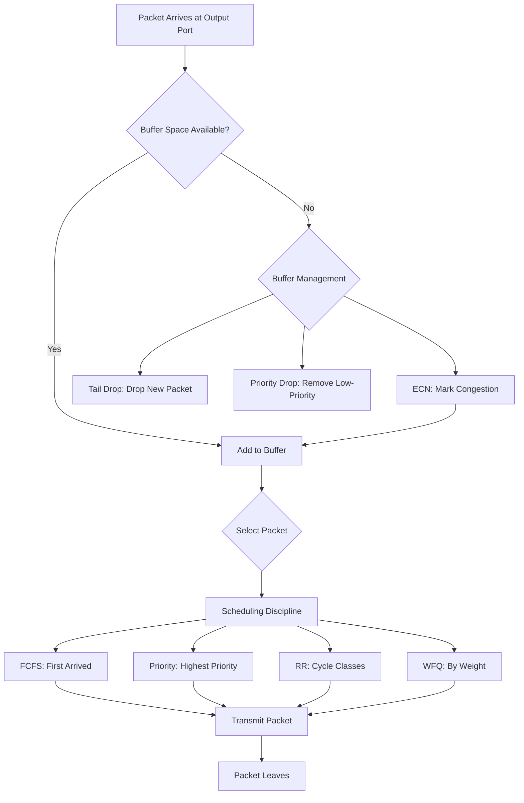

## Input Port Queuing
- **Cause**: Switching fabric slower than incoming links causes queuing.
- **HOL (Head-of-the-Line) Blocking**: Front packet blocks others if targeting the same output, even if other ports are free.
- **Example**: Red packets to one output; one waits, blocking a green packet.

**Why It Matters**: HOL blocking delays packets, hurting efficiency.

---

## Output Port Queuing
- **Buffering**: Needed as packets arrive (N × R) faster than link transmits (R).
- **Congestion Loss**: Full buffers drop packets, key in best-effort model.
- **Cause**: Too many TCP (Transmission Control Protocol) senders.
- **Decisions**: Drop policy (which packets to drop); scheduling (next to send).

**Why It Matters**: Controls congestion, affecting loss and delay.

---

## How Much Buffering?
- **Guides**:
  - **RFC 3439**: Buffer = RTT (~250 ms) × capacity (e.g., 2.5 Gbit for 10 Gbps).
  - **Recent**: Buffer = RFC 3439 / √N (N = flows).
- **Trade-offs**: More buffers cut loss but raise delays, slowing TCP and real-time apps.
- **Goal**: Buffer bursts, keep link busy, avoid slow congestion control.

**Why It Matters**: Balancing loss vs. delay is unresolved.

---

## Buffer Management
- **Policies**:
  - **Tail Drop**: Drop new packets if full.
  - **Priority Drop**: Drop low-priority (e.g., TCP) for high-priority (e.g., ISP control).
  - **ECN (Explicit Congestion Notification)**: Mark packets to signal congestion.
- **Queue Model**: Packets arrive, wait, are served, or dropped.

**Why It Matters**: Manages loss and congestion signaling.

---

## Packet Scheduling: FCFS
- **FCFS (First-Come, First-Served)**: Sends packets in arrival order (aka FIFO).
- **Analogy**: Bank queue, first in served first.

**Why It Matters**: Simple, no traffic prioritization.

---

## Scheduling Policies: Priority
- **Priority Scheduling**: Classifies packets (e.g., by port, IP) into priority classes.
- **Operation**: Sends from highest-priority queue; FCFS within class.
- **Example**: VoIP (Voice over IP) over email; ISP sets classes (e.g., paid priority).

**Why It Matters**: Favors critical traffic, raises neutrality concerns.

---

## Scheduling Policies: Round Robin
- **RR (Round Robin)**: Classifies packets, sends one per class cyclically.
- **Key**: No priority, ensures class fairness.

**Why It Matters**: Balances traffic types.

---

## Scheduling Policies: Weighted Fair Queuing
- **WFQ (Weighted Fair Queuing)**: Like RR, but class \( i \) has weight \( w_i \).
- **Operation**: Guarantees$\( w_i / \sum w_j \)$of bandwidth (e.g., \( w_i \times R \)).
- **Feature**: Minimum bandwidth per class.

**Why It Matters**: Enables QoS (Quality of Service).

---

## Sidebar: Network Neutrality
- **Definition**: Rules on ISP (Internet Service Provider) resource allocation (scheduling, buffering), mixing tech, social, economic issues.
- **Issues**: Free speech, innovation, competition.
- **2015 FCC Rules**:
  1. **No Blocking**: No blocking lawful content, except network management.
  2. **No Throttling**: No degrading lawful traffic (e.g., BitTorrent TCP resets).
  3. **No Paid Prioritization**: Equal service, no paid fast lanes.
- **Debate**: Paid priority could fund ISPs but limit competition.
- **Global**: Varies by country.

**Why It Matters**: Shapes ISP fairness, user experience.

---

## Mermaid Diagram: Packet Scheduling and Buffer Management

