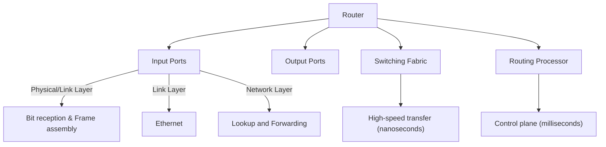
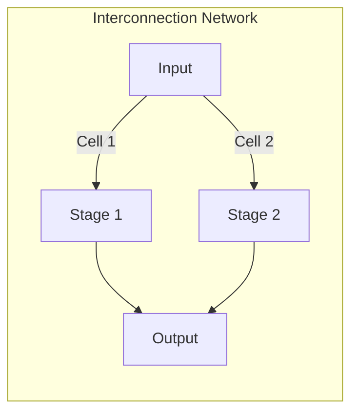

### **1. Router Architecture Overview**  
**Kurose's explanation**:  
*"Packets move from input ports to output ports through a switching fabric - the heart of the router. There's also a routing processor (CPU) handling control plane functions."*  

**Key Components**:  

- The **switching fabric** is the router's core, directing all packet traffic.
    
- It acts like a **network within a network**.
    
- Routers are controlled through the switching fabric.
    
- A **routing processor** (usually a CPU) manages control tasks.
    
- It controls the switching fabric and sets up **forwarding tables**.

**Implementation**:  
- **Data Plane**: Hardware-accelerated (ASICs/TCAMs)  
- **Control Plane**: Software-based (routing protocols)  

---

### **2. Input Port Processing**  

- The key **network layer function** at the input port is **lookup and forwarding**.
    
- It determines the correct **output port** for each incoming packet.
    
- This process uses a **match plus action** method.
    
- The **destination IP address** in the packet header guides the forwarding decision.
    
- The selected output port sends the packet through the **switching fabric**.
**Three Layer Processing**:  
1. **Physical Layer**:  
   - *"Receives bit-level transmissions over copper/fiber/wireless"*  
2. **Link Layer**:  
   - *"Assembles bits into frames (e.g., Ethernet)"*  
3. **Network Layer**:  
   - **Critical Function**: *"Lookup/output port determination via forwarding table"*  

**Match+Action Types**:  

| **Type**               | **Matching Criteria**                |
| ---------------------- | ------------------------------------ |
| Destination-Based      | Only destination IP address          |
| Generalized Forwarding | Any header field (IP, TCP/UDP, etc.) |
- **Generalized forwarding** allows output port decisions based on multiple fields.
    
- These fields can come from the **network layer header**, **link layer frame header**, or **transport layer**.
    
- This approach provides more flexible and complex **packet forwarding** than traditional methods.
---

### **3. Destination-Based Forwarding**  
**Problem**:  
- *"With 4B possible IPv4 addresses, we can't store individual entries."*  

**Solution**: **Prefix Aggregation**  
Example from slide 5:  

| **Destination Range**               | **Interface** |  
|-------------------------------------|--------------|  
| 11001000 00010111 00010000 00000000 | 0            |  
| 11001000 00010111 00010000 00000111 | 3            |  

- The **stars** (asterisks) represent **wildcards** or "don’t care" bits in an address.
    
- These bits are **not part of the prefix**, but help define an **address range**.
    
- Wildcards allow flexibility in **matching multiple addresses** within a range.

---

### **4. Longest Prefix Matching (LPM)**  
**Slide 6 Example**: 

| **Prefix**               | **Interface** |  
|--------------------------|--------------|  
| 11001000 00010111 00010*** | 0            |  
| 11001000 00010111 00011000 | 1            |  

**Kurose's Explanation**:  
*"For address `11001000 00010111 00011000 10101010`, the 24-bit prefix matches interface 1 (longer than the 21-bit match)."*  

**Hardware Acceleration**:  
- **TCAMs (Ternary Content-Addressable Memories)**:  
  - *"Retrieves matches in one clock cycle, regardless of table size."* (Slide 10)  
  - Cisco Catalyst: ~1M entries in TCAM.  

---

### **5. Switching Fabrics**  
**Three Types (Slides 13-16)**:  

#### **A. Memory Switching**  
*"First-gen routers copied packets to CPU memory (2 bus crossings → slow)."*  
**Limitation**: Memory bandwidth bottleneck.  

#### **B. Bus Switching**  
*"Packets bypass CPU memory but contend for shared bus bandwidth."*  
**Example**: Cisco 5600 with 32 Gbps bus.  

#### **C. Interconnection Networks**  
**Key Techniques**:  
1. **Crossbar/Clos Networks**:  
   - *"Multistage switches (e.g., 8x8 from 2x2 elements)."*  
2. **Cell Switching**:  
   - *"Fragment datagrams into fixed-length cells for parallel routing."*  

**Real-World**:  
- *"Cisco CRS uses 8 parallel planes → 100s of Tbps capacity."* (Slide 16)  

---

### **Key Takeaways**  
1. **LPM is critical for scalable forwarding tables**.  
2. **Switching fabrics determine router performance**:  
   - Memory → Bus → Interconnection (parallelism wins).  
3. **TCAMs enable nanosecond lookups**.  

**Next**: Output port queuing & scheduling (slides 17-28).  

--- 

**Obsidian Integration**:  
- Paste Mermaid diagrams directly.  
- Use `#tags` like `#LPM` or `#TCAM`.  
- Link to related notes (e.g., `[[4.1 Network Layer Overview]]`).  

Let me know if you'd like:  
1. Anki cards for this section.  
2. Deeper dives into Clos networks.  
3. Buffer management details.