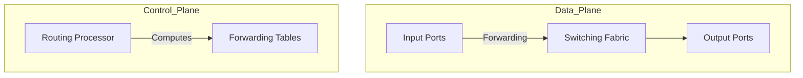
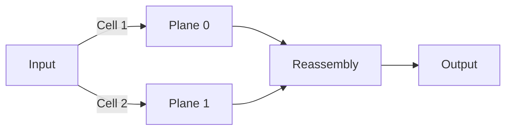

Here's your comprehensive breakdown of **4.2 What's Inside a Router?** combining the PowerPoint slides and Kurose's lecture, with Obsidian-compatible formatting and detailed explanations:

---

## **Router Architecture Overview**  
*(Slide 2: "Router architecture overview")*  

### **1. Core Components**  
**Kurose's explanation**:  
*"The router has input ports, output ports, a switching fabric, and a routing processor. The data plane (forwarding) operates at nanoseconds (hardware), while the control plane (routing) works at milliseconds (software)."*  

**Functional Breakdown**:  

---

## **Input Port Functions**  
*(Slides 3-4: "Input port functions")*  

### **1. Processing Pipeline**  
1. **Physical Layer**:  
   - *"Bit-level reception over copper, fiber, or wireless."*  
2. **Link Layer**:  
   - *"Assembles bits into frames (e.g., Ethernet)."*  
3. **Network Layer**:  
   - **Lookup & Forwarding**:  
     - *"Match-plus-action: Uses header fields (destination IP) to lookup output port in forwarding table."*  
     - **TCAMs (Ternary Content-Addressable Memories)**:  
       - *"Hardware that performs LPM in one clock cycle, regardless of table size."*  

**Key Challenge**:  
- *"Input port queuing occurs if datagrams arrive faster than the switching fabric can process them."*  

---

## **Destination-Based Forwarding & LPM**  
*(Slides 5-10: "Destination-based forwarding", "Longest prefix matching")*  

### **1. Forwarding Table Example**  
| **Destination Address Range**       | **Link Interface** |  
|-------------------------------------|-------------------|  
| `11001000 00010111 00010*** *******` | 0                 |  
| `11001000 00010111 00011000 *******` | 1                 |  
| `11001000 00010111 00011*** *******` | 2                 |  
| Otherwise                            | 3 (Default)       |  

**Kurose's Example**:  
- *"For address `11001000 00010111 00011000 10101010`, the longest prefix match is the second row (24-bit match), so it goes to Interface 1."*  

### **2. Why LPM?**  
- *"Address ranges don’t always divide neatly. LPM efficiently handles overlapping prefixes."*  

---

## **Switching Fabrics**  
*(Slides 11-16: "Switching fabrics")*  

### **1. Three Types**  
| **Type**               | **Mechanism**                                                                 | **Limitation**                     |  
|------------------------|-------------------------------------------------------------------------------|------------------------------------|  
| **Memory Switching**   | *"CPU copies packets from input to output memory (2 bus crossings)."*         | Slow (limited by memory bandwidth) |  
| **Bus Switching**      | *"Shared bus connects all ports (e.g., Cisco 5600 with 32 Gbps bus)."*        | Bus contention                     |  
| **Interconnection**    | *"Parallel paths (Clos networks). Fragments packets into cells for switching."* | Complex but scalable               |  

**Modern Implementation**:  
- *"Cisco CRS uses 8 parallel switching planes, each with a 3-stage Clos network, for terabit capacity."*  

---

## **Queuing & Scheduling**  
*(Slides 17-25: "Input/output port queuing", "Packet scheduling")*  

### **1. Buffering Challenges**  
- **Input Queuing**:  
  - *"Head-of-Line (HOL) blocking: One packet blocks others in the queue."*  
- **Output Queuing**:  
  - *"RFC 3439: Buffer size = RTT × C (e.g., 10 Gbps link → 2.5 Gbit buffer)."*  

### **2. Scheduling Policies**  
| **Policy**               | **Mechanism**                                                                 | **Use Case**                |  
|--------------------------|-------------------------------------------------------------------------------|-----------------------------|  
| **FIFO (FCFS)**          | *"Packets transmitted in arrival order."*                                     | Basic traffic               |  
| **Priority Scheduling**  | *"High-priority queue always served first."*                                  | VoIP, video calls           |  
| **Weighted Fair Queuing**| *"Guarantees minimum bandwidth per class (e.g., w₁/(w₁+w₂))."*               | Enterprise networks         |  

---

## **Network Neutrality**  
*(Slides 26-28: Sidebar on Network Neutrality)*  

**Kurose's Summary**:  
- *"Technical: How ISPs allocate resources (scheduling/buffering). Social: Rules preventing blocking/throttling."*  
- **2015 FCC Rules**:  
  1. No blocking lawful content.  
  2. No throttling.  
  3. No paid prioritization.  

---

### **Anki Flashcards**  
**Front**: What are the three switching fabric types?  
**Back**:  
1. Memory (CPU copies packets)  
2. Bus (shared bandwidth)  
3. Interconnection (parallel paths, e.g., Clos).  
*Kurose: "Cisco CRS uses 8 parallel planes for terabit speeds."*  

**Front**: Why use LPM in forwarding tables?  
**Back**: To handle overlapping IP address ranges efficiently. *Example: `11001000.../24` beats `11001000.../21` match.*  

**Front**: What causes HOL blocking?  
**Back**: A queued packet blocks others behind it. *"Only one red packet can move, blocking green packets."*  

--- 

**Obsidian Integration**:  
- Use Mermaid diagrams for visualizations.  
- Tag with `#RouterArchitecture #LPM #Queuing`.  
- Link to related notes (e.g., `[[4.1 Network Layer Overview]]`).  

Let me know if you'd like to expand any section (e.g., Clos networks math, buffer sizing formulas)!