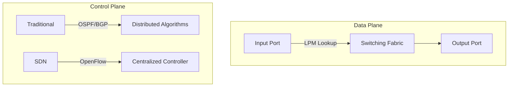

## **4.1 Introduction and Network Layer Service Model**  
*(Slide heading from Kurose's presentation)*  

### **1. Network Layer Fundamentals**  
**Kurose's definition**:  
*"The network layer is implemented in each and every internet-connected device - that's billions of hosts and routers. If there's any glue holding the Internet together, it's this layer."*  

**Key Roles**:  
- **Host-to-Host Delivery**:  
  - *"At the sending host: takes transport layer segments from TCP (Transmission Control Protocol) or UDP (User Datagram Protocol), encapsulates them into IP (Internet Protocol) datagrams."*  
  - *"At the receiving host: validates checksums, extracts payloads, and demultiplexes to transport layer."*  

---

### **2. Data Plane vs. Control Plane**  
**Kurose's distinction**:  
*"The data plane handles local per-router actions like forwarding, while the control plane manages the network-wide logic of how packets flow from edge to edge."*  

#### **Data Plane**  
- **Definition**: *"Moving datagrams from input link to output link at a router."*  
- **Hardware Acceleration**: Uses TCAMs (Ternary Content-Addressable Memories) for LPM (Longest Prefix Matching).  
- **Timescale**: Operates at nanoseconds (hardware speed).  

#### **Control Plane**  
- **Traditional Approach**:  
  *"Distributed routing algorithms (like OSPF (Open Shortest Path First) or BGP (Border Gateway Protocol)) run in every router, exchanging topology information to compute forwarding tables."*  
- **SDN (Software-Defined Networking) Approach**:  
  *"A remote controller (running in redundant data centers) computes and distributes forwarding tables to routers."*  



---

### **3. Forwarding vs. Routing**  
**Kurose's analogy**:  
*"Forwarding is like navigating a single intersection, while routing is planning your entire road trip across multiple cities."*  

**Forwarding Tables**:  
- Populated by control plane  
- Use LPM: *"Matches destination IP addresses against prefixes like 192.168.1.0/24."*  

**Routing Protocols**:  
- **Interior**: OSPF, IS-IS (Intermediate System to Intermediate System)  
- **Exterior**: BGP  

---

### **4. Internet Service Model: Best Effort**  
**Kurose's explanation**:  
*"The Internet uses best-effort service: no delivery guarantees, no delay bounds, no bandwidth reservations. You might call it a 'no service' model!"*  

#### **Why Other Models Failed**  
- **ATM (Asynchronous Transfer Mode)**:  
  *"Provided guaranteed constant bit rate but was too complex to deploy at Internet scale."*  
- **IntServ (Integrated Services)**:  
  *"Required per-flow state in routers - impossible to manage in large networks."*  

#### **Why Best Effort Succeeded**  
1. **Simplicity**: *"Easy to add new hosts/networks."*  
2. **Overprovisioning**: *"Enough bandwidth makes VoIP/video 'good enough'."*  
3. **Application-Layer Workarounds**:  
   - *"TCP (Transmission Control Protocol) congestion control backs off during congestion."*  
   - *"CDNs (Content Delivery Networks) like Netflix replicate content globally."*  

---

### **5. Key Takeaways (Verbatim Quotes)**  
- *"We engineers focus too much on mechanisms and forget big-picture questions like service models."*  
- *"Best-effort’s simplicity was one of the Internet’s most important design decisions."*  

---

### **Obsidian Integration Tips**  
1. **Mermaid Diagrams**: Copy-paste the flowcharts directly.  
2. **Acronym Glossary**:  
    
   - **TCP**: Transmission Control Protocol  
   - **UDP**: User Datagram Protocol  
   - **OSPF**: Open Shortest Path First  
   - **BGP**: Border Gateway Protocol  
   
1. **Flashcard Template**:  
   ```  
   Q: What are the two network layer functions?  
   A: Forwarding (local) and Routing (global).  
   ```  

