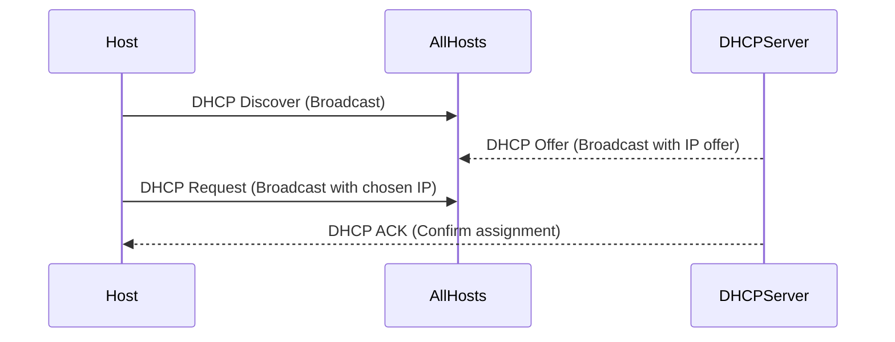

## Overview of Network Layer

- The Internet’s network layer is divided into:
    
    - The data plane: forwards packets through the network.
        
    - The control plane: computes the forwarding tables used by routers.
        
- Two core protocols:
    
    - IP (Internet Protocol): defines datagram structure, addressing, and forwarding rules.
        
    - ICMP (Internet Control Message Protocol): used for diagnostics and error reporting.
        
- Forwarding decisions are made using the destination IP address and a forwarding table.
    
- Forwarding tables are created either:
    
    - Via distributed routing protocols (e.g., OSPF, BGP).
        
    - Or through centralized Software Defined Networking (SDN) controllers.
        

---

## The Internet Protocol (IP): What It Is

- IP defines:
    
    - The format of datagrams.
        
    - How addressing works.
        
    - Packet handling rules (e.g., fragmentation).
        
- IP is not a routing protocol itself; routing is handled by control plane components.
    
- The IP protocol is foundational to the data plane.
    

---

## IP Datagram Format

- Standard header is 20 bytes (can vary if options are present).
    
- Key fields:
    
    - Version (4 bits): IP version (IPv4 in this case).
        
    - Header Length (4 bits): specifies where the payload begins.
        
    - Type of Service (8 bits): includes Explicit Congestion Notification (ECN) and Differentiated Services (DiffServ).
        
    - Total Length (16 bits): total datagram size (max ~64KB).
        
    - Identification, Flags, Fragment Offset: used for fragmentation (rarely used; not in IPv6).
        
    - Time To Live (TTL): decremented at each router; prevents infinite loops.
        
    - Protocol: specifies upper-layer protocol (e.g., 6 = TCP, 17 = UDP).
        
    - Header Checksum: must be recomputed at each router due to changes like TTL.
        
    - Source and Destination IP: 32-bit addresses.
        

---

## IP Addressing Basics

- An IP address identifies an interface, not a device.
    
    - Routers have multiple interfaces.
        
    - Hosts (e.g., laptops) can have multiple interfaces (Ethernet, Wi-Fi).
        
- Address format: 32-bit number, typically written in dotted decimal (e.g., 223.1.1.1).
    
- Interfaces connected on the same physical or wireless network form a subnet.
    

---

## Subnets

- A subnet is a group of interfaces that can directly communicate without passing through a router.
    
- IP address = subnet part + host part.
    
- All interfaces in a subnet share the same subnet prefix.
    
- Subnet mask: defines the number of bits used for the subnet portion.
    
    - Example: 223.1.3.0/24 indicates that the first 24 bits define the subnet.
        
- Subnets are determined by detaching each interface and observing which ones share direct connections.
    

---

## CIDR (Classless Inter-Domain Routing)

- CIDR notation: a.b.c.d/x where x = number of bits in the subnet prefix.
    
- Replaces the older class-based system (Class A, B, C).
    
- Enables more flexible and efficient allocation of address space.
    
- Example: 200.23.16.0/23 covers two Class C-sized blocks.
    

---

## How Does a Host Get an IP Address?

- Historically: configured manually (e.g., edited in config files).
    
- Now: typically via DHCP (Dynamic Host Configuration Protocol).
    
    - Plug-and-play method: no manual configuration.
        
    - Supports mobility: hosts can join/leave networks dynamically.
        

---

## DHCP (Dynamic Host Configuration Protocol)

- Used when a host joins a network to get its IP address and other parameters.
    
- Process:
    
    1. DHCP Discover: client broadcasts request to find a DHCP server.
        
    2. DHCP Offer: server replies with an available IP address and lease info.
        
    3. DHCP Request: client accepts the offered address (or proposes another).
        
    4. DHCP ACK: server confirms the address allocation.
        
- All messages are encapsulated in UDP over IP and broadcast on the local subnet.S
  
  # Scenario  

Certainly! Below is a **detailed**, step-by-step breakdown of the DHCP (Dynamic Host Configuration Protocol) message exchange, explaining each field, its purpose, and the underlying networking concepts.

---

## **Detailed DHCP Client-Server Exchange**

### **Step 1: DHCP Discover (Client → Broadcast)**
**Purpose**: A new device (client) joining the network broadcasts a **DHCP Discover** message to locate available DHCP servers.  

#### **Packet Details**:
- **Source IP**: `0.0.0.0` *(Client has no IP yet)*  
- **Destination IP**: `255.255.255.255` *(Broadcast to all devices in the subnet)*  
- **UDP Ports**:  
  - **Source Port**: `68` *(Standard DHCP client port)*  
  - **Destination Port**: `67` *(Standard DHCP server port)*  
- **DHCP Fields**:  
  - **Transaction ID (xid)**: `654` *(Random number to track responses)*  
  - **Client MAC Address**: Embedded *(Used to identify the client)*  
  - **Requested Parameters**: Subnet mask, default gateway, DNS servers, etc.  

**Why Broadcast?**  
- The client doesn’t know the DHCP server’s IP, so it sends the message to `255.255.255.255` (all devices).  
- Routers do not forward this broadcast (unless DHCP relay is configured).  

---

### **Step 2: DHCP Offer (Server → Broadcast)**
**Purpose**: A DHCP server (`223.1.2.5`) responds with a **DHCP Offer**, proposing an IP address (`223.1.2.4`) for the client.  

#### **Packet Details**:
- **Source IP**: `223.1.2.5` *(DHCP server’s IP)*  
- **Destination IP**: `255.255.255.255` *(Still broadcast since the client lacks an IP)*  
- **UDP Ports**:  
  - **Source Port**: `67` *(Server port)*  
  - **Destination Port**: `68` *(Client port)*  
- **DHCP Fields**:  
  - **Transaction ID (xid)**: `654` *(Same as Discover to match the request)*  
  - **Your IP (yiaddr)**: `223.1.2.4` *(Offered IP address)*  
  - **Lease Time**: `3600 sec` *(1 hour before renewal is needed)*  
  - **Subnet Mask, Router (Gateway), DNS Servers**: Included if configured.  

**Why Broadcast Again?**  
- The client still doesn’t have an IP, so the server must broadcast the response.  

**What If Multiple Servers Respond?**  
- The client may receive multiple offers but typically accepts the **first one**.  

---

### **Step 3: DHCP Request (Client → Broadcast)**
**Purpose**: The client formally requests the offered IP (`223.1.2.4`) from the server.  

#### **Packet Details**:
- **Source IP**: `0.0.0.0` *(Still no IP assigned)*  
- **Destination IP**: `255.255.255.255` *(Broadcast to ensure the server receives it)*  
- **UDP Ports**: Same as before (`68` → `67`)  
- **DHCP Fields**:  
  - **Transaction ID (xid)**: `655` *(New ID for this phase)*  
  - **Requested IP (ciaddr)**: `223.1.2.4` *(The IP from the Offer)*  
  - **Server Identifier**: `223.1.2.5` *(To confirm which server’s offer is accepted)*  

**Why a New Transaction ID?**  
- The client starts a new transaction to avoid confusion with the previous Discover/Offer phase.  

**Why Broadcast (Again)?**  
- Ensures all DHCP servers know which offer was accepted (in case multiple servers responded).  

---

### **Step 4: DHCP ACK (Server → Client)**
**Purpose**: The server confirms the lease and provides final configuration details.  

#### **Packet Details**:
- **Source IP**: `223.1.2.5` *(DHCP server)*  
- **Destination IP**:  
  - Usually `255.255.255.255` *(Broadcast, since the client may not yet have full network stack ready)*  
  - Sometimes unicast (`223.1.2.4`) if the client can accept it.  
- **UDP Ports**: `67` → `68`  
- **DHCP Fields**:  
  - **Transaction ID (xid)**: `655` *(Matches the Request phase)*  
  - **Your IP (yiaddr)**: `223.1.2.4` *(Final assigned IP)*  
  - **Lease Time**: `3600 sec` *(Can be renewed later)*  
  - **Additional Config**: Subnet mask (`255.255.255.0`), gateway (`223.1.2.1`), DNS (`8.8.8.8`), etc.  

**What Happens Next?**  
- The client configures its network interface with `223.1.2.4`.  
- It starts a timer (~50% of lease time) to **renew** the IP before expiration.  

---

## **Why Does DHCP Work This Way?**
1. **No Prior IP**: The client starts with `0.0.0.0`, so it must use **broadcast**.  
2. **Multiple Servers**: Broadcast ensures all DHCP servers see the request.  
3. **Lease Management**: The **lease time** (`3600 sec`) prevents IP exhaustion.  
4. **Transaction IDs**: Prevent confusion if multiple clients request simultaneously.  

    
- DHCP may also provide:
    
    - First-hop router IP.
        
    - DNS server IP and name.
        
    - Subnet mask.
        

---

## How Does a Network Get a Subnet Address?

- A network typically receives an address block from its upstream ISP.
    
- Example: ISP with 200.23.16.0/20 can allocate:
    
    - 200.23.16.0/23 to Organization 0.
        
    - 200.23.18.0/23 to Organization 1.
        
    - And so on...
        
- This forms a hierarchical structure in address space assignment.
- A network (e.g., a business or home network) needs IP addresses for its devices.
    
- Typically, it gets these addresses from its **Internet Service Provider (ISP)**.
    
- The ISP has a large pool of IP addresses (e.g., a **/20 block**).
    
- The ISP can divide this block into smaller ranges (e.g., **/23 subnets**).
    
- Each **/23 subnet** is assigned to a customer network.
    
- Example:
    
    - ISP owns **203.0.113.0/20** (4,096 addresses).
        
    - Splits into **8 x /23 blocks** (512 addresses each).
        
    - Assigns one **/23** (e.g., **203.0.116.0/23**) to a customer.
        
- The customer network then assigns individual IPs from its allocated range to devices.

---

## Hierarchical Addressing & Route Aggregation

- ISPs can advertise a single large address prefix instead of many small ones.
    
    - Fly-By-Night ISP advertises 200.23.16.0/20 to the global Internet.
        
- Organization 1 switching ISPs illustrates route specificity:
    
    - Original ISP: advertises /20.
        
    - New ISP: advertises more specific /23.
        
    - Routers use Longest Prefix Match to prefer more specific prefixes.
      
      ### **Hierarchical Addressing & Route Aggregation Explained**  

#### **Key Concepts**  
✅ **Address Aggregation (Route Summarization)**  
   - A parent ISP (e.g., **Fly-By-Night-ISP**) groups multiple smaller subnets under a single larger prefix.  
   - Example:  
     - **8 x /23 subnets** (e.g., `200.23.16.0/23` to `200.23.30.0/23`)  
     - Aggregated into **one /20 prefix** (`200.23.16.0/20`).  
   - **Benefit**: Reduces routing table size in the global Internet.  

✅ **How It Works**  
   - **Fly-By-Night-ISP** advertises only **`200.23.16.0/20`** to the Internet.  
     - Covers all 8 customer subnets (`/23` each).  
   - External routers forward traffic to **Fly-By-Night-ISP**, which then routes internally to the correct `/23` subnet.  

✅ **Breaking Aggregation (More Specific Routes)**  
   - If **Organization 1** switches from **Fly-By-Night-ISP** to **ISPs-R-Us**:  
     - **ISPs-R-Us** advertises a **more specific route** (e.g., `200.23.18.0/23`).  
     - Now, traffic for `200.23.18.0/23` goes directly to **ISPs-R-Us**, bypassing **Fly-By-Night-ISP**.  
   - **Result**:  
     - The global Internet sees **two routes**:  
       1. `200.23.16.0/20` (Fly-By-Night-ISP)  
       2. `200.23.18.0/23` (ISPs-R-Us)  

✅ **Why Aggregation Isn’t Always Perfect**  
   - Real-world networks aren’t perfectly hierarchical.  
   - Example:  
     - **ISPs-R-Us** also advertises `199.31.0.0/16` (unrelated to `200.23.16.0/20`).  
     - This "breaks" aggregation, requiring separate routing entries.  

---

### **Visual Summary**  
| **ISP**               | **Advertised Route**      | **Purpose**                          |  
|------------------------|--------------------------|--------------------------------------|  
| Fly-By-Night-ISP       | `200.23.16.0/20`         | Aggregates 8x `/23` subnets.         |  
| ISPs-R-Us (new)        | `200.23.18.0/23`         | More specific route for Org 1.       |  
| ISPs-R-Us (other)      | `199.31.0.0/16`          | Unrelated, non-aggregated route.     |  

---

## How Does an ISP Get IP Addresses?

- ICANN (Internet Corporation for Assigned Names and Numbers):
    
    - Allocates IP blocks to five Regional Registries (e.g., ARIN, RIPE).
        
    - Also manages DNS root servers, top-level domains, and protocol numbers.
        
    - Example: Protocol 6 = TCP, 17 = UDP.
        
- IPv4 exhaustion:
    
    - ICANN allocated its last blocks in 2011.
        
    - Remaining addresses reside with regional registries.
        
    - IPv6 was created to solve this issue.
        

---

## Historical Insight: Why 32 Bits for IPv4?

- Vint Cerf (Internet co-founder) explained:
    
    - Originally designed for Department of Defense use.
        
    - Estimated 2 networks per 128 countries, with 16 million hosts per network.
        
    - 8 bits for network ID, 24 for host ID → 32-bit address space.
        
    - ~4.3 billion possible addresses seemed sufficient in the 1970s.
        
    - In hindsight, 128-bit addressing (as in IPv6) would’ve avoided scarcity—but seemed excessive then.
        

---

## Mermaid Diagram: DHCP Address Assignment

---

.

